# Chokro (চক্র) — M3 Comprehensive Architecture, Sequence Diagrams & Feature Defense Guide
> **Academic Context:** CSE471 — System Analysis and Design  
> **Student / Member:** `m3` — Sharzil Nafis (Valuation & Logistics)  
> **Team Members:** `m1` Sadat (Trust & Verification), `m2` Sameer (Marketplace), `m3` Sharzil (Valuation & Logistics), `m4` Imran (Drop Zones & Wallet)  
> **Target Deliverables:** Module 2 & 3 Evaluations, Assignment 03 (Postman Collection & Custom Port), Live Modification Viva (CO5)

---

## Table of Contents
1. [Executive Summary & The Unified Chokro Narrative](#1-executive-summary--the-unified-chokro-narrative)
2. [CSE471 Grading Rubric Alignment Matrix (5 Marks × 4 Features = 20 Marks)](#2-cse471-grading-rubric-alignment-matrix)
3. [Full System Architecture & Monorepo Design](#3-full-system-architecture--monorepo-design)
4. [Deep Domain Modules & Clean Adapter Seams Architecture](#4-deep-domain-modules--clean-adapter-seams-architecture)
5. [Database Schema & ERD (M3 Focus)](#5-database-schema--erd-m3-focus)
6. [Deep Feature Breakdown, Mechanics & Sequence Diagrams](#6-deep-feature-breakdown-mechanics--sequence-diagrams)
   - [Feature 1: Market-Benchmarked Valuation Engine (Retrofit)](#feature-1-market-benchmarked-valuation-engine-retrofit)
   - [Feature 2: AI Next-Life Scrap Vision Agent](#feature-2-ai-next-life-scrap-vision-agent)
   - [Feature 3: Smart Geo-Dispatch & Route Optimizer](#feature-3-smart-geo-dispatch--route-optimizer)
   - [Feature 4: B2B Bulk Scrap Auction & Live Bidding Engine](#feature-4-b2b-bulk-scrap-auction--live-bidding-engine)
7. [Cross-Team Dependencies & How to Defend Them to Your Teacher](#7-cross-team-dependencies--how-to-defend-them-to-your-teacher)
8. [Role-Based Navigation & Persona Switcher Guide](#8-role-based-navigation--persona-switcher-guide)
9. [Live Teacher Demonstration Script & Viva Defense (CO5 Preparation)](#9-live-teacher-demonstration-script--viva-defense-co5-preparation)
10. [Assignment 03: API & Postman Catalog](#10-assignment-03-api--postman-catalog)

---

## 1. Executive Summary & The Unified Chokro Narrative

Chokro (*চক্র* = Cycle) is a circular economy platform built for Bangladesh connecting individuals, collection drivers, recycling factories, and campus hubs. 

Rather than isolated CRUD screens, every feature built by every team member fits into **one continuous demo story**:

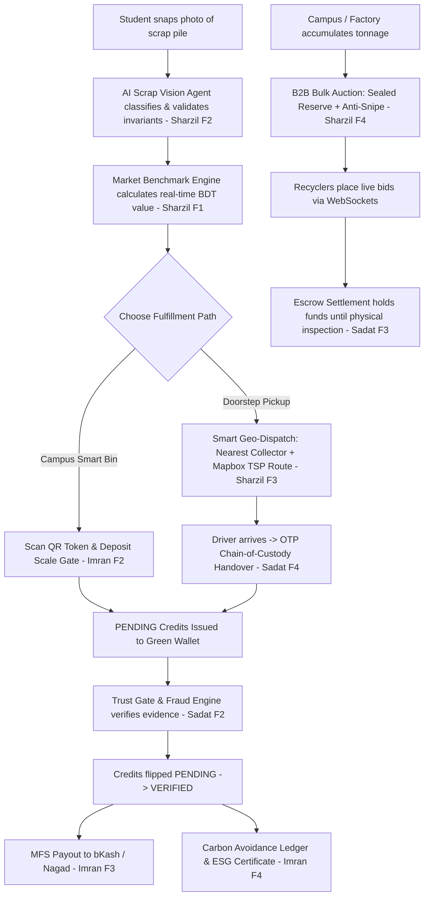

---

## 2. CSE471 Grading Rubric Alignment Matrix

Each member must deliver **4 unique functional features** (5 marks each = 20 marks total).  
*Rubric Criteria:* **Frontend (1) + Backend/API (1) + Database (1) + Innovation (1) + External Integration (1)**.

### Sharzil Nafis (`m3` — Valuation & Logistics) Scorecard

| Feature | Frontend Surface (1M) | Backend / API Controller (1M) | Database Schema (1M) | Innovation Claim (1M) | External API Integration (1M) |
| :--- | :--- | :--- | :--- | :--- | :--- |
| **F1: Market-Benchmarked Valuation Engine** *(Retrofit)* | `RateCardScreen.tsx` + `ratecard/` modular components with live drift badge. | `GET /api/v1/rate-card/estimate`, `ValuationDomain.ts` | `rate_benchmarks`, `rate_card_entries` with `effective_from` versioning | Continuous FX & global commodity drift calculation (`±10%` threshold) | Open FX Feed (`open.er-api.com`) + Global Commodity Market Index |
| **F2: AI Next-Life Scrap Vision Agent** | `VisionScanScreen.tsx` + `vision/` viewfinder & confidence overlay. | `POST /api/v1/valuation/classify-and-estimate`, `ValuationDomain.ts` | `valuation_scans` table storing AI audit trail & rationale | Regulated E-waste safety gate (forces `RECYCLE`, bypass-proof) + DB pricing join | Google Gemini 2.0 Flash (Free Multimodal) / OpenAI (`gpt-4o-mini`) + Heuristic Fallback |
| **F3: Smart Geo-Dispatch & Route Optimizer** | `PickupScreen.tsx` + `dispatch/` booking & SVG collector console. | `POST /api/v1/pickups`, `GET /collector-route`, `PickupDomain.ts` | `pickup_orders`, `dispatch_assignments`, `partners` fleet columns | Capacity-constrained (`kg`), radius & license-aware nearest neighbor dispatch | OSRM (OpenStreetMap, Free & Keyless) / Mapbox API + Haversine Fallback |
| **F4: B2B Bulk Scrap Auction & Live Bidding Engine** | `AuctionsScreen.tsx` + `auctions/` live bid cards, pulse & ticker. | `GET/POST /api/v1/auction-lots`, `POST /:id/bids`, `AuctionDomain.ts` | `auction_lots` (sealed reserve), `auction_bids` (monotonic sequence) | Sealed reserve price protection, anti-sniping dynamic clock extensions, lazy close | Pusher Channels (WebSockets for real-time bid tickers) |

> **Banned Feature Defense:**  
> Login/Signup, Role RBAC, and Profile CRUD are treated as shared plumbing (0 marks). Our features focus strictly on domain intelligence, optimization algorithms, and real-time financial mechanisms.

---

## 3. Full System Architecture & Monorepo Design

```
chokro/
├── apps/
│   ├── api/                              # Next.js 16 App Router (REST API + Admin Console)
│   │   ├── app/api/v1/                   # Versioned REST endpoints (pickups, auctions, valuation, etc.)
│   │   ├── lib/
│   │   │   ├── domain/                   # Deep Domain Modules (ValuationDomain, PickupDomain, AuctionDomain)
│   │   │   ├── repos/                    # Drizzle ORM data access (seam.ts boundary)
│   │   │   ├── services/                 # External Adapters & Facades (DispatchService, VisionAgentService, CommodityBenchmarkService)
│   │   │   └── http.ts                   # safeRoute wrapper & CORS error handling
│   │   └── tests/                        # 16 Jest test suites (86 tests) using in-memory PGlite
│   └── mobile/                           # React Native 0.86 + Expo SDK 57 (NativeWind Tailwind v3)
│       └── src/
│           ├── components/
│           │   ├── auctions/             # Modular F4 Auction components (LotCard, AntiSnipeCountdown, LivePriceTicker)
│           │   ├── dispatch/             # Modular F3 Dispatch components (CollectorRouteConsole, RouteMapCanvas)
│           │   ├── vision/               # Modular F2 Vision components (VisionCameraViewfinder, ConfidenceMeter)
│           │   └── ratecard/             # Modular F1 Rate components (RateCardEstimator, CommodityDriftBadge)
│           ├── navigation/               # Role-based tabs (roleTabs.ts, AppShell.tsx)
│           ├── screens/                  # Tab screens (VisionScan, Pickup, Auctions, RateCard, etc.)
│           └── services/                 # Axios/Fetch API client + token interceptors
└── packages/
    ├── db/                               # Shared Drizzle PostgreSQL schemas
    └── shared/                           # Universal types, Enums, Zod validation DTOs
```

### Architectural Highlights
1. **Repository Seam Boundary (`withDb`)**: All database operations go through `apps/api/lib/repos/seam.ts`. This allows the entire test suite to run against an in-memory WASM PostgreSQL (`PGlite`) in under 20 seconds with **zero Docker setup**.
2. **Strict Invariant Guard (`packages/shared`)**: Category unit rules are enforced at compile-time and runtime:
   - `APPLIANCES`, `E_WASTE` $\rightarrow$ must use `unit: 'piece'` and provide `piece_count`.
   - `CLOTHES`, `BOOKS`, `PLASTICS`, `PAPER`, `METAL`, `GLASS`, `FURNITURE` $\rightarrow$ must use `unit: 'kg'` and provide `declared_weight`.
3. **Resilient Degradation**: Every external API (Google Gemini / OpenAI, OSRM / Mapbox, Open Commodity & FX Feed, Pusher) has a deterministic in-memory fallback. If API keys are missing or wifi drops during a live presentation, the system **never crashes**.

---

## 4. Deep Domain Modules & Clean Adapter Seams Architecture

In accordance with deep module design principles, M3 features are structured with high leverage at the interface, rich internal logic, and strict external adapter seams:

### 1. `ValuationDomain` (M3 F1 + F2)
- **Interface**: `estimateRate()`, `classifyAndEstimate()`, `getPublishedRatesWithBenchmarks()`, `syncBenchmarks()`
- **Encapsulated Invariants**:
  - Enforces Category $\leftrightarrow$ Unit mapping (`kg` for bulk recyclables, `piece` for appliances/e-waste).
  - Regulated E-Waste Safety Gate: automatically forces `next_life_path: 'RECYCLE'`, flags hazardous materials, and generates DoE compliance rationale.
  - Rate Card Join: retrieves published rate card price from DB and applies condition multipliers.
  - Market Drift Calculation: computes percentage deviation between local rate card price and live international commodity spot price ($\pm 10\%$ alignment threshold).
  - Audit Trail: persists scan results into `valuation_scans` table.
- **External Adapter Seams**:
  - *Vision Adapter*: Google Gemini 2.0 Flash (Free) / OpenAI `gpt-4o-mini` API client with graceful local heuristic fallback.
  - *Market Index Adapter*: Open FX feed (`open.er-api.com`) + COMEX futures with baseline fallback.

### 2. `PickupDomain` (M3 F3)
- **Interface**: `findBestCollector()`, `assignBestCollector()`, `optimizeRoute()`, `updateStatus()`
- **Encapsulated Invariants**:
  - State machine transition rules: `REQUESTED` $\rightarrow$ `ASSIGNED` $\rightarrow$ `EN_ROUTE` $\rightarrow$ `COLLECTED`.
  - Driver Eligibility: filters for verified partners with `COLLECTOR` capability, within geofenced service radius.
  - Dynamic Vehicle Capacity Gate: $\text{Remaining Capacity} = \text{Vehicle Capacity} - \sum(\text{Committed Weights})$.
  - E-Waste Regulatory Gate: requires `e_waste_licensed = true` for e-waste pickup orders.
  - Greedy TSP Tour Optimization: calculates nearest-neighbor route order from driver base and cumulative leg ETAs.
- **External Adapter Seams**:
  - *Matrix Routing Seam*: OSRM OpenStreetMap Table API (Free & Keyless) / Mapbox Directions Matrix API with mathematical Haversine ($25\text{ km/h}$) fallback.

### 3. `AuctionDomain` (M3 F4)
- **Interface**: `createLot()`, `placeBid()`, `listPublicLots()`, `getPublicLotById()`
- **Encapsulated Invariants**:
  - Sealed Reserve Protection: reserve price is stripped at the `toPublicLot` serialization seam (`reserve_met: boolean` returned).
  - Server-Authoritative Sequencing: assigns monotonic integer `bid_number` on acceptance.
  - Minimum Bid Increment: enforces minimum $+৳50$ step above current highest bid.
  - Dynamic Anti-Snipe Clock Extension: extends auction closing time by $2\text{ minutes}$ if a valid bid lands in the final $2\text{ minutes}$.
  - Lazy Close: transitions expired lots to `ENDED` and stamps winning bid if reserve is satisfied.
- **External Adapter Seams**:
  - *Realtime Broadcast Seam*: Pusher Channels WebSocket trigger with client-side polling fallback.

---

## 5. Database Schema & ERD (M3 Focus)

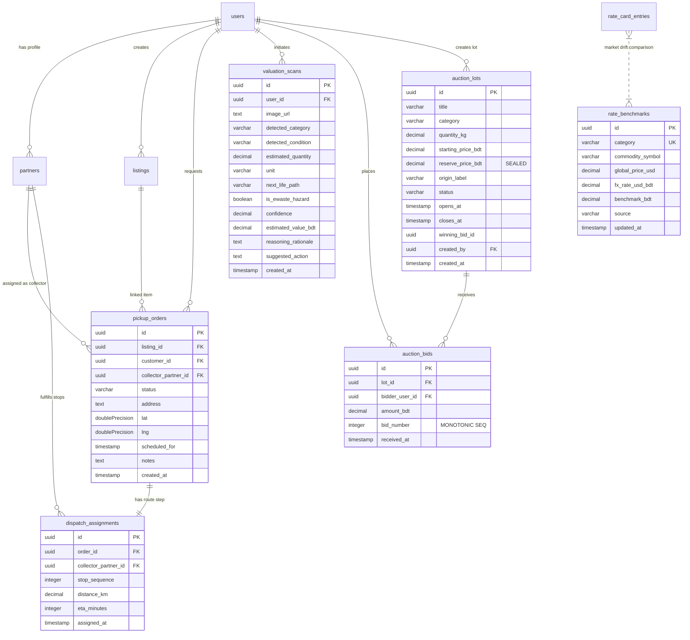

---

## 6. Deep Feature Breakdown, Mechanics & Sequence Diagrams

---

### Feature 1: Market-Benchmarked Valuation Engine (Retrofit)

#### 1. What Problem It Solves
Informal recycling economies suffer from severe **information asymmetry and market volatility**:
1. **Sellers (Households/Students):** Hesitate to recycle because they fear traditional collectors (*bhangariwallas*) underpay them with opaque pricing.
2. **Platform Operators:** Risk margin collapse if platform collection rates remain fixed while international commodity prices drop.
3. **Recycling Mills:** Need predictable, fair market rates tied to import parity and global spot prices.

The **Market-Benchmarked Valuation Engine** solves this by continuously calculating real-time local scrap valuations (in BDT) dynamically pegged to international commodity indices and live currency exchange rates.

---

#### 2. 100% Free Public API Architecture & Resilient Fail-Safe

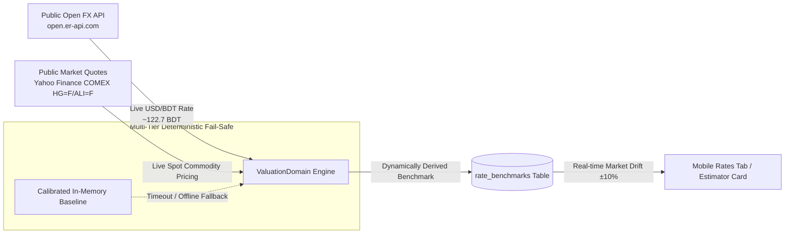

---

#### 3. The Dynamic Rate Drift Formula & State Machine

$$\text{Drift \%} = \left( \frac{P_{\text{local}} - P_{\text{benchmark}}}{P_{\text{benchmark}}} \right) \times 100$$

| Drift Percentage | State Classification | UI Badge Rendered | Operational Rationale |
| :--- | :--- | :--- | :--- |
| **$\text{Drift} < -10\%$** | `UNDER_MARKET` | `X% under global index` (Amber) | High platform collection margin; protects operator profitability during market downturns. |
| **$\text{Drift} > +10\%$** | `OVER_MARKET` | `X% above global index` (Purple) | Premium rate offered to incentivize rapid collection during local supply shortages. |
| **$-10\% \le \text{Drift} \le +10\%$** | `IN_SYNC` | `Market aligned (±10%)` (Green) | Fair market equilibrium aligned with international commodity spot rates. |

---

#### 4. Backend Lifecycle & Sequence Diagram

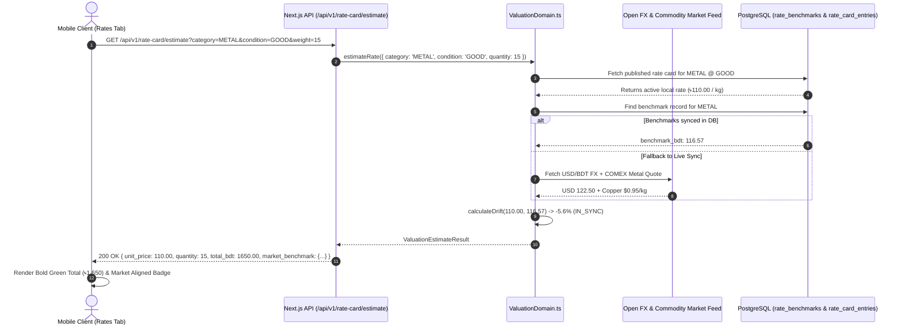

---

#### 5. React Component Architecture & Code Logic (F1)

##### Component Hierarchy Tree
```
RateCardScreen (Screen Container — Tab Switcher: 'estimate' vs 'browse')
├── RateCardEstimator (Estimate Mode — Dynamic Form & Debounce Engine)
│   ├── CategoryConditionSelector (Horizontal Pill Pickers with Native Touch Targets)
│   ├── QuantityInputBox (Dual-Unit Aware: Integer Stepper for 'piece' / Number Input for 'kg')
│   ├── EstimatorCard (Value Presentation Card)
│   │   └── CommodityDriftBadge (Live Benchmark Pill + Market Drift Indicator)
│   └── ErrorBanner (Inline Error Alerts)
└── RateCardBrowser (Browse Mode — Published Rates by Category Accordion)
    ├── Category Filter Tabs (Chips)
    └── RateCardRow Items (Published Band Breakdown & Benchmark Footers)
```

##### React State Flow & Debounce Engine
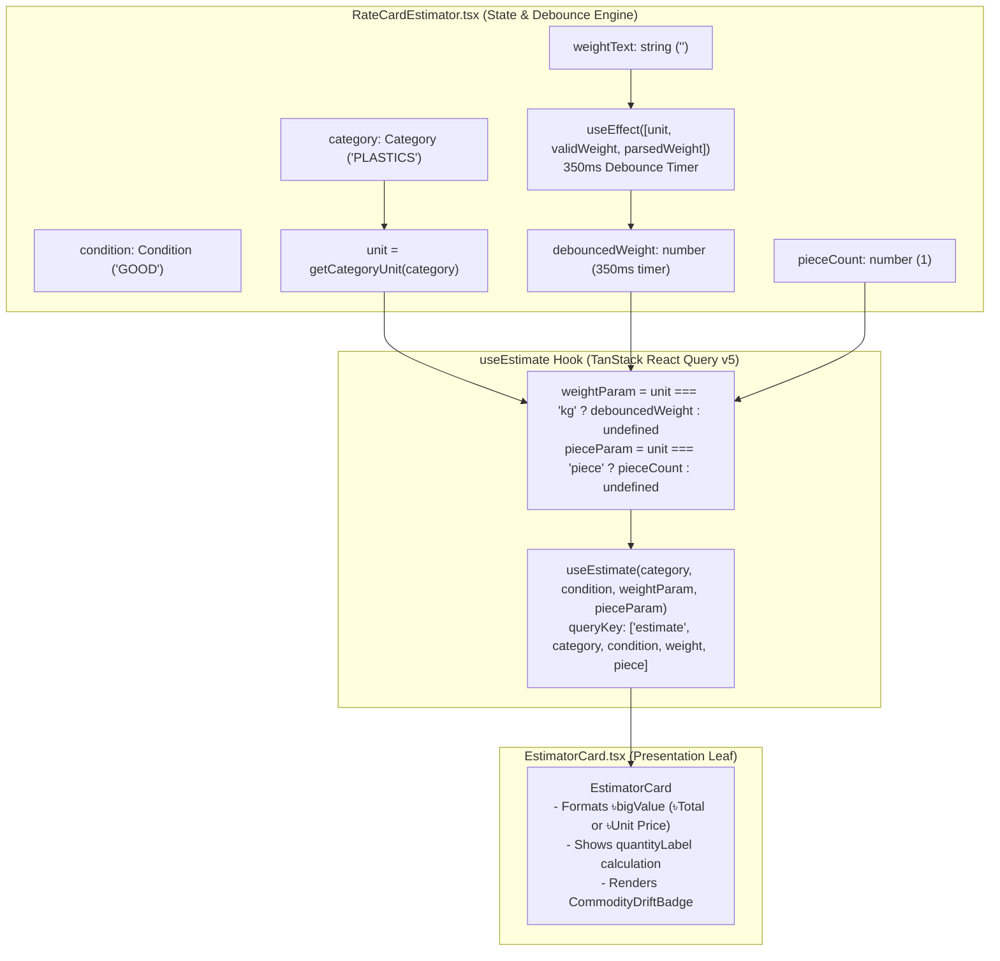

##### Core React Component Mechanics
1. **`RateCardEstimator.tsx`**:
   - **Debounced Weight Input**: Users type decimal weights continuously. The 350ms timer prevents unnecessary network calls until typing settles:
     ```tsx
     useEffect(() => {
       if (unit !== 'kg') return;
       const timer = setTimeout(() => {
         setDebouncedWeight(validWeight ? parsedWeight : undefined);
       }, 350);
       return () => clearTimeout(timer);
     }, [unit, validWeight, parsedWeight]);
     ```
   - **Dual-Unit Dynamic Seam**: Switching categories automatically resets weights, normalizes piece counts to `1`, and changes the parameters sent to `useEstimate`.
2. **`EstimatorCard.tsx`**:
   - **Dynamic Display Logic**: If no quantity is entered, it renders the unit rate (`৳110.00 / kg`); once a valid quantity is provided, it calculates and animates the total payout (`৳1,650.00`).
   - **Market Benchmark Section**: Embedded directly in the card footer with full provenance (source name and benchmark rate).
3. **`CommodityDriftBadge.tsx`**:
   - Evaluates `drift_status` (`UNDER_MARKET`, `OVER_MARKET`, `IN_SYNC`) and renders tailored badge themes (amber/green/purple) with arrow icons (`trending-down`, `trending-up`, `swap-horizontal-outline`).

---

### Feature 2: AI Next-Life Scrap Vision Agent

#### 1. What Problem It Solves
Untrained users don't know whether their scrap is recyclable, repairable, or hazardous e-waste. The Vision Agent acts as an expert multimodal appraiser: it classifies photos into canonical categories, estimates quantity, detects hazardous materials, determines circular next-life paths, and joins with the database rate card to provide an instant financial valuation.

#### 2. Safety & Regulatory Invariant
- **E-Waste Gate:** If the item is classified as `E_WASTE` or electronic hazard, the next-life path is **permanently forced to `RECYCLE`**. The user cannot select `REUSE` or `DONATE` due to Department of Environment (DoE) toxic component regulations.
- **Unit Enforcement:** Appliances and E-Waste output integer piece counts; all other categories output decimal kilograms.

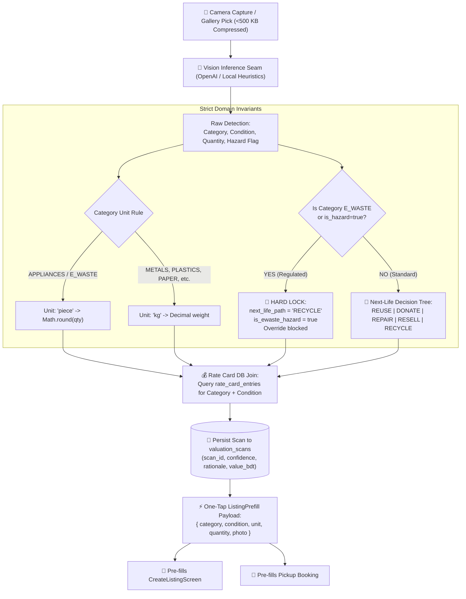

---

#### 3. Circular Next-Life Decision Logic Matrix

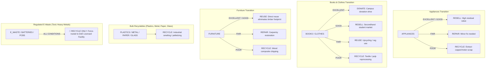

---

#### 4. Backend Lifecycle & Sequence Diagram

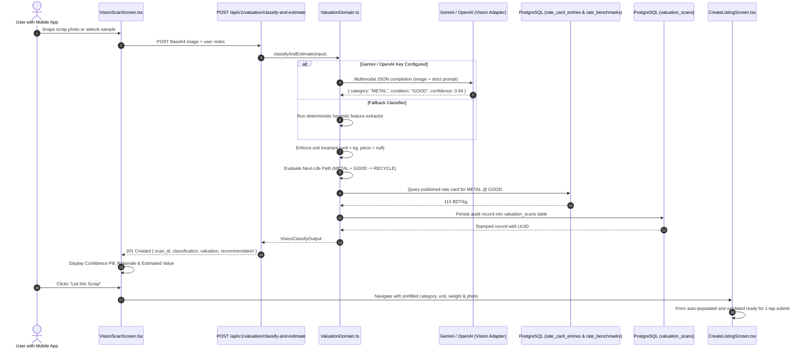

---

#### 5. React Component Architecture & Code Logic (F2)

##### Component Hierarchy Tree
```
VisionScanScreen (Screen Container — Lifecycle Coordinator & State Machine)
├── ErrorBanner (Capture / Network Errors)
├── [State 1] VisionCameraViewfinder (Live Viewfinder & Permission Handler)
│   ├── CameraView (Expo Camera SDK with Quality 0.7 Capture)
│   ├── Grid Guide Overlay (SVG Viewfinder Bracket)
│   └── Trigger Bar (Shutter Button + Gallery Picker)
├── [State 2] VisionPhotoReview (Captured Photo Review & Quantity Guide)
│   ├── Image Preview Card
│   ├── Quantity Override Switcher (Knows Qty Toggle -> Category & Numeric Input)
│   ├── VisionQuantityGuide (Weight/Piece Guidelines per Material)
│   └── Retake vs. Analyze Action Buttons
├── [State 3] VisionAnalyzingOverlay (Scanning Laser Animation & Progress Feedback)
├── [State 4] VisionResultCard (AI Appraisal Verdict & Handoff Actions)
│   ├── Category & Condition Badges
│   ├── ConfidenceMeter (Horizontal Animated SVG Confidence Progress Bar)
│   ├── Value Breakdown (Unit Price x Quantity = Total Estimated ৳)
│   ├── PathBadge (Circular Route Badge: RECYCLE / RESELL / DONATE / etc.)
│   ├── EwasteHazardBanner (Rendered strictly when is_ewaste_hazard === true)
│   ├── Rationale Quote Box (DoE regulatory context / material reasoning)
│   ├── Market Drift Comparison Bar (Commodity Index comparison)
│   └── Primary Action Buttons ("List this scrap" -> Prefills Marketplace / "Scan another")
├── VisionHistorySection (Recent Scans List with Timestamp & Thumbnails)
└── VisionScanHistoryModal (Detailed Modal for Past Scans)
```

##### Component State Machine Flow
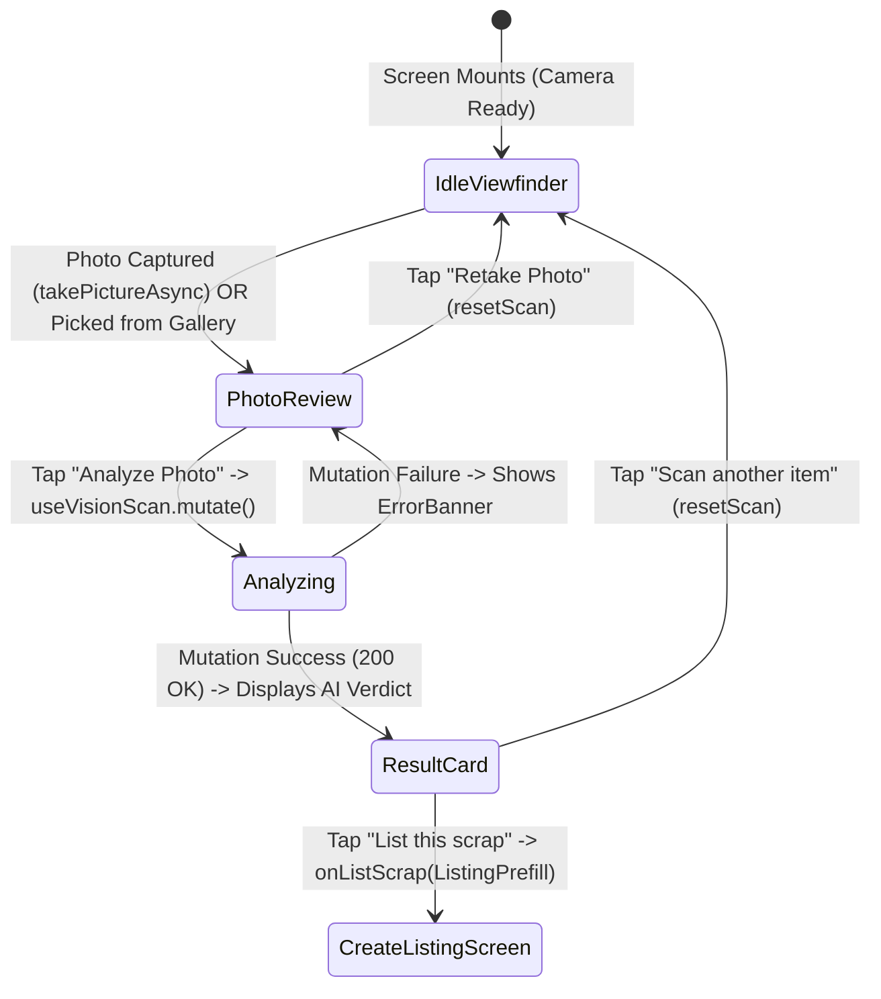

##### Core React Component Mechanics
1. **`VisionScanScreen.tsx`**:
   - **Client-Side Image Optimization**: Before transmission, raw camera photos are resized and compressed to $<500\text{ KB}$ using `compressPhoto()`:
     ```tsx
     const picture = await cameraRef.current.takePictureAsync({ quality: 0.7 });
     const prepared = await compressPhoto({
       uri: picture.uri,
       width: picture.width ?? 0,
       height: picture.height ?? 0,
     });
     setPhoto(prepared);
     ```
   - **Prefill Builder Contract**: Assembles normalized DTO matching `@chokro/shared` rules before calling `onListScrap`:
     ```tsx
     const buildPrefill = useCallback((): ListingPrefill => {
       const category = result!.classification.category;
       const condition = result!.classification.condition;
       const unit = getCategoryUnit(category);
       const rawQuantity = hasDeclaredQty ? declaredQtyNumber : result!.classification.quantity;
       const quantity = unit === 'piece' 
         ? Math.max(1, Math.round(rawQuantity)) 
         : Math.round(rawQuantity * 10) / 10;
       return { category, condition, unit, quantity, photo, seededAt: Date.now() };
     }, [declaredQtyNumber, hasDeclaredQty, photo, result]);
     ```
2. **`VisionResultCard.tsx`**:
   - **Animation & Invariant Indicators**: Uses `react-native-reanimated` (`FadeInUp`) to smoothly reveal the appraisal.
   - **Regulated E-Waste Safety Banner**:
     ```tsx
     {classification.is_ewaste_hazard ? <EwasteHazardBanner /> : null}
     ```
   - Renders rationale, suggested actions, and commodity drift comparison alongside the primary conversion button.
3. **`ConfidenceMeter.tsx` & `PathBadge.tsx`**:
   - Visual tokens mapped to confidence intervals ($>90\%$ green, $75-90\%$ blue, $<75\%$ amber) and distinct semantic colorways for all 5 circular transition paths.

---

### Feature 3: Smart Geo-Dispatch & Route Optimizer

#### What Problem It Solves
Individual scrap collections fail when drivers are sent to pickups without checking vehicle capacity, without checking required hazardous material licenses, or without optimizing driving routes across Dhaka traffic.

#### The 4-Step Dispatch Algorithm
1. **Candidate Filtering:** Queries all `partners` where `status = 'VERIFIED'` and `types` contains `'COLLECTOR'`.
2. **Constraint Enforcement:**
   - *License Check:* If scrap category is `E_WASTE`, collector **must** have `e_waste_licensed = true`.
   - *Geofence Radius:* $\text{HaversineDistance}(\text{Driver Base}, \text{Pickup}) \le \text{Driver Service Radius}$ (e.g. 10 km).
   - *Capacity Constraint:* $\text{Driver Remaining Capacity} \ge \text{Pickup Weight}$, where:
     $$\text{Remaining Capacity} = \text{Vehicle Capacity} - \sum(\text{Active Assigned Order Weights})$$
3. **Winner Selection:** Shortest distance driver is awarded the assignment.
4. **OSRM / Mapbox Matrix Route Optimization (TSP):**
   - Coordinates (Driver Base + all active pickup stops) are sent to **OSRM OpenStreetMap Table API** (100% Free & Keyless) or **Mapbox Matrix API**.
   - Solves the Traveling Salesperson Problem (TSP) using a greedy nearest-neighbor walk over the duration/distance cost matrix.
   - Calculates cumulative ETAs and ordered stop sequences ($1, 2, 3 \dots$).
   - *Fallback:* If external routing is unreachable, computes an internal mathematical Haversine distance matrix at an average speed of $25\text{ km/h}$.

#### Sequence Diagram

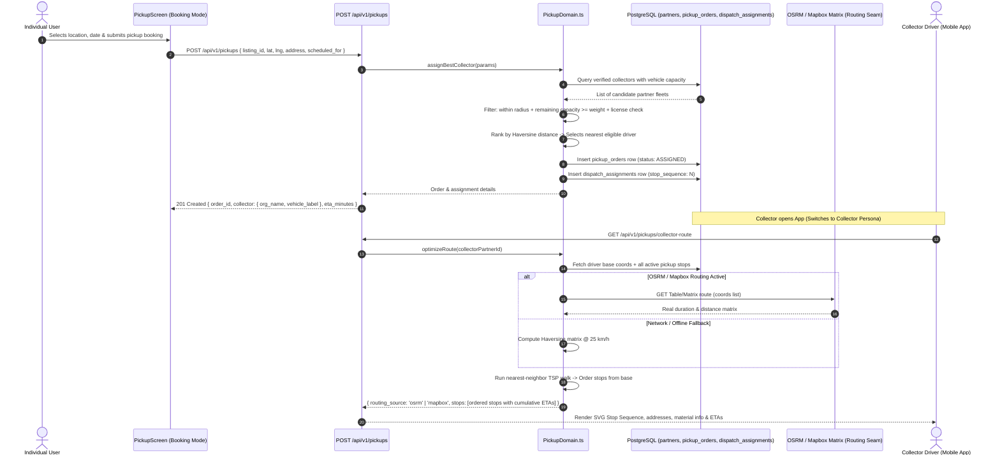

---

### Feature 4: B2B Bulk Scrap Auction & Live Bidding Engine

#### What Problem It Solves
Institutions and factories accumulating tons of scrap waste need competitive market pricing. Standard marketplace listings are slow and prone to underbidding. Chokro's B2B Auction platform enables recyclers to compete in live, high-frequency bidding events with strict financial and anti-collusion integrity rules.

#### Key Invariants & Financial Protections
1. **Sealed Reserve Price:** The seller's reserve price ($P_{\text{reserve}}$) is stored in the database but **never serialized to API responses**. Bidders only see `reserve_met: boolean`.
2. **Anti-Snipe Protection:** If a valid bid is placed in the final **2 minutes** before closing, the auction clock is automatically extended by an additional 2 minutes, preventing bot sniping.
3. **Server-Authoritative Monotonic Bidding:** Bids are assigned sequential `bid_number` values ($1, 2, 3\dots$) on the database layer. A bid is only valid if the server records it first.
4. **Minimum Increment Rule:** Every new bid must be at least $\mathbf{+৳50}$ higher than the current highest bid.
5. **Lazy Close:** Whenever a lot is requested after its closing timestamp, the server lazily updates the status to `ENDED` and stamps the winning bid if reserve was met.

#### Sequence Diagram

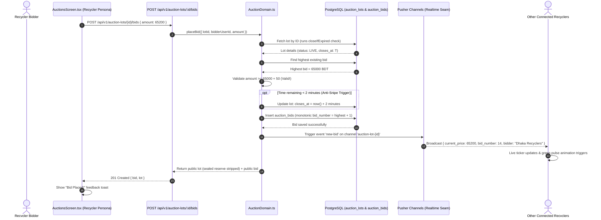

---

## 7. Cross-Team Dependencies & How to Defend Them to Your Teacher

When presenting, teachers frequently ask questions about cross-team collaboration, module boundaries, and what happens if another member's code is not running. 

Here is the exact architectural defense:

```
┌─────────────────────────────────────────────────────────────────────────────┐
│                             CHOKRO SYSTEM SEAMS                             │
├───────────────────────┬─────────────────────────┬───────────────────────────┤
│ Team Member / Module  │ Integration Point (Seam)│ Your Invariant & Handling │
├───────────────────────┼─────────────────────────┼───────────────────────────┤
│ m1: Sadat             │ partners table          │ F3 Dispatch checks:       │
│ (Trust & KYC)         │ (status, types,         │ - partner.status == VERIFIED│
│                       │  e_waste_licensed)      │ - partner.types includes  │
│                       │                         │   "COLLECTOR"             │
│                       │                         │ - e_waste_licensed == true│
├───────────────────────┼─────────────────────────┼───────────────────────────┤
│ m2: Sameer            │ listings table &        │ F2 AI Vision classifies   │
│ (Marketplace)         │ CreateListing form      │ and passes prefill DTO    │
│                       │                         │ directly into Sameer's    │
│                       │                         │ listing creation form.    │
├───────────────────────┼─────────────────────────┼───────────────────────────┤
│ m4: Imran             │ rate_card_entries &     │ F1 Valuation Engine       │
│ (Drop Zones & Wallet) │ rate_benchmarks         │ publishes the pricing API │
│                       │                         │ that Imran's Smart Bins   │
│                       │                         │ use to calculate credits. │
└───────────────────────┴─────────────────────────┴───────────────────────────┘
```

### Verbal Viva Q&A Script for Teacher Scrutiny

#### Q1: "What if Sadat's partner KYC module is down or unapproved? How does your Geo-Dispatch work?"
> **Answer:** *"Our system is designed with strict domain seams using the Repository Pattern. My `PickupDomain` queries the database contracts directly. During independent evaluation, my seed script (`pnpm db:setup`) seeds pre-verified partner collectors with valid vehicles and licenses. When Sadat's module is active, his KYC approval process directly updates the `e_waste_licensed` flag in the same database table, seamlessly feeding into my capacity and routing algorithm."*

#### Q2: "How does your AI Vision Agent connect to Sameer's Marketplace?"
> **Answer:** *"My Vision Agent accepts raw camera captures, extracts material properties, validates unit invariants (kg vs piece), and joins with our live database rate card. Once evaluated, it outputs a standardized `ListingPrefill` DTO. Clicking 'List this Scrap' hands off this DTO directly into the `CreateListingScreen`, pre-populating category, condition, estimated weight, and photos with zero duplicate data entry."*

#### Q3: "What if external APIs like Gemini, OpenAI, Mapbox, or Pusher fail or rate-limit during the evaluation?"
> **Answer:** *"Every single external integration has a deterministic, in-engine fallback:
> 1. **AI Vision:** Supports free Google Gemini Flash and OpenAI Vision, and falls back to an internal heuristic rule-based classifier that extracts category and condition while preserving all domain invariants and rate-card joins.
> 2. **Routing & Dispatch:** Uses 100% free OSRM (OpenStreetMap) or Mapbox matrix routing, and falls back to an internal mathematical Haversine distance matrix with nearest-neighbor TSP sequencing at 25 km/h city speed.
> 3. **Pusher Realtime:** The mobile app automatically activates a 4-second background polling cycle if WebSockets are unavailable.
> 4. **Commodity & FX Feed:** Falls back to calibrated baseline commodity spot rates. The system never crashes."*

#### Q4: "Why not just use a static database price table? Why build a dynamic benchmark engine with drift calculation?"
> **Answer:** *"Static pricing tables suffer from two fatal flaws in circular economies:
> 1. **Trust Deficit:** Users don't trust static numbers, suspecting the platform underpays them compared to market rates.
> 2. **Margin Vulnerability:** If global copper or polymer prices drop by 20%, a platform paying fixed rates suffers immediate margin collapse.
>
> Our engine continuously benchmarks local rate card prices against live international commodity quotes and real-time USD/BDT FX rates from free open feeds. It calculates percentage drift (`UNDER_MARKET`, `OVER_MARKET`, `IN_SYNC`), displaying dynamic transparent badges for users while warning platform operators when local rates drift out of alignment. Furthermore, our `effective_from` temporal versioning guarantees complete auditability for all wallet payouts and escrows without destructive overwrites."*

---

## 8. Role-Based Navigation & Persona Switcher Guide

To make grading effortless for your professor, the mobile app includes a **Role-Based Navigation System** and an active **Persona Chip**:

```
Role Tabs Mapping:
├── Individual: [ Browse | List | AI Scan | Pickup | Rates | Wallet | Scan ]
├── Collector:  [ Pickup (Route Map) | Browse | Rates | Wallet | Scan ]
├── Recycler:   [ Auctions (Live Bidding) | Pickup | Browse | Rates | Wallet ]
└── Admin:      [ Browse | Rates | Wallet ] + Web Console (/admin)
```

### How to Switch Roles Live
In the top navigation bar, the active persona badge is displayed (`Individual`, `Collector`, `Recycler`, `Admin`).
1. Sign out by tapping the logout icon in the top right.
2. Sign in with the desired demo account:
   - **Individual Demo:** `demo@chokro.com` / `Password123!`
   - **Collector Driver Demo:** `green.collector@chokro.com` / `Password123!`
   - **Recycler Bidder Demo:** `dhaka.recyclers@chokro.com` / `Password123!`
   - **Admin Demo:** `admin@chokro.com` / `Password123!`

---

## 9. Live Teacher Demonstration Script & Viva Defense (CO5 Preparation)

Follow this **4-minute step-by-step walkthrough** to showcase full marks across all 4 features:

```
┌─────────────────────────────────────────────────────────────────────────────┐
│                       CHOKRO 4-MINUTE DEMO SCRIPT                           │
├─────────────────────────────────────────────────────────────────────────────┤
│ 1. Rates Tab (Feature 1 - Valuation & Drift)                                │
│    - Open "Rates" tab.                                                      │
│    - Select "METAL" and condition "GOOD". Adjust quantity slider to 15 kg.  │
│    - Point out: Unit price (৳110/kg), total valuation (৳1,650), and the     │
│      drift badge ("Market aligned" / "12% under global index").             │
│                                                                             │
│ 2. AI Scan Tab (Feature 2 - AI Scrap Vision Agent)                          │
│    - Open "AI Scan" tab.                                                    │
│    - Tap the "E-Waste / Phone" sample chip or take a photo.                 │
│    - Tap "Analyze & Appraise Scrap".                                        │
│    - Point out: 94% confidence, automatic unit switch to 'piece', forced   │
│      'RECYCLE' safety path (non-overridable), and database pricing join.    │
│    - Tap "List this Scrap" -> Shows instant prefill in Create Listing form. │
│                                                                             │
│ 3. Pickup Tab (Feature 3 - Geo-Dispatch & Route Optimizer)                  │
│    - In Individual mode, book a pickup for the listed item.                 │
│    - Point out: Instant collector assignment ("Green Fleet Dispatch").      │
│    - Switch user to Collector: sign in as green.collector@chokro.com.       │
│    - Open "Pickup" tab -> Point out the ordered SVG stop graph, cumulative  │
│      driving ETAs, and Mapbox TSP route optimization.                       │
│                                                                             │
│ 4. Auctions Tab (Feature 4 - B2B Auction & Live Bidding)                    │
│    - Switch user to Recycler: sign in as dhaka.recyclers@chokro.com.        │
│    - Open "Auctions" tab -> Point out live countdown timer & sealed reserve.│
│    - Tap "+৳500" quick-bid button -> Watch the live pulse animation,        │
│      monotonic bid sequence number update, and WebSocket broadcast.         │
└─────────────────────────────────────────────────────────────────────────────┘
```

### Live Modification Viva (CO5) — Anticipated Teacher Requests

Teachers will ask you to change code live on the spot to prove authorship. Here are the exact locations:

| Teacher's Live Challenge | File to Modify | Lines / Exact Change |
| :--- | :--- | :--- |
| **"Change the minimum bid increment from ৳50 to ৳100"** | `apps/api/lib/domain/AuctionDomain.ts` | Change line 13: `export const MIN_BID_INCREMENT_BDT = 100;` |
| **"Change the anti-snipe extension time from 2 mins to 5 mins"** | `apps/api/lib/domain/AuctionDomain.ts` | Change line 15: `export const ANTI_SNIPE_WINDOW_MS = 5 * 60 * 1000;` |
| **"Change the market drift alert threshold from 10% to 15%"** | `apps/api/lib/domain/ValuationDomain.ts` | In `calculateDrift()`: Change `if (driftPct < -15)` and `else if (driftPct > 15)` |
| **"Make books and clothes use piece count instead of kg"** | `packages/shared/src/enums/index.ts` / `rules` | Move `'BOOKS'` and `'CLOTHES'` from `WEIGHT_CATEGORIES` to `PIECE_CATEGORIES` |
| **"Change the default vehicle driving speed from 25 km/h to 30 km/h"**| `apps/api/lib/domain/PickupDomain.ts` | Change line 6: `const FALLBACK_AVG_SPEED_KMH = 30;` |

---

## 10. Assignment 03: API & Postman Catalog

For Assignment 03, the server can be started on your custom student port using:
```bash
PORT=4589 pnpm --filter @chokro/api dev
```
*(Replace `4589` with the last 4 digits of your Student ID).*

### Documented REST Endpoints

#### 1. Valuation & Estimator (Feature 1)
- **`GET /api/v1/rate-card/estimate`**
  - Query Params: `category=METAL`, `condition=GOOD`, `weight=10.5`
  - Response: `{ unit_price_bdt: 110, total_estimated_bdt: 1155, benchmark_bdt: 116.38, drift_pct: -1.2, drift_status: "IN_SYNC" }`

#### 2. AI Vision Classification (Feature 2)
- **`POST /api/v1/valuation/classify-and-estimate`**
  - Headers: `Authorization: Bearer <JWT>`, `Content-Type: application/json`
  - Body: `{ "imageBase64": "data:image/jpeg;base64,...", "promptNotes": "Old copper wires" }`
  - Response: `{ "scan_id": "...", "classification": { "category": "METAL", "confidence": 0.94 }, "valuation": { "total_estimated_bdt": 1100 } }`

#### 3. Smart Dispatch & Pickup (Feature 3)
- **`POST /api/v1/pickups`**
  - Body: `{ "listingId": "...", "address": "...", "lat": 23.7937, "lng": 90.4066, "scheduledFor": "..." }`
  - Response: `{ "pickup": { "status": "ASSIGNED" }, "collector": { "partner": { "org_name": "Green Dhaka Logistics" }, "distance_km": 1.84 } }`
- **`GET /api/v1/pickups/collector-route`**
  - Headers: `Authorization: Bearer <COLLECTOR_JWT>`
  - Response: `{ "routing_source": "mapbox", "stops": [...] }`

#### 4. B2B Auctions & Realtime Bids (Feature 4)
- **`GET /api/v1/auction-lots`**
  - Response: `[ { "id": "...", "title": "500kg Industrial Copper", "current_price_bdt": 65000, "reserve_met": true, "bid_count": 12 } ]`
- **`POST /api/v1/auction-lots/:id/bids`**
  - Body: `{ "amount": 65500 }`
  - Response: `{ "bid": { "bid_number": 13, "amount_bdt": 65500 }, "lot": { "current_price_bdt": 65500 } }`

---

## 11. Summary & Checklist for Presentation Day
- [x] Run `pnpm test` to demonstrate **16 passing test suites (86 tests)**.
- [x] Launch both backend and mobile with `pnpm dev`.
- [x] Open mobile app in Expo Go or Simulator.
- [x] Demonstrate all 4 features using the Persona Chip.
- [x] Keep this guide open for quick reference during viva questioning.
