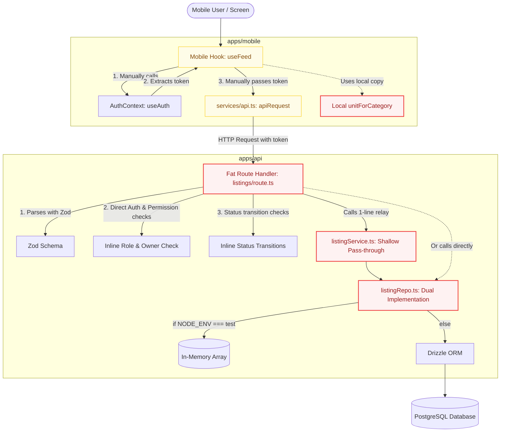
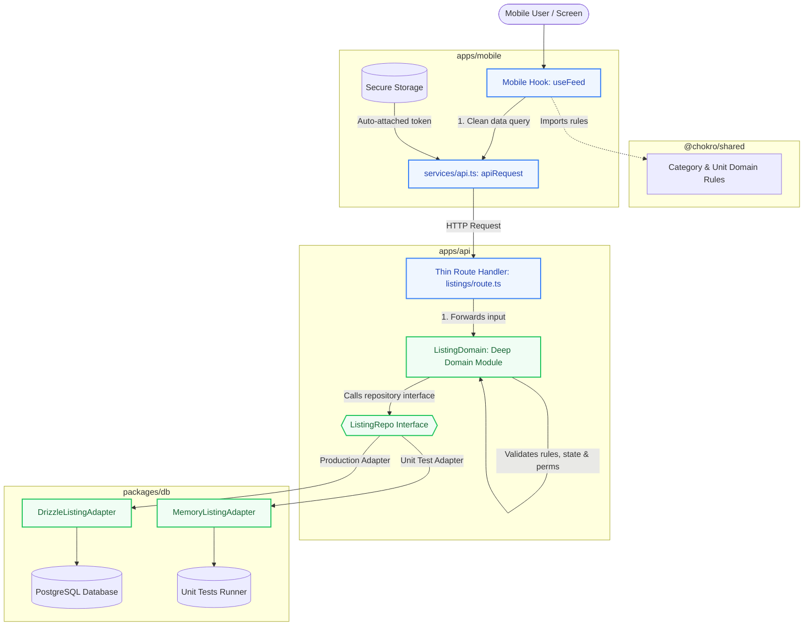
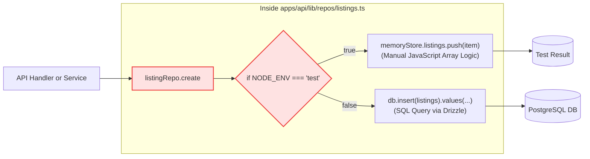
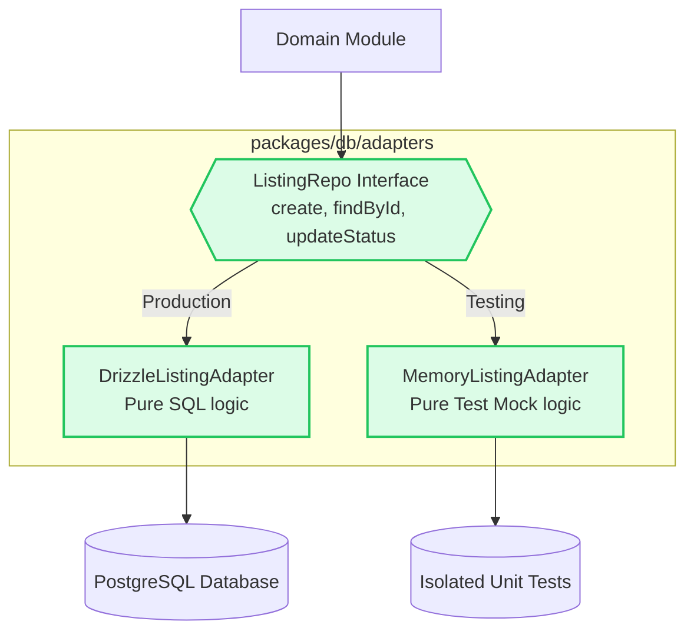
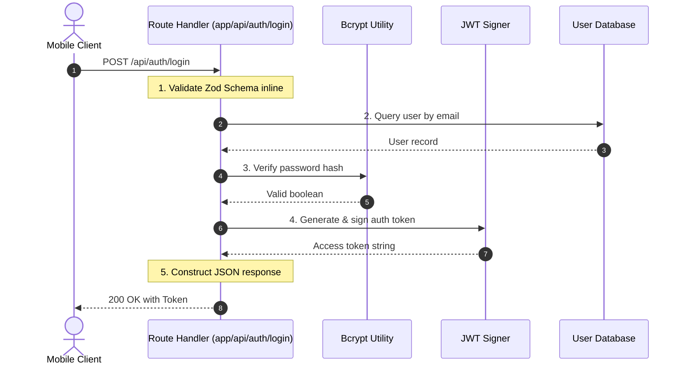
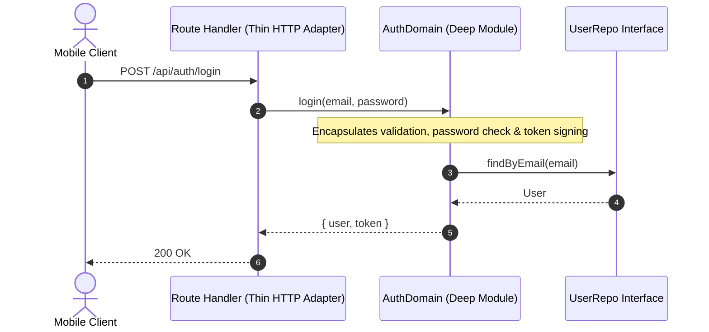
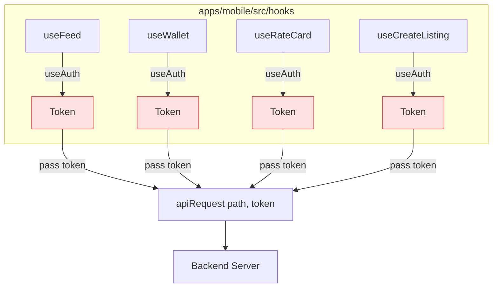
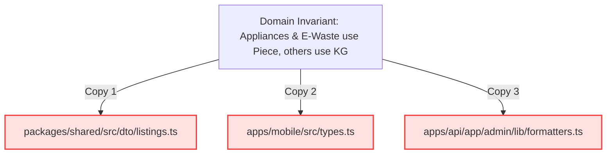
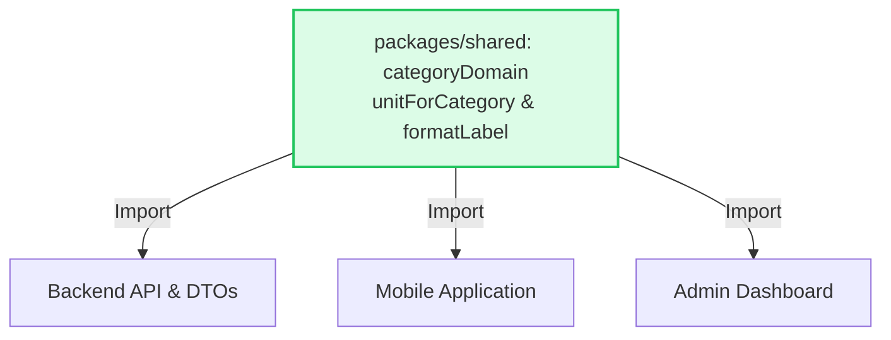

# Chokro Architecture Visual Flows (Mermaid Diagrams)

Visual before-and-after architecture flows comparing the past system with the optimized design.

---

## 🗺️ 1. End-to-End System Flow

### 🔴 Past Architecture Flow (Tangled & Leaky)



---

### 🟢 Optimized Architecture Flow (Clean & Pluggable)



---

## 🔍 2. Problem-by-Problem Detailed Flows

---

### 1. Database & Testing Seam (Problem #1)

#### 🔴 Before: Dual SQL + Memory code inside every single repo function


#### 🟢 After: Clean Pluggable Adapters behind an Interface


---

### 2. Backend Route Handling (Problem #2)

#### 🔴 Before: Fat Route Handler doing everything


#### 🟢 After: Thin Route + Reusable Deep Domain Module


---

### 3. Mobile Network & Token Management (Problem #3)

#### 🔴 Before: Every Hook manually threads auth tokens


#### 🟢 After: Network client automatically injects tokens
```mermaid
flowchart TD
    subgraph Hooks["apps/mobile/src/hooks"]
        H1[useFeed]
        H2[useWallet]
        H3[useRateCard]
        H4[useCreateListing]
    end
    
    H1 -->|clean call: apiRequest('/feed')| API[apiRequest client]
    H2 -->|clean call: apiRequest('/wallet')| API
    H3 -->|clean call: apiRequest('/rate-card')| API
    H4 -->|clean call: apiRequest('/listings')| API

    Storage[(Secure Token Storage)] -.->|Auto-injected| API
    API --> Backend[Backend Server]

    classDef good fill:#dcfce7,stroke:#22c55e,stroke-width:2px;
    class API,Storage good;
```

---

### 4. Category & Unit Rules (Problem #4)

#### 🔴 Before: Duplicate rule in 3 separate repositories/folders


#### 🟢 After: Single Source of Truth

