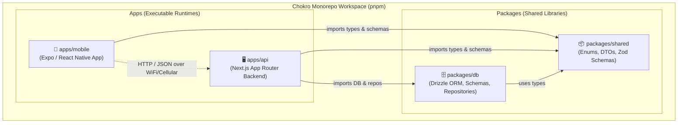
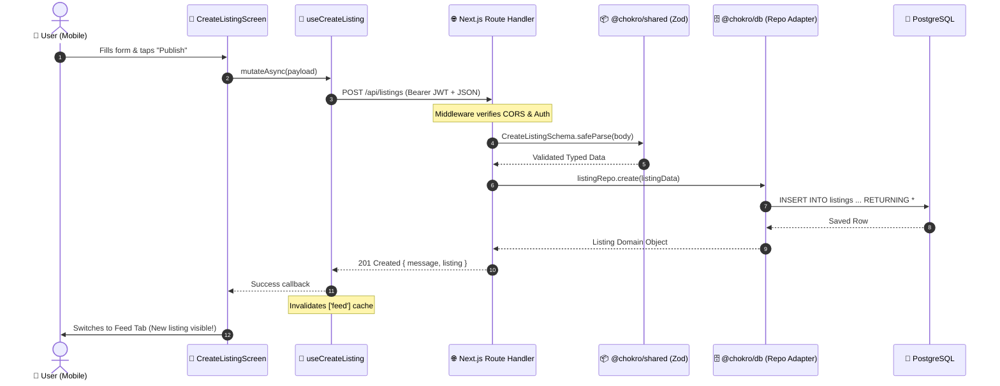

# Chokro High-Level Architecture & Intuition Guide

> **Goal of this Guide**: To bridge the gap between understanding isolated code files and developing an instinctive mental model for how the entire Chokro system connects, communicates, and enforces rules across all layers.

---

## 1. The Big Picture: What is Chokro?

Chokro is a circular economy and scrap recycling marketplace. It connects three key personas:
1. **Individuals & Households** who want to sell or donate recyclable materials (plastics, paper, appliances, e-waste).
2. **Scrap Collectors & Recyclers (Partners)** who collect, process, and weigh materials.
3. **Admins & Institutions** who manage rate cards, drop-zones, and financial credit ledger reconciliations.

To make this seamless, reliable, and testable, the codebase is structured as a **TypeScript Monorepo** managed by `pnpm`.



---

## 2. The 4 Layers & "Dependency Gravity"

Think of the monorepo as a 4-tier building. Code can only flow **downwards** or across clearly defined network interfaces:

| Layer | Location | Role in Plain English | Mental Model |
| :--- | :--- | :--- | :--- |
| **1. The Treaty** | [`packages/shared`](file:///Users/sharzilnafis/Desktop/Project/chokro/packages/shared) | The common language and validation rules that both frontend and backend agree upon. | **The Legal Contract**: If a rule isn't written here, neither side knows it exists. |
| **2. The Vault** | [`packages/db`](file:///Users/sharzilnafis/Desktop/Project/chokro/packages/db) | Database tables, SQL migrations, ORM definitions, and storage adapters. | **The Bank Vault**: Stores the permanent truth on disk (PostgreSQL) or in memory for testing. |
| **3. The Conductor** | [`apps/api`](file:///Users/sharzilnafis/Desktop/Project/chokro/apps/api) | Receives HTTP requests, authenticates callers, enforces business logic, and coordinates database reads/writes. | **The Security Guard & Traffic Controller**: Checks IDs, validates tickets, and tells the vault what to store. |
| **4. The Cockpit** | [`apps/mobile`](file:///Users/sharzilnafis/Desktop/Project/chokro/apps/mobile) | The user interface on iOS/Android. Captures user input, queries the API, caches data, and displays views. | **The Pilot's Display**: Shows information, responds to button presses, and communicates with the control tower (API). |

### 🚨 The Golden Rule of Monorepo Imports
- `packages/shared` **NEVER** imports anything from `packages/db`, `apps/api`, or `apps/mobile`. It is pure TypeScript and Zod.
- `packages/db` imports from `packages/shared`, but **NEVER** from `apps/*`.
- `apps/mobile` **NEVER** imports from `packages/db` or `apps/api`. It only talks to the API via HTTP network requests (`fetch`).
- `apps/api` imports from `packages/shared` and `packages/db`.

---

## 3. Developing Intuition: Why is it Built This Way?

### Intuition 1: Why share DTOs between Mobile and API?
* **The Problem without Shared DTOs**: If the backend changes a field name from `weight` to `declaredWeight`, the frontend breaks silently at runtime. You only find out when a user presses a button and gets a crash.
* **The Chokro Solution**: In [`packages/shared/src/dto/listings.ts`](file:///Users/sharzilnafis/Desktop/Project/chokro/packages/shared/src/dto/listings.ts), we write `CreateListingSchema` **once** using Zod.
  - The **mobile app** uses TypeScript types inferred from `CreateListingSchema` so autocomplete ensures you provide the exact right fields.
  - The **backend** runs `CreateListingSchema.safeParse(body)` to guarantee malicious or malformed payloads are rejected with 400 Bad Request before touching business logic.

### Intuition 2: Why the Repository Pattern in `packages/db`?
* **The Problem**: If your route handlers directly write SQL or Drizzle queries (`db.select().from(listings)...`), you cannot easily test your backend without running a live PostgreSQL database docker container.
* **The Chokro Solution**: We separate the **Interface** from the **Storage Engine**:
  ```typescript
  // 1. The Interface (The Promise)
  interface ListingRepository {
    create(data: NewListing): Promise<Listing>;
    findById(id: string): Promise<Listing | null>;
  }

  // 2. Adapter A: Production (PostgreSQL + Drizzle)
  class DrizzleListingAdapter implements ListingRepository { ... }

  // 3. Adapter B: Tests (Fast In-Memory Javascript Array)
  class MemoryListingAdapter implements ListingRepository { ... }
  ```
  - **Result**: Unit and integration tests run in milliseconds in pure memory without Docker, while production code talks to real PostgreSQL with zero code rewrites.

### Intuition 3: Why React Query (TanStack Query) in `apps/mobile`?
* **The Problem**: Managing network loading spinners, error alerts, cache staleness, and pull-to-refresh manually with `useState` and `useEffect` creates spaghetti code and stale screens.
* **The Chokro Solution**:
  - `useFeed()` handles cache keys (`['feed', category, condition]`), pagination, and background refetching.
  - `useCreateListing()` automatically invalidates the `['feed']` cache on success (`queryClient.invalidateQueries({ queryKey: ['feed'] })`).
  - When the user publishes a listing, the feed automatically refreshes without manual event buses or callbacks.

---

## 4. Architectural Boundaries & Communication Matrix



---

## 5. Summary Cheat Sheet for Mental Models

1. **Need to add a new category or field?**
   - Start in [`packages/shared`](file:///Users/sharzilnafis/Desktop/Project/chokro/packages/shared) (Update Enum or DTO schema).
   - Update [`packages/db`](file:///Users/sharzilnafis/Desktop/Project/chokro/packages/db) (Schema column & migration).
   - Update [`apps/api`](file:///Users/sharzilnafis/Desktop/Project/chokro/apps/api) (Service & Route handler).
   - Update [`apps/mobile`](file:///Users/sharzilnafis/Desktop/Project/chokro/apps/mobile) (Form UI & API call).
2. **Need to understand where business rules live?**
   - Pure validation rules (e.g. "appliances cannot be measured in kilograms"): [`packages/shared/src/dto`](file:///Users/sharzilnafis/Desktop/Project/chokro/packages/shared/src/dto).
   - Database integrity & ledger invariants (e.g. "credit transactions cannot be edited or deleted"): [`packages/db/src/schema.ts`](file:///Users/sharzilnafis/Desktop/Project/chokro/packages/db/src/schema.ts) & migrations.
   - Workflow & authorization rules (e.g. "only verified partners can accept drop-offs"): [`apps/api/lib`](file:///Users/sharzilnafis/Desktop/Project/chokro/apps/api/lib).
   - Presentation & UX flow (e.g. "compress photos to <500KB before uploading"): [`apps/mobile/src/lib`](file:///Users/sharzilnafis/Desktop/Project/chokro/apps/mobile/src/lib).

---

*Next Step: To see how every single line of code and byte of data moves across these layers, open the companion guide: [In-Depth Flow Walkthrough](file:///Users/sharzilnafis/Desktop/Project/chokro/docs/architecture/in-depth-flow-walkthrough.md).*
