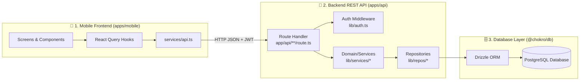
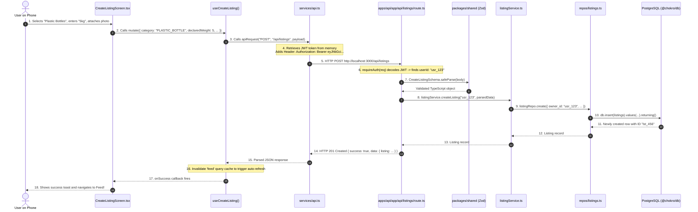

# Chokro Complete System Architecture & Data Flow Guide

This document is a comprehensive, ground-up guide to understanding the entire Chokro platform — how the database, backend, and mobile frontend work together, how code is structured across the monorepo, and the step-by-step journey of data through every layer.

---

## 1. What is Chokro? (The Core Product)

**Chokro** (চক্র, meaning *Cycle/Circle*) is a waste management and circular economy platform built for Bangladesh. 

### The Core User Loops:
1. **Recycler (User)**: Collects recyclable materials (e.g., PET plastic bottles, paper, metal, e-waste), creates a **Listing** with weight and photos, and deposits it at a physical **Drop Zone** (smart bin or collection booth) by scanning a QR code.
2. **Eco-Points & Wallet**: For every deposit, the user earns **Eco-Points** based on dynamic **Rate Cards** (e.g., 1 kg plastic = 30 points). Points accumulate in a **Wallet** and can be converted to monetary balance (BDT) or redeemed.
3. **Partners & Admins**: Collection partners verify the weight and condition of deposits and manage drop zones.

---

## 2. Monorepo Structure: What Every Folder Does

Chokro is organized as a **monorepo** (a single Git repository containing multiple sub-projects that share code):

```
chokro/
├── packages/
│   ├── shared/        <-- 📦 Shared TypeScript Types, Enums & Zod Schemas
│   └── db/            <-- 🗄️ PostgreSQL Database Schemas (Drizzle ORM) & Migrations
├── apps/
│   ├── api/           <-- 🚀 Backend REST API (Next.js App Router)
│   └── mobile/        <-- 📱 Mobile Application (React Native / Expo)
└── docs/              <-- 📚 Documentation Hub
```

### Why is it split this way?
- **`packages/shared`**: Holds validation schemas (Zod) and enums (e.g. `ListingStatus`, `WasteCategory`). Both the mobile app and backend import from here. If a validation rule changes, both frontend and backend update simultaneously.
- **`packages/db`**: Defines what the database tables look like in PostgreSQL using Drizzle ORM.
- **`apps/api`**: The server that receives HTTP requests from the mobile app, checks permissions, runs business logic, and talks to PostgreSQL.
- **`apps/mobile`**: The user interface on iOS and Android phones.

---

## 3. The 3 Core Pillars: DB, Backend, and Frontend



---

### Pillar 1: The Database Layer (`packages/db`)
* **Technology**: PostgreSQL + [Drizzle ORM](https://orm.drizzle.team/)
* **What it does**: Defines the schema tables and handles database connections.

#### Key Database Tables (`packages/db/src/schema/`):
1. **`users`**: User accounts, email, hashed passwords (bcrypt), roles (`RECYCLER`, `PARTNER`, `ADMIN`), and account status (`ACTIVE`, `SUSPENDED`).
2. **`listings`**: Recycling listings created by users (`category`, `declared_weight`, `piece_count`, `photos`, `status`: `DRAFT`, `ACTIVE`, `CANCELLED`).
3. **`transactions`**: Ledger of eco-point awards and redemptions in user wallets (`amount`, `type`: `EARNED`, `REDEEMED`, `status`: `VERIFIED`, `PENDING`).
4. **`rate_cards`**: Current conversion rates for waste types (e.g., PET Plastic = 30 pts/kg).
5. **`drop_zones`**: Physical drop-off locations and their secure QR tokens.

---

### Pillar 2: The Backend REST API (`apps/api`)
* **Technology**: Next.js App Router (TypeScript)
* **What it does**: Exposes HTTP endpoints that the mobile app calls.

#### How a Request is Processed in the Backend:
1. **Route Handler (`apps/api/app/api/**/route.ts`)**: The entry point for an HTTP URL (e.g., `POST /api/listings`).
2. **Authentication (`apps/api/lib/auth.ts`)**: Decodes the JWT token sent in the `Authorization: Bearer <token>` header to identify who is making the request (`userId`, `role`).
3. **Validation (`packages/shared/src/dto/`)**: Uses Zod to verify the incoming JSON payload (e.g., weight is positive, category is valid).
4. **Business Logic / Services (`apps/api/lib/services/`)**: Enforces business rules (e.g., calculating points, checking if account is active).
5. **Repositories (`apps/api/lib/repos/`)**: Executes SQL queries against PostgreSQL via Drizzle ORM.

---

### Pillar 3: The Mobile Frontend (`apps/mobile`)
* **Technology**: React Native with Expo, React Navigation, and TanStack React Query.
* **What it does**: Runs on the user's phone, renders the UI, and sends network requests to the backend.

#### Key Frontend Layers:
1. **Screens (`apps/mobile/src/screens/`)**:
   - `FeedScreen.tsx`: Shows active listings and public activity.
   - `CreateListingScreen.tsx`: Form to select waste category, enter weight, take a photo, and submit.
   - `WalletScreen.tsx`: Displays verified/pending points and transaction history.
   - `QRScannerScreen.tsx`: Camera scanner to read Drop Zone QR codes.
   - `LoginScreen.tsx` / `RegisterScreen.tsx`: Authentication screens.
2. **State & Context (`apps/mobile/src/context/AuthContext.tsx`)**:
   - Stores the logged-in user and auth token in memory + Secure Storage on the device.
3. **Data Hooks (`apps/mobile/src/hooks/`)**:
   - Uses React Query (`useFeed`, `useWallet`, `useCreateListing`) to fetch data asynchronously, handle loading spinners, and cache responses.
4. **API Client (`apps/mobile/src/services/api.ts`)**:
   - The central `fetch()` wrapper that automatically attaches the user's JWT token to every request and handles network errors.

---

## 4. End-to-End Walkthrough: Creating a Listing

Here is the exact, step-by-step path of execution when a user creates a listing:



---

## 5. Why Are We Improving the Architecture?

Now that the flow is clear, here is why our previous code needed architecture improvements:

### Problem 1: Dual-Implementation Branching in Repositories
- **The Issue**: In [`apps/api/lib/repos/listings.ts`](file:///Users/sharzilnafis/Desktop/Project/chokro/apps/api/lib/repos/listings.ts), every database function has an `if (process.env.NODE_ENV === 'test')` check. If testing, it writes to a temporary JavaScript array (`memoryStore.listings.push(...)`); if production, it runs SQL.
- **The Risk**: Writing database queries twice (once in SQL, once in JavaScript array filters) means the two implementations easily diverge and hide bugs.
- **The Solution (Candidate 1)**: Define clean **Repository Interfaces** (`ListingRepository`) and separate `DrizzleListingAdapter` (for real SQL) from `MemoryListingAdapter` (for fast tests).

### Problem 2: Route Handlers Doing Too Much (Fat Routes)
- **The Issue**: In [`apps/api/app/api/auth/login/route.ts`](file:///Users/sharzilnafis/Desktop/Project/chokro/apps/api/app/api/auth/login/route.ts), the route handler directly runs password hashing, token signing, and database lookups.
- **The Risk**: Business logic cannot be tested or reused without creating fake HTTP requests.
- **The Solution (Candidate 2)**: Move business rules into cohesive **Domain Modules** (`authDomain`, `listingDomain`, `walletDomain`) so route handlers only handle HTTP transport.
