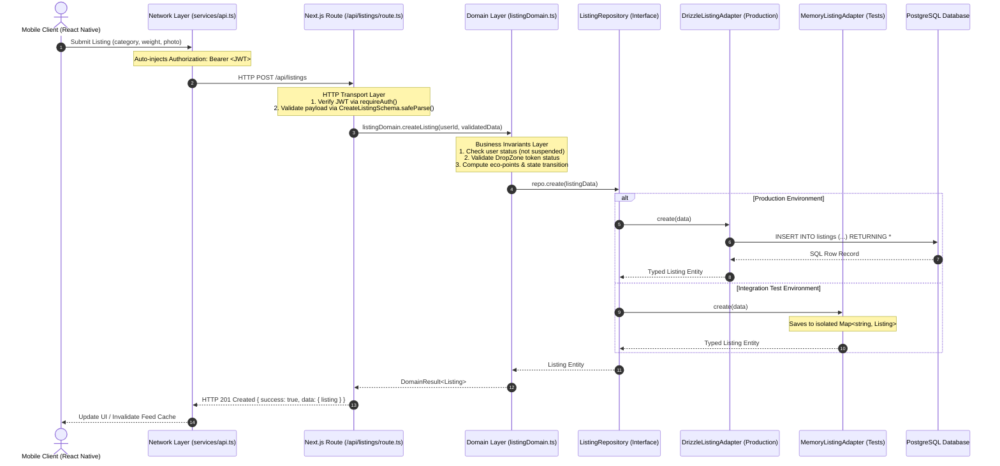
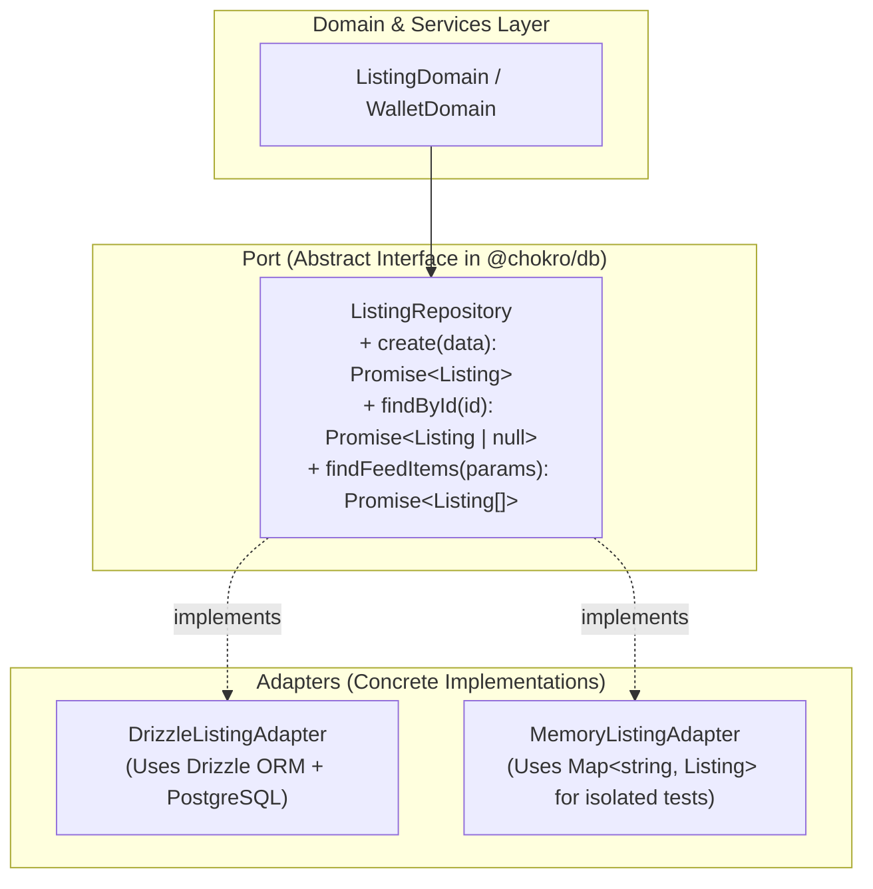
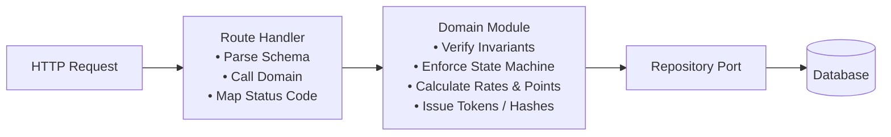

# Technical Architecture Breakdown & Deepening Guide

**Repository:** `chokro` (Monorepo: `@chokro/db`, `@chokro/shared`, `apps/api`, `apps/mobile`)  
**Target:** Implementation of Architecture Improvement Candidates #1 & #2

---

## 1. System Architecture & End-to-End Data Flow

The following diagram illustrates the complete, layered request lifecycle in Chokro from client interaction to durable persistence:



---

## 2. Candidate 1: Pluggable Repository Pattern (`@chokro/db`)

### 2.1 The Architectural Flaw in Current Code
Currently, every database repository method in [`apps/api/lib/repos/`](file:///Users/sharzilnafis/Desktop/Project/chokro/apps/api/lib/repos) uses `databaseOrTestStore()` to branch at runtime based on `process.env.NODE_ENV === 'test'`.

#### Real Code: `apps/api/lib/repos/listings.ts` (Current State)
```typescript
import { db, listings, memoryStore } from '@chokro/db';
import { databaseOrTestStore } from '../database';
import { and, desc, eq, lt, or } from 'drizzle-orm';
import crypto from 'crypto';

export const listingRepo = {
  // PROBLEM: Every single method contains two complete parallel implementations
  async create(values: CreateListingInput) {
    return databaseOrTestStore(
      // Branch A: Production Drizzle SQL
      async () => (await db.insert(listings).values(values).returning())[0],
      // Branch B: Test In-Memory Array Mutation
      () => {
        const listing = {
          id: crypto.randomUUID(),
          ...values,
          created_at: new Date(),
        };
        memoryStore.listings.push(listing); // Untyped global mutable state
        return listing;
      },
    );
  },

  async findFeedItems({ category, condition, cursor, limit }: FindFeedItemsParams) {
    const filters = [eq(listings.status, 'ACTIVE')];
    if (category) filters.push(eq(listings.category, category));
    if (condition) filters.push(eq(listings.declared_condition, condition));
    // ...

    return databaseOrTestStore(
      // Real SQL pagination
      () => db.select().from(listings).where(and(...filters)).orderBy(desc(listings.created_at)).limit(limit + 1),
      // Hand-rolled in-memory JavaScript array sorting and cursor simulation
      () =>
        memoryStore.listings
          .filter((item) => {
            if (item.status !== 'ACTIVE' || (category && item.category !== category)) return false;
            if (!cursor) return true;
            const itemTime = new Date(item.created_at).getTime();
            return itemTime < new Date(cursor.createdAt).getTime();
          })
          .sort((a, b) => new Date(b.created_at).getTime() - new Date(a.created_at).getTime())
          .slice(0, limit + 1),
    );
  },
};
```

### 2.2 Why This Breaks Engineering Standards
1. **Violation of Single Responsibility Principle (SRP)**: The repository file simultaneously acts as a SQL query builder, a test mock harness, an in-memory array database, and a runtime environment switch.
2. **Behavioral Divergence**: If SQL logic is updated (e.g. adding index filters, JSON column parsing, default values), the in-memory branch easily goes out of sync, causing tests to pass while production fails.
3. **Polluted Production Artifacts**: Test state structures (`memoryStore`) and runtime branching logic are compiled into production server bundles.

---

### 2.3 The Target Architecture: Hexagonal / Ports & Adapters



#### Step 1: Define Explicit Interface in `@chokro/db` (`packages/db/src/repos/interfaces.ts`)
```typescript
import type { Listing, NewListing } from '../schema/listings';

export interface FindFeedParams {
  category?: string | null;
  condition?: string | null;
  cursor?: { createdAt: string; id: string } | null;
  limit: number;
}

export interface ListingRepository {
  create(data: NewListing): Promise<Listing>;
  findById(id: string): Promise<Listing | null>;
  findByOwnerId(ownerId: string): Promise<Listing[]>;
  updateStatus(id: string, status: string): Promise<Listing | null>;
  findFeedItems(params: FindFeedParams): Promise<Listing[]>;
}
```

#### Step 2: Implement Production Drizzle Adapter (`packages/db/src/repos/drizzle/DrizzleListingAdapter.ts`)
```typescript
import { and, desc, eq, lt, or } from 'drizzle-orm';
import type { NodePgDatabase } from 'drizzle-orm/node-postgres';
import { listings, type Listing, type NewListing } from '../../schema/listings';
import type { FindFeedParams, ListingRepository } from '../interfaces';

export class DrizzleListingAdapter implements ListingRepository {
  constructor(private readonly db: NodePgDatabase<any>) {}

  async create(data: NewListing): Promise<Listing> {
    const [created] = await this.db.insert(listings).values(data).returning();
    return created;
  }

  async findById(id: string): Promise<Listing | null> {
    const [result] = await this.db.select().from(listings).where(eq(listings.id, id));
    return result ?? null;
  }

  async findByOwnerId(ownerId: string): Promise<Listing[]> {
    return this.db.select().from(listings).where(eq(listings.owner_id, ownerId));
  }

  async updateStatus(id: string, status: string): Promise<Listing | null> {
    const [updated] = await this.db.update(listings).set({ status }).where(eq(listings.id, id)).returning();
    return updated ?? null;
  }

  async findFeedItems({ category, condition, cursor, limit }: FindFeedParams): Promise<Listing[]> {
    const filters = [eq(listings.status, 'ACTIVE')];
    if (category) filters.push(eq(listings.category, category));
    if (condition) filters.push(eq(listings.declared_condition, condition));
    if (cursor) {
      const createdAt = new Date(cursor.createdAt);
      filters.push(
        or(
          lt(listings.created_at, createdAt),
          and(eq(listings.created_at, createdAt), lt(listings.id, cursor.id)),
        )!,
      );
    }

    return this.db
      .select()
      .from(listings)
      .where(and(...filters))
      .orderBy(desc(listings.created_at), desc(listings.id))
      .limit(limit + 1);
  }
}
```

#### Step 3: Implement Isolated Memory Adapter (`packages/db/src/repos/memory/MemoryListingAdapter.ts`)
```typescript
import crypto from 'crypto';
import type { Listing, NewListing } from '../../schema/listings';
import type { FindFeedParams, ListingRepository } from '../interfaces';

export class MemoryListingAdapter implements ListingRepository {
  private readonly store = new Map<string, Listing>();

  constructor(initialData: Listing[] = []) {
    initialData.forEach((item) => this.store.set(item.id, { ...item }));
  }

  async create(data: NewListing): Promise<Listing> {
    const record: Listing = {
      id: crypto.randomUUID(),
      created_at: new Date(),
      updated_at: new Date(),
      ...data,
    } as Listing;
    this.store.set(record.id, record);
    return { ...record };
  }

  async findById(id: string): Promise<Listing | null> {
    const item = this.store.get(id);
    return item ? { ...item } : null;
  }

  async findByOwnerId(ownerId: string): Promise<Listing[]> {
    return Array.from(this.store.values())
      .filter((item) => item.owner_id === ownerId)
      .map((item) => ({ ...item }));
  }

  async updateStatus(id: string, status: string): Promise<Listing | null> {
    const item = this.store.get(id);
    if (!item) return null;
    item.status = status;
    item.updated_at = new Date();
    return { ...item };
  }

  async findFeedItems({ category, condition, cursor, limit }: FindFeedParams): Promise<Listing[]> {
    return Array.from(this.store.values())
      .filter((item) => {
        if (item.status !== 'ACTIVE') return false;
        if (category && item.category !== category) return false;
        if (condition && item.declared_condition !== condition) return false;
        if (!cursor) return true;
        const itemTime = new Date(item.created_at).getTime();
        const cursorTime = new Date(cursor.createdAt).getTime();
        return itemTime < cursorTime || (itemTime === cursorTime && item.id < cursor.id);
      })
      .sort((a, b) => new Date(b.created_at).getTime() - new Date(a.created_at).getTime() || b.id.localeCompare(a.id))
      .slice(0, limit + 1)
      .map((item) => ({ ...item }));
  }

  clear(): void {
    this.store.clear();
  }
}
```

---

## 3. Candidate 2: Domain Layer & Pure HTTP Route Handlers

### 3.1 The Architectural Flaw in Current Code
Currently, Next.js route handlers execute core business transactions directly, while "service" classes are redundant one-line forwarders.

#### Real Code: `apps/api/app/api/auth/login/route.ts` (Current State)
```typescript
import { userRepo } from '../../../../lib/repos/users';
import { comparePassword, signToken } from '../../../../lib/auth';
import { apiError, apiSuccess, safeRoute } from '../../../../lib/http';
import { LoginSchema } from '@chokro/shared';

// PROBLEM: The Route Handler directly executes password hashing, JWT creation, and DB queries
export const POST = safeRoute(async (req: Request) => {
  const body = await req.json();
  const parsed = LoginSchema.safeParse(body);
  if (!parsed.success) {
    return apiError('Invalid credentials', 401);
  }

  const { email, password } = parsed.data;
  const user = await userRepo.findByEmail(email);

  if (!user || !comparePassword(password, user.password_hash)) {
    return apiError('Invalid credentials', 401);
  }

  const token = signToken({
    userId: user.id,
    email: user.email,
    role: user.role,
  });

  return apiSuccess('Login successful', {
    user: { id: user.id, email: user.email, role: user.role, institutionId: user.institution_id },
    token,
  });
});
```

#### Real Code: `apps/api/lib/services/listingService.ts` (Current State)
```typescript
import { listingRepo } from '@/lib/repos/listings';

// PROBLEM: The service is an anemic pass-through wrapper
export const listingService = {
  async getListingById(id: string) {
    return listingRepo.findById(id); // 1-line wrapper
  },
  async getListingsByOwner(ownerId: string) {
    return listingRepo.findByOwnerId(ownerId); // 1-line wrapper
  },
  async updateListingStatus(id: string, status: ListingStatus) {
    return listingRepo.updateStatus(id, status); // 1-line wrapper
  }
};
```

---

### 3.2 The Target Architecture: Cohesive Domain Modules



#### Step 1: Create Deep Domain Module (`apps/api/lib/domain/authDomain.ts`)
```typescript
import { comparePassword, hashPassword, signToken } from '@/lib/auth';
import type { UserRepository } from '@chokro/db';

export interface AuthSession {
  user: {
    id: string;
    email: string;
    role: string;
    institutionId: string | null;
  };
  token: string;
}

export class AuthDomain {
  constructor(private readonly userRepo: UserRepository) {}

  async authenticate(email: string, password: string): Promise<AuthSession | null> {
    const user = await this.userRepo.findByEmail(email.toLowerCase().trim());
    if (!user) return null;

    if (user.status === 'SUSPENDED') {
      throw new Error('USER_SUSPENDED');
    }

    const isValid = comparePassword(password, user.password_hash);
    if (!isValid) return null;

    const token = signToken({
      userId: user.id,
      email: user.email,
      role: user.role,
    });

    return {
      user: {
        id: user.id,
        email: user.email,
        role: user.role,
        institutionId: user.institution_id,
      },
      token,
    };
  }
}
```

#### Step 2: Refactor Route Handler to Thin HTTP Adapter (`apps/api/app/api/auth/login/route.ts`)
```typescript
import { authDomain } from '@/lib/domain';
import { apiError, apiSuccess, safeRoute } from '@/lib/http';
import { LoginSchema } from '@chokro/shared';

export const POST = safeRoute(async (req: Request) => {
  const body = await req.json();
  const parsed = LoginSchema.safeParse(body);
  if (!parsed.success) {
    return apiError('Invalid request payload', 400, parsed.error.format());
  }

  try {
    const session = await authDomain.authenticate(parsed.data.email, parsed.data.password);
    if (!session) {
      return apiError('Invalid credentials', 401);
    }
    return apiSuccess('Login successful', session);
  } catch (err: any) {
    if (err.message === 'USER_SUSPENDED') {
      return apiError('Account has been suspended', 403);
    }
    throw err;
  }
});
```

---

## 4. Key Terminology & Invariants Reference

| Architectural Concept | Definition | Concrete Implementation in Chokro |
| :--- | :--- | :--- |
| **Port (Interface)** | An abstract contract specifying *what* operations are needed without specifying *how* they are implemented. | `ListingRepository`, `WalletRepository`, `UserRepository` in `@chokro/db`. |
| **Adapter** | A concrete class that implements a Port for a specific technology. | `DrizzleListingAdapter` (PostgreSQL), `MemoryListingAdapter` (RAM for test suite). |
| **Domain Invariant** | A core business constraint that must remain true under all circumstances. | • Listing weight must be $> 0$.<br>• Status transition must follow `DRAFT -> ACTIVE -> CANCELLED`.<br>• Wallet transactions cannot be claimed twice. |
| **HTTP Transport Adapter** | Code responsible solely for network serialization, HTTP status codes, headers, and request routing. | Next.js `route.ts` files inside `apps/api/app/api/**`. |

---

## 5. Execution Plan

1. **Phase 1: Database Layer (`@chokro/db`)**
   - Create `packages/db/src/repos/interfaces.ts` (`ListingRepository`, `UserRepository`, `WalletRepository`, `PartnerRepository`, `RateCardRepository`, `DropZoneRepository`).
   - Implement `Drizzle*Adapter` in `packages/db/src/repos/drizzle/`.
   - Implement `Memory*Adapter` in `packages/db/src/repos/memory/`.
   - Export repository container from `@chokro/db`.
   - Remove `apps/api/lib/database.ts` runtime `databaseOrTestStore` branching.

2. **Phase 2: API Domain Layer (`apps/api`)**
   - Create domain services in `apps/api/lib/domain/` (`authDomain`, `listingDomain`, `walletDomain`).
   - Wire domain dependencies to repository interfaces.
   - Refactor route handlers to delegate all business decisions to domain classes.
   - Run full unit and integration test suite to verify 100% test pass.
