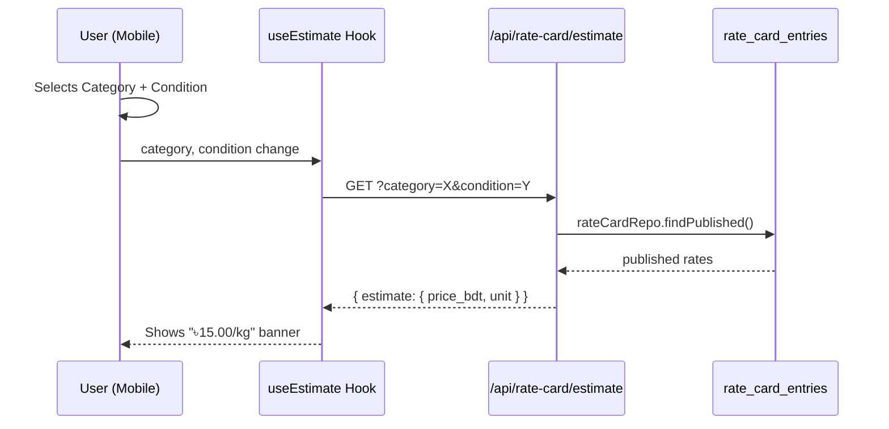

# Rate Card Value Estimator — Implementation Summary

**Branch:** `feat/rate-card-estimator`
**Commit:** `248d1548`
**Files changed:** 3 (1 new API route, 1 new hook, 1 modified screen) — **85 lines added**

---

## What was built

When a user picks a **category** + **condition** on the Create Listing screen, the app immediately shows a live **"Estimated value: ৳X.XX/kg"** banner — fetched from the rate card.

## Files

### 1. API Endpoint (new)
[`apps/api/app/api/rate-card/estimate/route.ts`](file:///Users/sharzilnafis/Desktop/Project/chokro/apps/api/app/api/rate-card/estimate/route.ts) — 34 lines

```
GET /api/rate-card/estimate?category=CLOTHES&condition=GOOD
→ { estimate: { price_bdt, unit, category, condition_band } }
```

- Validates query params → `400` if missing
- Reuses `rateCardRepo.findPublished()` (same as the existing published endpoint)
- Returns `404` if no matching rate entry exists
- Public endpoint (no auth), CORS-enabled via `safeRoute`

### 2. React Hook (new)
[`apps/mobile/src/hooks/useEstimate.ts`](file:///Users/sharzilnafis/Desktop/Project/chokro/apps/mobile/src/hooks/useEstimate.ts) — 31 lines

- `useEstimate(category, condition)` → React Query with `['estimate', category, condition]` key
- Auto-refetches when either param changes
- Skips retries on `404` (no rate = expected state)

### 3. UI Banner (modified)
[`apps/mobile/src/screens/CreateListingScreen.tsx`](file:///Users/sharzilnafis/Desktop/Project/chokro/apps/mobile/src/screens/CreateListingScreen.tsx) — 22 lines added

- Loading state: spinner + "Looking up current rate..."
- Estimate found: `৳15.00/kg` with pricetag icon + disclaimer
- No rate: silently hidden (no error shown)

## Architecture flow



## Sprint 2 scaffolding

> The TC2 Next-Life Agent will do the exact same rate lookup server-side. This feature pre-builds the **display layer** — Sprint 2 just swaps the trigger from manual category pick → AI category detection.
