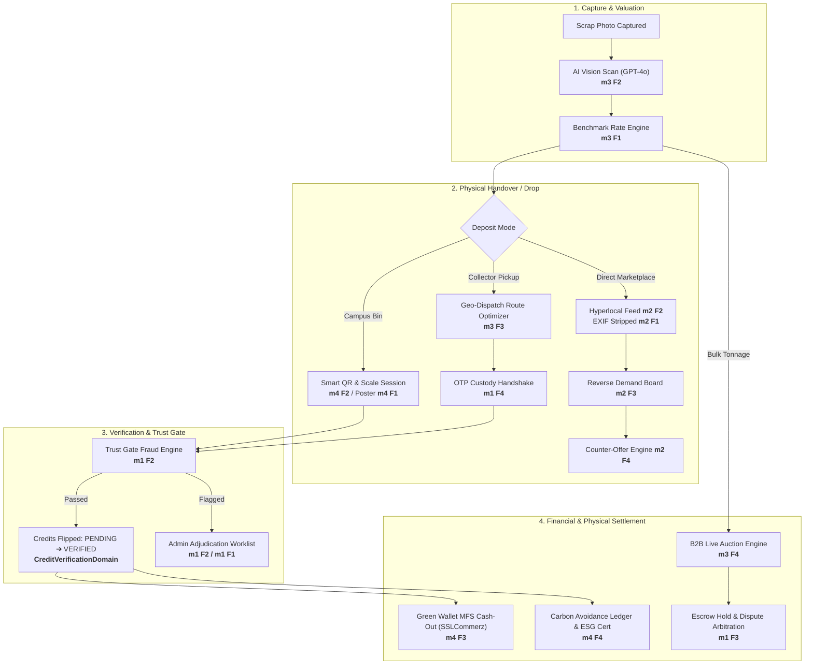

# Chokro (চক্র) — Comprehensive Feature Implementation & Evaluation Guide

> **Academic Submission:** Module 1 (Lab 5), Module 2 (Lab 6), and Module 3 (Lab 7) Final Project Evaluation  
> **Repository:** [sharzilnfz/chokro](https://github.com/sharzilnfz/chokro) · **Active Branch:** `Sprint3`  
> **Verification Status:** `pnpm typecheck` passed (0 errors) · `pnpm test` passed (40/40 suites, 332/332 tests)

---

## 1. Executive Summary & Team Structure

According to the **Project Guidelines**, the Chokro platform is implemented across **4 team members**, each owning **4 full-stack features** (1 in Module 1, 1 in Module 2, 2 in Module 3) totaling **16 load-bearing features**.

* **Excluded Shared Scaffolding (Zero Feature Marks):** Login/OAuth, Sign-up, Logout, Role Management, Profile Management, and Generic Admin CRUD are shared baseline infrastructure and not claimed as individual features.
* **Code-Level Guarantee:** Every feature listed below is 100% implemented in the codebase with dedicated database tables, domain service logic, HTTP route handlers, mobile/admin UI surfaces, and external API integrations with offline/degraded fallbacks.

```mermaid
gantt
    title Chokro 16-Feature Delivery Across Modules
    dateFormat  X
    axisFormat  %d
    section Module 1 (Lab 5)
    m1 F1 - Partner KYC OCR               :done, m1f1, 0, 1
    m2 F1 - Media Pipeline & EXIF Strip   :done, m2f1, 0, 1
    m3 F1 - Rate Benchmarking Engine      :done, m3f1, 0, 1
    m4 F1 - Drop-Zone Poster & Telemetry  :done, m4f1, 0, 1
    section Module 2 (Lab 6)
    m1 F2 - Trust Gate Decision Engine    :done, m1f2, 1, 2
    m2 F2 - Hyperlocal Geo Radius Feed    :done, m2f2, 1, 2
    m3 F2 - AI Next-Life Vision Agent     :done, m3f2, 1, 2
    m4 F2 - QR Deposit & Scale Gate       :done, m4f2, 1, 2
    section Module 3 (Lab 7)
    m1 F3 - Escrow & Quality Arbitration  :done, m1f3, 2, 3
    m1 F4 - Custody Handover OTP          :done, m1f4, 2, 3
    m2 F3 - Recycler Demand Board         :done, m2f3, 2, 3
    m2 F4 - Counter-Offer Engine          :done, m2f4, 2, 3
    m3 F3 - Smart Geo-Dispatch & Routing  :done, m3f3, 2, 3
    m3 F4 - B2B Live Auction Engine       :done, m3f4, 2, 3
    m4 F3 - Green Wallet MFS Cash-Out     :done, m4f3, 2, 3
    m4 F4 - ESG Carbon Avoidance Ledger   :done, m4f4, 2, 3
```



---

## 2. End-to-End System Narrative & Data Flow



---

## 3. Code-Grounded Feature Implementation by Member

```
┌─────────────────────────────────────────────────────────────────────────────────────────────────┐
│                               MEMBER 1 (m1) — SADAT SKD                                         │
│                  GitHub: @SadatSKD | Email: sadatskd003@gmail.com                               │
│                  Assigned Domain: Trust Gate, Identity & Settlement                             │
└─────────────────────────────────────────────────────────────────────────────────────────────────┘
```

### `m1` Feature 1 (Module 1 / Lab 5): Partner KYC & Licence Document Intelligence
* **What was implemented:** Automated optical document intelligence engine that analyzes Department of Environment (DoE) trade licenses, extracts registration numbers and expiration dates, calculates normalized Levenshtein string similarity against user input, and evaluates expiration and e-waste authority.
* **How it is implemented in code:**
  * **Domain:** [`PartnerKycDomain.ts`](file:///Users/sharzilnafis/Desktop/Project/chokro-m3/apps/api/lib/domain/PartnerKycDomain.ts) implements `extractKycDocument()`, `evaluateDiscrepancies()`, and `adjudicateKyc()`.
  * **Repository:** [`kycExtractions.ts`](file:///Users/sharzilnafis/Desktop/Project/chokro-m3/apps/api/lib/repos/kycExtractions.ts), [`partnerComplianceAudits.ts`](file:///Users/sharzilnafis/Desktop/Project/chokro-m3/apps/api/lib/repos/partnerComplianceAudits.ts).
  * **Routes:** `POST /api/v1/partners/kyc/extract`, `GET /api/v1/admin/partners/kyc/queue`, `POST /api/v1/admin/partners/kyc/adjudicate`.
  * **Database Tables:** `kyc_extractions`, `partner_compliance_audits`, `partners`.
  * **UI Surfaces:** [`PartnerConsoleScreen.tsx`](file:///Users/sharzilnafis/Desktop/Project/chokro-m3/apps/mobile/src/screens/PartnerConsoleScreen.tsx) (M18), [`/admin/kyc-queue/page.tsx`](file:///Users/sharzilnafis/Desktop/Project/chokro-m3/apps/api/app/admin/kyc-queue/page.tsx) (A06).
* **External API & Fallback:** Google Cloud Vision OCR API $\to$ *Fallback: Local Regex / Heuristic Parser*.
* **Defense Point:** Defends statutory DoE licensing compliance under Bangladesh E-Waste Management Rules 2021 rather than a generic user status toggle.

---

### `m1` Feature 2 (Module 2 / Lab 6): Trust Gate — Deposit Verification & Fraud Anomaly Engine
* **What was implemented:** A deterministic multi-signal fraud adjudication engine that ingests physical deposit and pickup signals (image perceptual hashes, weight divergence, account velocity, and geofencing) and automatically clears credits or escalates to human administrators.
* **How it is implemented in code:**
  * **Domain:** [`TrustGateDomain.ts`](file:///Users/sharzilnafis/Desktop/Project/chokro-m3/apps/api/lib/domain/TrustGateDomain.ts) implements `evaluate()` and `checkImageDeduplication()`; [`CreditVerificationDomain.ts`](file:///Users/sharzilnafis/Desktop/Project/chokro-m3/apps/api/lib/domain/CreditVerificationDomain.ts) triggers the single-owner ledger flip.
  * **Repository:** [`trustGate.ts`](file:///Users/sharzilnafis/Desktop/Project/chokro-m3/apps/api/lib/repos/trustGate.ts).
  * **Routes:** `POST /api/v1/trust-gate/evaluate`, `GET /api/v1/admin/trust-gate/escalations`, `POST /api/v1/admin/trust-gate/adjudicate`, `GET /api/v1/admin/trust-gate/thresholds`.
  * **Database Tables:** `trust_decisions`, `fraud_flags`, `trust_threshold_configs`, `evidence_hashes`.
  * **UI Surfaces:** [`/admin/trust-gate/page.tsx`](file:///Users/sharzilnafis/Desktop/Project/chokro-m3/apps/api/app/admin/trust-gate/page.tsx) (A07), [`/admin/thresholds/page.tsx`](file:///Users/sharzilnafis/Desktop/Project/chokro-m3/apps/api/app/admin/thresholds/page.tsx) (A08).
* **External API & Fallback:** Telegram Bot Webhook (alerting staff on high-severity fraud) $\to$ *Fallback: Local In-Memory / File Escalation Log*.
* **Defense Point:** Mathematical fraud score aggregation and pHash deduplication rather than subjective manual review.

---

### `m1` Feature 3 (Module 3 / Lab 7): Escrow Settlement & Quality Dispute Arbitration
* **What was implemented:** Bilateral financial escrow holding mechanism for B2B scrap lots with inspection countdown timers, dispute ticketing, two-sided photo evidence submission, and administrator arbitration.
* **How it is implemented in code:**
  * **Domain:** [`EscrowDomain.ts`](file:///Users/sharzilnafis/Desktop/Project/chokro-m3/apps/api/lib/domain/EscrowDomain.ts) manages `lockEscrowOnAuctionWin()`, `releaseToSeller()`, `returnToBuyer()`, and `sweepExpiredHolds()`; [`DisputeDomain.ts`](file:///Users/sharzilnafis/Desktop/Project/chokro-m3/apps/api/lib/domain/DisputeDomain.ts) handles tickets.
  * **Repository:** [`escrow.ts`](file:///Users/sharzilnafis/Desktop/Project/chokro-m3/apps/api/lib/repos/escrow.ts), [`disputes.ts`](file:///Users/sharzilnafis/Desktop/Project/chokro-m3/apps/api/lib/repos/disputes.ts).
  * **Routes:** `POST /api/v1/disputes`, `GET /api/v1/disputes/[id]`, `POST /api/v1/admin/disputes/[id]/resolve`, `GET /api/v1/escrow/holds`.
  * **Database Tables:** `escrow_holds`, `disputes`.
  * **UI Surfaces:** [`DisputeScreen.tsx`](file:///Users/sharzilnafis/Desktop/Project/chokro-m3/apps/mobile/src/screens/DisputeScreen.tsx) (M15), [`/admin/disputes/page.tsx`](file:///Users/sharzilnafis/Desktop/Project/chokro-m3/apps/api/app/admin/disputes/page.tsx) (A09).
* **External API & Fallback:** Resend Email Notification API $\to$ *Fallback: In-App Store & Contact Resolver*.
* **Defense Point:** Enforces bilateral escrow fund locking with automated inspection window timeouts rather than a generic ticketing system.

---

### `m1` Feature 4 (Module 3 / Lab 7): Chain-of-Custody Handover & OTP Handshake
* **What was implemented:** Two-party cryptographic verification protocol for physical scrap pickups where the giver receives an SMS/app OTP that the collector must enter to cryptographically seal the custody transfer.
* **How it is implemented in code:**
  * **Domain:** [`CustodyDomain.ts`](file:///Users/sharzilnafis/Desktop/Project/chokro-m3/apps/api/lib/domain/CustodyDomain.ts) (and [`HandoverDomain.ts`](file:///Users/sharzilnafis/Desktop/Project/chokro-m3/apps/api/lib/domain/HandoverDomain.ts)) handles `generateOtpChallenge()` and `verifyHandoverOtp()`.
  * **Repository:** [`custody.ts`](file:///Users/sharzilnafis/Desktop/Project/chokro-m3/apps/api/lib/repos/custody.ts).
  * **Routes:** `POST /api/v1/handovers/generate-otp`, `POST /api/v1/handovers/verify-otp`.
  * **Database Tables:** `custody_handovers`, `pickup_orders`.
  * **UI Surfaces:** [`HandoverOtpModal.tsx`](file:///Users/sharzilnafis/Desktop/Project/chokro-m3/apps/mobile/src/components/HandoverOtpModal.tsx) (M08), [`PickupScreen.tsx`](file:///Users/sharzilnafis/Desktop/Project/chokro-m3/apps/mobile/src/screens/PickupScreen.tsx) (M07).
* **External API & Fallback:** Twilio SMS Gateway $\to$ *Fallback: Server-Side Cryptographic TOTP*.
* **Defense Point:** Physical custody transfer is an immutable signed transaction that neither party can counterfeit alone.

---

```
┌─────────────────────────────────────────────────────────────────────────────────────────────────┐
│                              MEMBER 2 (m2) — AHMAD SAMEER                                       │
│                  GitHub: @Antizer17 | Email: ahmad.sameer.5122@gmail.com                        │
│                  Assigned Domain: Circular Marketplace & Discovery                              │
└─────────────────────────────────────────────────────────────────────────────────────────────────┘
```

### `m2` Feature 1 (Module 1 / Lab 5): Listing Media Pipeline & EXIF Privacy Stripping
* **What was implemented:** Multi-format image processing pipeline that parses multipart and base64 uploads, extracts and strips sensitive GPS EXIF coordinates before public storage, and generates responsive WebP images.
* **How it is implemented in code:**
  * **Domain:** [`MediaDomain.ts`](file:///Users/sharzilnafis/Desktop/Project/chokro-m3/apps/api/lib/domain/MediaDomain.ts) handles `parseUploadRequest()`, `extractExifGps()`, and `processMedia()`.
  * **Repository:** [`listingMedia.ts`](file:///Users/sharzilnafis/Desktop/Project/chokro-m3/apps/api/lib/repos/listingMedia.ts).
  * **Routes:** `POST /api/v1/media/upload`, `POST /api/v1/listings`.
  * **Database Tables:** `listing_media`, `listings`.
  * **UI Surfaces:** [`CreateListingScreen.tsx`](file:///Users/sharzilnafis/Desktop/Project/chokro-m3/apps/mobile/src/screens/CreateListingScreen.tsx) (M02).
* **External API & Fallback:** Cloudinary CDN $\to$ *Fallback: Sharp Local Pipeline with file system storage*.
* **Defense Point:** Enforces residential privacy by stripping exact coordinates at the ingest boundary rather than naive client-side image passing.

---

### `m2` Feature 2 (Module 2 / Lab 6): Hyperlocal Geo-Discovery & Radius Filter Feed
* **What was implemented:** Location-aware listing discovery feed that computes pure trigonometric Haversine distances in SQL (PGlite/PostgreSQL compatible) and filters listings by radius (1–10 km) and Bangladesh administrative Thana/Ward units.
* **How it is implemented in code:**
  * **Domain:** [`FeedDomain.ts`](file:///Users/sharzilnafis/Desktop/Project/chokro-m3/apps/api/lib/domain/FeedDomain.ts) implements `parseFeedQuery()` and `getHyperlocalFeed()`.
  * **Repository:** [`feed.ts`](file:///Users/sharzilnafis/Desktop/Project/chokro-m3/apps/api/lib/repos/feed.ts).
  * **Routes:** `GET /api/v1/feed`, `GET /api/v1/listings/feed`.
  * **Database Tables:** `listings` (with `lat`, `lng`, `thana`, `zilla`), `service_areas`.
  * **UI Surfaces:** [`FeedScreen.tsx`](file:///Users/sharzilnafis/Desktop/Project/chokro-m3/apps/mobile/src/screens/FeedScreen.tsx) (M01).
* **External API & Fallback:** OpenStreetMap Nominatim Geocoding API $\to$ *Fallback: Campus Polygon Lookup Table*.
* **Defense Point:** Solves the localized transport economics problem through spatial SQL filtering rather than returning static nationwide lists.

---

### `m2` Feature 3 (Module 3 / Lab 7): Reverse Marketplace — Recycler Demand Board & Matching
* **What was implemented:** Inverted marketplace board where commercial recyclers post specific material demands (e.g., "Need 500kg Copper in Tejgaon") and the system automatically matches and notifies them upon new seller listing creation.
* **How it is implemented in code:**
  * **Domain:** [`DemandDomain.ts`](file:///Users/sharzilnafis/Desktop/Project/chokro-m3/apps/api/lib/domain/DemandDomain.ts) (and [`DemandBoardDomain.ts`](file:///Users/sharzilnafis/Desktop/Project/chokro-m3/apps/api/lib/domain/DemandBoardDomain.ts)) implements `createDemand()` and `matchDemandToListing()`.
  * **Repository:** [`demands.ts`](file:///Users/sharzilnafis/Desktop/Project/chokro-m3/apps/api/lib/repos/demands.ts).
  * **Routes:** `POST /api/v1/demands`, `GET /api/v1/demands`, `GET /api/v1/demands/matches`.
  * **Database Tables:** `buyer_demands`, `demand_matches`.
  * **UI Surfaces:** [`DemandsScreen.tsx`](file:///Users/sharzilnafis/Desktop/Project/chokro-m3/apps/mobile/src/screens/DemandsScreen.tsx) (M11).
* **External API & Fallback:** OneSignal Push Notification API $\to$ *Fallback: In-App Notification Queue*.
* **Defense Point:** Event-driven matching algorithm that solves supply fragmentation in circular supply chains.

---

### `m2` Feature 4 (Module 3 / Lab 7): Binding Counter-Offer Negotiation Engine
* **What was implemented:** Bilateral contract state machine supporting formal offer/counter-offer cycles, 24-hour TTL expiry, and atomic locking of listings upon binding acceptance.
* **How it is implemented in code:**
  * **Domain:** [`NegotiationDomain.ts`](file:///Users/sharzilnafis/Desktop/Project/chokro-m3/apps/api/lib/domain/NegotiationDomain.ts) manages `createThread()`, `submitCounterOffer()`, and `acceptOffer()`.
  * **Repository:** [`negotiations.ts`](file:///Users/sharzilnafis/Desktop/Project/chokro-m3/apps/api/lib/repos/negotiations.ts).
  * **Routes:** `POST /api/v1/negotiations`, `POST /api/v1/negotiations/[id]/offer`, `POST /api/v1/negotiations/[id]/accept`, `POST /api/v1/negotiations/[id]/reject`.
  * **Database Tables:** `negotiation_threads`, `negotiation_offers`.
  * **UI Surfaces:** [`NegotiationThreadScreen.tsx`](file:///Users/sharzilnafis/Desktop/Project/chokro-m3/apps/mobile/src/screens/NegotiationThreadScreen.tsx) (M12).
* **External API & Fallback:** Pusher Channels / Ably Realtime $\to$ *Fallback: Smart ETag Polling*.
* **Defense Point:** Replaces informal chat messages with legally binding contract states and race-condition-safe acceptance locks.

---

```
┌─────────────────────────────────────────────────────────────────────────────────────────────────┐
│                              MEMBER 3 (m3) — SHARZIL NAFIS                                      │
│                  GitHub: @sharzilnfz | Email: sharzilrs@gmail.com                               │
│                  Assigned Domain: Valuation, Intelligence & Core Logistics                      │
└─────────────────────────────────────────────────────────────────────────────────────────────────┘
```

### `m3` Feature 1 (Module 1 / Lab 5): Market-Benchmarked Valuation Engine & Dynamic Rate Cards
* **What was implemented:** Real-time pricing engine that benchmarks local Bangladeshi scrap rates against international commodity spot prices with USD/BDT FX conversion, drift alerts, and effective-dated rate versioning.
* **How it is implemented in code:**
  * **Domain:** [`RateCardDomain.ts`](file:///Users/sharzilnafis/Desktop/Project/chokro-m3/apps/api/lib/domain/RateCardDomain.ts) and [`ValuationDomain.ts`](file:///Users/sharzilnafis/Desktop/Project/chokro-m3/apps/api/lib/domain/ValuationDomain.ts) handle `calculateEstimate()`, `detectRateDrift()`, and `upsertRateCard()`.
  * **Repository:** [`rateCards.ts`](file:///Users/sharzilnafis/Desktop/Project/chokro-m3/apps/api/lib/repos/rateCards.ts), [`benchmarks.ts`](file:///Users/sharzilnafis/Desktop/Project/chokro-m3/apps/api/lib/repos/benchmarks.ts).
  * **Routes:** `GET /api/v1/rate-card/published`, `GET /api/v1/rate-card/estimate`, `POST /api/v1/admin/rate-card`.
  * **Database Tables:** `rate_card_entries`, `rate_benchmarks`.
  * **UI Surfaces:** [`RateCardScreen.tsx`](file:///Users/sharzilnafis/Desktop/Project/chokro-m3/apps/mobile/src/screens/RateCardScreen.tsx) (M04), [`/admin/rate-card/page.tsx`](file:///Users/sharzilnafis/Desktop/Project/chokro-m3/apps/api/app/admin/rate-card/page.tsx) (A04).
* **External API & Fallback:** Metals-API / AlphaVantage Commodity API $\to$ *Fallback: Stored Benchmark Cache Table*.
* **Defense Point:** Rate cards use immutable effective-dated supersession so historical valuations remain 100% reproducible over time.

---

### `m3` Feature 2 (Module 2 / Lab 6): AI Next-Life Scrap Vision Agent
* **What was implemented:** Multi-modal scrap image classification agent that identifies material category, condition band, estimated weight/pieces, and circular next-life path (`REUSE`, `REPAIR`, `RECYCLE`), strictly enforcing hazardous e-waste safety locks.
* **How it is implemented in code:**
  * **Domain:** [`VisionDomain.ts`](file:///Users/sharzilnafis/Desktop/Project/chokro-m3/apps/api/lib/domain/VisionDomain.ts) and [`ValuationDomain.ts`](file:///Users/sharzilnafis/Desktop/Project/chokro-m3/apps/api/lib/domain/ValuationDomain.ts) execute `classifyAndEstimate()`.
  * **Repository:** [`valuationScans.ts`](file:///Users/sharzilnafis/Desktop/Project/chokro-m3/apps/api/lib/repos/valuationScans.ts).
  * **Routes:** `POST /api/v1/valuation/classify-and-estimate`.
  * **Database Tables:** `valuation_scans`.
  * **UI Surfaces:** [`VisionScanScreen.tsx`](file:///Users/sharzilnafis/Desktop/Project/chokro-m3/apps/mobile/src/screens/VisionScanScreen.tsx) (M03).
* **External API & Fallback:** OpenAI GPT-4o-mini Vision API $\to$ *Fallback: Domain Rule Heuristic Classifier*.
* **Defense Point:** Constrains multi-modal LLM output to domain enums and joins directly to effective database rate cards with mandatory e-waste safety routing.

---

### `m3` Feature 3 (Module 3 / Lab 7): Smart Geo-Dispatch & Route Optimizer
* **What was implemented:** Capacity-constrained collector dispatching and Traveling Salesperson Problem (TSP) multi-stop route sequencing based on vehicle payload limits, distance matrices, and partner category licenses.
* **How it is implemented in code:**
  * **Domain:** [`DispatchDomain.ts`](file:///Users/sharzilnafis/Desktop/Project/chokro-m3/apps/api/lib/domain/DispatchDomain.ts) (and [`PickupDomain.ts`](file:///Users/sharzilnafis/Desktop/Project/chokro-m3/apps/api/lib/domain/PickupDomain.ts)) implements `bookPickup()`, `findEligibleCollectors()`, and `optimizeRouteSequence()`.
  * **Repository:** [`pickups.ts`](file:///Users/sharzilnafis/Desktop/Project/chokro-m3/apps/api/lib/repos/pickups.ts).
  * **Routes:** `POST /api/v1/pickups/book`, `GET /api/v1/pickups/tasks`, `POST /api/v1/pickups/[id]/assign`.
  * **Database Tables:** `pickup_orders`, `dispatch_assignments`.
  * **UI Surfaces:** [`PickupScreen.tsx`](file:///Users/sharzilnafis/Desktop/Project/chokro-m3/apps/mobile/src/screens/PickupScreen.tsx) (M07).
* **External API & Fallback:** Mapbox Matrix API $\to$ *Fallback: Haversine TSP Matrix Orderer*.
* **Defense Point:** Solves vehicle capacity allocation and sequential stop ordering rather than rendering passive map markers.

---

### `m3` Feature 4 (Module 3 / Lab 7): B2B Bulk Scrap Live Auction Engine
* **What was implemented:** Real-time auction engine for institutional bulk lots featuring server-authoritative monotonic bid ordering, sealed reserve price protection, and dynamic anti-snipe countdown extensions.
* **How it is implemented in code:**
  * **Domain:** [`AuctionDomain.ts`](file:///Users/sharzilnafis/Desktop/Project/chokro-m3/apps/api/lib/domain/AuctionDomain.ts) handles `placeBid()`, `endAuction()`, and `lockEscrowOnAuctionWin()`.
  * **Repository:** [`auctions.ts`](file:///Users/sharzilnafis/Desktop/Project/chokro-m3/apps/api/lib/repos/auctions.ts).
  * **Routes:** `GET /api/v1/auction-lots/live`, `POST /api/v1/auction-lots`, `POST /api/v1/auction-lots/[id]/bids`.
  * **Database Tables:** `auction_lots`, `auction_bids`.
  * **UI Surfaces:** [`AuctionsScreen.tsx`](file:///Users/sharzilnafis/Desktop/Project/chokro-m3/apps/mobile/src/screens/AuctionsScreen.tsx) (M09), [`LotDetailScreen.tsx`](file:///Users/sharzilnafis/Desktop/Project/chokro-m3/apps/mobile/src/screens/LotDetailScreen.tsx) (M10).
* **External API & Fallback:** Pusher Channels Realtime $\to$ *Fallback: Monotonic Sequence Number Polling*.
* **Defense Point:** Guarantees race-condition prevention in high-concurrency bidding environments through database transaction locks.

---

```
┌─────────────────────────────────────────────────────────────────────────────────────────────────┐
│                             MEMBER 4 (m4) — IMRAN AHMED UPOM                                    │
│                  GitHub: @Imran-1815 | Email: imran.ahmed.upom@g.bracu.ac.bd                    │
│                  Assigned Domain: Drop Zones, Green Wallet & ESG Impact                         │
└─────────────────────────────────────────────────────────────────────────────────────────────────┘
```

### `m4` Feature 1 (Module 1 / Lab 5): Drop-Zone Telemetry & Printable Poster Generator
* **What was implemented:** Physical collection bin capacity modeling with automated emptying dispatch alerts and a printable QR poster generator featuring HMAC-SHA256 tamper-evident tokens and static maps.
* **How it is implemented in code:**
  * **Domain:** [`DropZoneTelemetryDomain.ts`](file:///Users/sharzilnafis/Desktop/Project/chokro-m3/apps/api/lib/domain/DropZoneTelemetryDomain.ts) and [`qr.ts`](file:///Users/sharzilnafis/Desktop/Project/chokro-m3/apps/api/lib/qr.ts) handle `calculateFillStatus()` and `generatePoster()`.
  * **Repository:** [`dropZones.ts`](file:///Users/sharzilnafis/Desktop/Project/chokro-m3/apps/api/lib/repos/dropZones.ts), [`dropZoneTelemetry.ts`](file:///Users/sharzilnafis/Desktop/Project/chokro-m3/apps/api/lib/repos/dropZoneTelemetry.ts).
  * **Routes:** `GET /api/v1/drop-zones`, `GET /api/v1/drop-zones/[id]/poster`, `GET /api/v1/admin/drop-zones/telemetry`.
  * **Database Tables:** `drop_zones`, `zone_capacity_logs`.
  * **UI Surfaces:** [`/admin/drop-zones/page.tsx`](file:///Users/sharzilnafis/Desktop/Project/chokro-m3/apps/api/app/admin/drop-zones/page.tsx) (A02), [`/admin/zone-capacity/page.tsx`](file:///Users/sharzilnafis/Desktop/Project/chokro-m3/apps/api/app/admin/zone-capacity/page.tsx) (A03).
* **External API & Fallback:** Google Static Maps API $\to$ *Fallback: Procedural SVG Grid Map Renderer*.
* **Defense Point:** Physical-digital bridge using timing-safe cryptographic QR token verification and predictive bin overflow models.

---

### `m4` Feature 2 (Module 2 / Lab 6): Smart QR Deposit Session & Weight-Scale Gate
* **What was implemented:** Time-bounded deposit session flow (15-minute TTL) requiring users to scan bin QRs, upload camera-only evidence (gallery blocked), and reconcile declared weight with collector scale telemetry upon emptying.
* **How it is implemented in code:**
  * **Domain:** [`DepositDomain.ts`](file:///Users/sharzilnafis/Desktop/Project/chokro-m3/apps/api/lib/domain/DepositDomain.ts) and [`ZoneEmptyingDomain.ts`](file:///Users/sharzilnafis/Desktop/Project/chokro-m3/apps/api/lib/domain/ZoneEmptyingDomain.ts) handle `openSession()` and `submitDeposit()`.
  * **Repository:** [`deposits.ts`](file:///Users/sharzilnafis/Desktop/Project/chokro-m3/apps/api/lib/repos/deposits.ts), [`dropSessions.ts`](file:///Users/sharzilnafis/Desktop/Project/chokro-m3/apps/api/lib/repos/dropSessions.ts).
  * **Routes:** `POST /api/v1/drop-sessions`, `POST /api/v1/deposits`, `POST /api/v1/drop-zones/[id]/empty`.
  * **Database Tables:** `drop_sessions`, `deposit_records`, `zone_emptying_records`, `credit_txns`.
  * **UI Surfaces:** [`QRScannerScreen.tsx`](file:///Users/sharzilnafis/Desktop/Project/chokro-m3/apps/mobile/src/screens/QRScannerScreen.tsx) (M05), [`DepositFlowScreen.tsx`](file:///Users/sharzilnafis/Desktop/Project/chokro-m3/apps/mobile/src/screens/DepositFlowScreen.tsx) (M06).
* **External API & Fallback:** Firebase Cloud Messaging $\to$ *Fallback: Local Session Token & In-App Polling*.
* **Defense Point:** Minting credits strictly inside hardware-validated physical sessions to eliminate fraudulent remote deposit claims.

---

### `m4` Feature 3 (Module 3 / Lab 7): Green Wallet Payout & MFS Cash-Out Engine
* **What was implemented:** Append-only transaction ledger with balance classifiers, concurrency locks, monthly liability budget caps, and mobile financial services (bKash/Nagad via SSLCommerz) automated cash-outs with compensating reversal entries.
* **How it is implemented in code:**
  * **Domain:** [`SettlementDomain.ts`](file:///Users/sharzilnafis/Desktop/Project/chokro-m3/apps/api/lib/domain/SettlementDomain.ts), [`WalletDomain.ts`](file:///Users/sharzilnafis/Desktop/Project/chokro-m3/apps/api/lib/domain/WalletDomain.ts), and [`LedgerMath.ts`](file:///Users/sharzilnafis/Desktop/Project/chokro-m3/apps/api/lib/LedgerMath.ts) execute `requestRedemption()`, `processPayoutSaga()`, and `reverseRedemption()`.
  * **Repository:** [`settlement.ts`](file:///Users/sharzilnafis/Desktop/Project/chokro-m3/apps/api/lib/repos/settlement.ts), [`wallet.ts`](file:///Users/sharzilnafis/Desktop/Project/chokro-m3/apps/api/lib/repos/wallet.ts).
  * **Routes:** `GET /api/v1/wallet/balance`, `POST /api/v1/wallet/redemptions`, `GET /api/v1/admin/wallet/liability`, `POST /api/v1/admin/wallet/redemptions/batch`.
  * **Database Tables:** `credit_txns`, `redemption_requests`, `payout_records`, `liability_caps`.
  * **UI Surfaces:** [`WalletScreen.tsx`](file:///Users/sharzilnafis/Desktop/Project/chokro-m3/apps/mobile/src/screens/WalletScreen.tsx) (M13), [`RedemptionRequestScreen.tsx`](file:///Users/sharzilnafis/Desktop/Project/chokro-m3/apps/mobile/src/screens/RedemptionRequestScreen.tsx) (M14), [`/admin/redemptions/page.tsx`](file:///Users/sharzilnafis/Desktop/Project/chokro-m3/apps/api/app/admin/redemptions/page.tsx) (A10), [`/admin/liability/page.tsx`](file:///Users/sharzilnafis/Desktop/Project/chokro-m3/apps/api/app/admin/liability/page.tsx) (A11).
* **External API & Fallback:** SSLCommerz MFS Gateway $\to$ *Fallback: Simulated MFS Webhook Protocol*.
* **Defense Point:** Balances are never directly updated; cash-outs execute as 2-phase database transactions with verifiable compensating entries.

---

### `m4` Feature 4 (Module 3 / Lab 7): Carbon Avoidance Ledger & ESG Certificate Generator
* **What was implemented:** Immutable corporate ESG impact ledger that translates verified physical scrap weights into avoided CO2e using ISO 14044 lifecycle emission factors, generating SHA-256 verifiable institutional sustainability certificates.
* **How it is implemented in code:**
  * **Domain:** [`ImpactDomain.ts`](file:///Users/sharzilnafis/Desktop/Project/chokro-m3/apps/api/lib/domain/ImpactDomain.ts) handles `recordVerifiedImpact()`, `generateCertificate()`, and `getPublicCertificate()`.
  * **Repository:** [`impact.ts`](file:///Users/sharzilnafis/Desktop/Project/chokro-m3/apps/api/lib/repos/impact.ts).
  * **Routes:** `GET /api/v1/impact/personal`, `GET /api/v1/certificates/[ref]`, `POST /api/v1/admin/impact/certificates`.
  * **Database Tables:** `impact_records`, `emission_factors`, `sustainability_certificates`, `institution_accounts`, `sponsorship_pools`.
  * **UI Surfaces:** [`ImpactDashboardScreen.tsx`](file:///Users/sharzilnafis/Desktop/Project/chokro-m3/apps/mobile/src/screens/ImpactDashboardScreen.tsx) (M16), [`CertificateViewScreen.tsx`](file:///Users/sharzilnafis/Desktop/Project/chokro-m3/apps/mobile/src/screens/CertificateViewScreen.tsx) (M17), [`/admin/certificates/page.tsx`](file:///Users/sharzilnafis/Desktop/Project/chokro-m3/apps/api/app/admin/certificates/page.tsx) (A12).
* **External API & Fallback:** Climatiq Carbon Intelligence API $\to$ *Fallback: ISO 14044 Factor Table Cache*.
* **Defense Point:** Generates legally auditable corporate compliance documents backed by immutable SHA-256 cryptographic hashes.

---

## 4. Complete UI Screen Directory

### Mobile Client (`apps/mobile/src/screens`)
| Screen ID | File Path | Owning Member | Purpose |
| :--- | :--- | :--- | :--- |
| **M01** | [`FeedScreen.tsx`](file:///Users/sharzilnafis/Desktop/Project/chokro-m3/apps/mobile/src/screens/FeedScreen.tsx) | `m2` (Sameer) | 1–10 km radius slider, Thana picker, distance badges |
| **M02** | [`CreateListingScreen.tsx`](file:///Users/sharzilnafis/Desktop/Project/chokro-m3/apps/mobile/src/screens/CreateListingScreen.tsx) | `m2` (Sameer) / `m3` | Unit invariant form, EXIF privacy strip uploader |
| **M03** | [`VisionScanScreen.tsx`](file:///Users/sharzilnafis/Desktop/Project/chokro-m3/apps/mobile/src/screens/VisionScanScreen.tsx) | `m3` (Sharzil) | GPT-4o scrap classifier with rate-card prefill |
| **M04** | [`RateCardScreen.tsx`](file:///Users/sharzilnafis/Desktop/Project/chokro-m3/apps/mobile/src/screens/RateCardScreen.tsx) | `m3` (Sharzil) | Published rates and market drift indicator table |
| **M05** | [`QRScannerScreen.tsx`](file:///Users/sharzilnafis/Desktop/Project/chokro-m3/apps/mobile/src/screens/QRScannerScreen.tsx) | `m4` (Imran) | Camera viewfinder for HMAC-signed bin tokens |
| **M06** | [`DepositFlowScreen.tsx`](file:///Users/sharzilnafis/Desktop/Project/chokro-m3/apps/mobile/src/screens/DepositFlowScreen.tsx) | `m4` (Imran) | 15-min deposit session countdown, camera evidence |
| **M07** | [`PickupScreen.tsx`](file:///Users/sharzilnafis/Desktop/Project/chokro-m3/apps/mobile/src/screens/PickupScreen.tsx) | `m3` (Sharzil) | Collector routing map, sequence order, task manager |
| **M08** | [`HandoverOtpModal.tsx`](file:///Users/sharzilnafis/Desktop/Project/chokro-m3/apps/mobile/src/components/HandoverOtpModal.tsx) | `m1` (Sadat) | 6-digit OTP entry modal for physical custody transfer |
| **M09** | [`AuctionsScreen.tsx`](file:///Users/sharzilnafis/Desktop/Project/chokro-m3/apps/mobile/src/screens/AuctionsScreen.tsx) | `m3` (Sharzil) | Live B2B bulk lots with real-time bid ticker |
| **M10** | [`LotDetailScreen.tsx`](file:///Users/sharzilnafis/Desktop/Project/chokro-m3/apps/mobile/src/screens/LotDetailScreen.tsx) | `m3` (Sharzil) / `m1` | Monotonic bidding desk, sealed reserve indicator |
| **M11** | [`DemandsScreen.tsx`](file:///Users/sharzilnafis/Desktop/Project/chokro-m3/apps/mobile/src/screens/DemandsScreen.tsx) | `m2` (Sameer) | Reverse demand composer and matched listings inbox |
| **M12** | [`NegotiationThreadScreen.tsx`](file:///Users/sharzilnafis/Desktop/Project/chokro-m3/apps/mobile/src/screens/NegotiationThreadScreen.tsx) | `m2` (Sameer) | Offer/counter-offer timeline with 24h TTL timer |
| **M13** | [`WalletScreen.tsx`](file:///Users/sharzilnafis/Desktop/Project/chokro-m3/apps/mobile/src/screens/WalletScreen.tsx) | `m4` (Imran) / `m1` | Verified vs. Pending balance cards, ledger transactions |
| **M14** | [`RedemptionRequestScreen.tsx`](file:///Users/sharzilnafis/Desktop/Project/chokro-m3/apps/mobile/src/screens/RedemptionRequestScreen.tsx) | `m4` (Imran) | MFS cash-out interface with 1.85% fee disclosure |
| **M15** | [`DisputeScreen.tsx`](file:///Users/sharzilnafis/Desktop/Project/chokro-m3/apps/mobile/src/screens/DisputeScreen.tsx) | `m1` (Sadat) | Bilateral dispute ticket filer with photo upload |
| **M16** | [`ImpactDashboardScreen.tsx`](file:///Users/sharzilnafis/Desktop/Project/chokro-m3/apps/mobile/src/screens/ImpactDashboardScreen.tsx) | `m4` (Imran) | Personal avoided CO2e metrics and badges |
| **M17** | [`CertificateViewScreen.tsx`](file:///Users/sharzilnafis/Desktop/Project/chokro-m3/apps/mobile/src/screens/CertificateViewScreen.tsx) | `m4` (Imran) | Downloadable institutional ESG certificate viewer |
| **M18** | [`PartnerConsoleScreen.tsx`](file:///Users/sharzilnafis/Desktop/Project/chokro-m3/apps/mobile/src/screens/PartnerConsoleScreen.tsx) | `m1` (Sadat) | DoE license upload, KYC verification status, fleet hub |

---

### Admin Web Console (`apps/api/app/admin`)
| Admin ID | File Path | Owning Member | Purpose |
| :--- | :--- | :--- | :--- |
| **A01** | [`campuses/page.tsx`](file:///Users/sharzilnafis/Desktop/Project/chokro-m3/apps/api/app/admin/campuses/page.tsx) | Baseline Scaffolding | Campus hub directory and institution registry |
| **A02** | [`drop-zones/page.tsx`](file:///Users/sharzilnafis/Desktop/Project/chokro-m3/apps/api/app/admin/drop-zones/page.tsx) | `m4` (Imran) | Drop-zone configuration and printable poster generator |
| **A03** | [`zone-capacity/page.tsx`](file:///Users/sharzilnafis/Desktop/Project/chokro-m3/apps/api/app/admin/zone-capacity/page.tsx) | `m4` (Imran) | Real-time capacity utilization and telemetry monitor |
| **A04** | [`rate-card/page.tsx`](file:///Users/sharzilnafis/Desktop/Project/chokro-m3/apps/api/app/admin/rate-card/page.tsx) | `m3` (Sharzil) | Effective-dated rate cards and commodity benchmarks |
| **A05** | [`partners/page.tsx`](file:///Users/sharzilnafis/Desktop/Project/chokro-m3/apps/api/app/admin/partners/page.tsx) | `m1` (Sadat) | Registered partner directory and fleet capacity |
| **A06** | [`kyc-queue/page.tsx`](file:///Users/sharzilnafis/Desktop/Project/chokro-m3/apps/api/app/admin/kyc-queue/page.tsx) | `m1` (Sadat) | Side-by-side OCR document viewer and mismatch flags |
| **A07** | [`trust-gate/page.tsx`](file:///Users/sharzilnafis/Desktop/Project/chokro-m3/apps/api/app/admin/trust-gate/page.tsx) | `m1` (Sadat) | Deposit escalation worklist and evidence bundles |
| **A08** | [`thresholds/page.tsx`](file:///Users/sharzilnafis/Desktop/Project/chokro-m3/apps/api/app/admin/thresholds/page.tsx) | `m1` (Sadat) | Fraud score threshold configuration |
| **A09** | [`disputes/page.tsx`](file:///Users/sharzilnafis/Desktop/Project/chokro-m3/apps/api/app/admin/disputes/page.tsx) | `m1` (Sadat) | Escrow arbitration desk and bilateral evidence reviewer |
| **A10** | [`redemptions/page.tsx`](file:///Users/sharzilnafis/Desktop/Project/chokro-m3/apps/api/app/admin/redemptions/page.tsx) | `m4` (Imran) | MFS cash-out queue and batch settlement executor |
| **A11** | [`liability/page.tsx`](file:///Users/sharzilnafis/Desktop/Project/chokro-m3/apps/api/app/admin/liability/page.tsx) | `m4` (Imran) | Monthly platform liability pool and budget run rate |
| **A12** | [`certificates/page.tsx`](file:///Users/sharzilnafis/Desktop/Project/chokro-m3/apps/api/app/admin/certificates/page.tsx) | `m4` (Imran) | Institutional ESG certification desk and factor freezer |

---

## 5. Architectural Invariants & Patterns

1. **Measurement Units Invariant:**
   * Piece Categories (`unit: 'piece'`): `APPLIANCES`, `E_WASTE` $\to$ Strictly requires positive integer `piece_count`; `declared_weight` is forbidden.
   * Weight Categories (`unit: 'kg'`): `CLOTHES`, `BOOKS`, `PLASTICS`, `PAPER`, `METAL`, `GLASS`, `FURNITURE` $\to$ Strictly requires positive decimal `declared_weight`; `piece_count` is forbidden.
2. **Immutable Append-Only Ledger (`credit_txns`):**
   * User balances are **never mutated**. Verified balance equals $\sum \text{amount}$ (`status = 'VERIFIED'`), while Pending balance equals $\sum \text{amount}$ (`status = 'PENDING'`).
   * [`LedgerMath.ts`](file:///Users/sharzilnafis/Desktop/Project/chokro-m3/apps/api/lib/LedgerMath.ts) is the single balance row-classifier across the entire repository.
   * [`CreditVerificationDomain.ts`](file:///Users/sharzilnafis/Desktop/Project/chokro-m3/apps/api/lib/domain/CreditVerificationDomain.ts) is the single owner for all `PENDING` $\to$ `VERIFIED` custody flips.
3. **Repository Seam Separation:**
   * Route handlers (`apps/api/app/api/*`) are thin controllers wrapped in `safeRoute()`.
   * Domain modules in `apps/api/lib/domain/` contain pure business logic and **never** import `@chokro/db` directly.
   * All database queries live in `apps/api/lib/repos/` and execute inside the `withDb()` transaction boundary.

---


## 7. Verification & Run Commands

```bash
# 1. Monorepo TypeScript Typecheck (0 errors across 4 packages)
pnpm typecheck

# 2. Run Complete Jest Test Suite (332 tests across 40 suites in PGlite WASM)
pnpm test

# 3. Start Next.js 16 API Server & Admin Web Console (http://localhost:3000)
pnpm --filter @chokro/api dev

# 4. Start Expo React Native Mobile Client
pnpm --filter @chokro/mobile start
```
