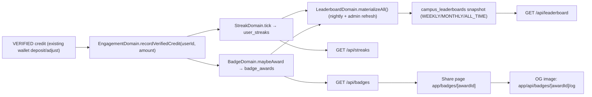
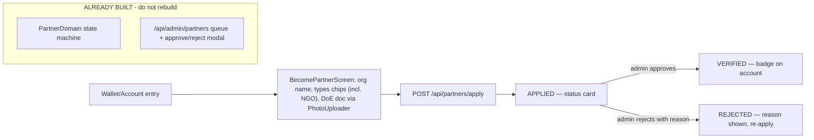

# Chokro — Feature Build Blueprint (AI-Executable)

**Features in this file:**
1. **Feature 1 — Inter-Campus Green Circularity Leaderboard & Badges** (Option 10)
2. **Feature 2 — Partner collaboration (NGO/vendor/collector) — complete the mobile user journey**

**Date:** 2026-08-16 · **Author:** sadat · **Status:** Executable draft (open decisions = `OD-`)

> **For the executing AI:** this file is a work order. Read **Part 0** (codebase conventions + verbatim templates), then execute the work orders in order — **Feature 1 `E1…E8`**, then **Feature 2 `P1…P6`**. Every work order lists the exact files to create/edit, the exact code/pattern to use, and the exact command to verify. Do not "design" — copy the templates. Do not touch files outside the lists. Run the verification command after every work order before moving on.

---

# Part 0 — Codebase blueprint (read this first)

## 0.1 Repo layout & import rules

| Where | What | Import style |
|---|---|---|
| `packages/shared/src` | Zod enums + DTOs (source of truth) | `import { X } from '@chokro/shared'` |
| `packages/db/src` | Drizzle schema, `db` client, migrate, seed | `import { db, users, eq, and, desc, sql } from '@chokro/db'` |
| `apps/api/lib` | auth, http, database, domains, repos | internal: `@/lib/...` |
| `apps/api/app/api/**/route.ts` | Next route handlers | `@/lib/auth`, `@/lib/http`, `@/lib/domain/...` |
| `apps/api/app/admin` | admin SPA | relative + `@chokro/shared` |
| `apps/mobile/src` | RN app | `@/services/api`, `@/hooks/...`, `@/components/...`, alias `@/` = `src/` |

**Path alias `@/`** exists in `apps/api` and `apps/mobile` (tsconfig path mapping + babel module-resolver in mobile).

## 0.2 The HTTP + auth helpers you MUST use (do not reimplement)

From `apps/api/lib/http.ts`:
- `safeRoute(handler)` — wraps any route handler; converts thrown errors to responses, stamps CORS. **Every exported handler is `export const GET/POST = safeRoute(async (req) => {...})`.**
- `apiData(data, status=200)` → `{...data}`
- `apiError(message, status, details?)` → `{ error: message [, details] }`
- `apiSuccess(message, data?, status=200)` → `{ message, ...data }`

From `apps/api/lib/auth.ts`:
- `requireAuth(req)` → `{ user } | { response }` (401). **Always: `const auth = requireAuth(req); if (auth.response) return auth.response;`**
- `requireAdmin(req)` → same shape, demands role `ADMIN` (403).
- Domain errors never reach `safeRoute` as 400 — routes catch domain errors and return `apiError(message, 400)` (see the partner apply route template below).

`apps/api/lib/database.ts` exports `routeError` (503 on DB down, else 500). Repos use `withDb` from `apps/api/lib/repos/seam.ts` — you never touch raw db in routes/domains.

## 0.3 Verbatim templates (COPY THESE, they are the language of this repo)

**A. Repo template** — copy `apps/api/lib/repos/partners.ts` shape verbatim:

```ts
import { db, partners, eq, desc } from '@chokro/db';
import { withDb } from './seam';

export const partnerRepo = {
  async findById(id: string) {
    return withDb(async () => {
      const rows = await db.select().from(partners).where(eq(partners.id, id)).limit(1);
      return rows[0] || null;
    });
  },
  async findAll() {
    return withDb(async () => db.select().from(partners).orderBy(desc(partners.created_at)));
  },
  async apply(input: { user_id: string; org_name: string; types: string[]; doe_license_doc?: string | null; e_waste_licensed?: boolean; status?: string }) {
    return withDb(async () => {
      const [row] = await db.insert(partners).values({ ...input, status: input.status || 'APPLIED' }).returning();
      return row;
    });
  },
};
```

**B. Route template** — copy `apps/api/app/api/partners/apply/route.ts` verbatim pattern (auth guard → zod parse → domain call → status response):

```ts
import { requireAuth } from '@/lib/auth';
import { apiError, apiSuccess, apiData, safeRoute } from '@/lib/http';
import { SomeDomain } from '@/lib/domain/SomeDomain';
import { SomeSchema } from '@chokro/shared';

export const POST = safeRoute(async (req: Request) => {
  const auth = requireAuth(req);
  if (auth.response) return auth.response;
  const body = await req.json();
  const parsed = SomeSchema.safeParse(body);
  if (!parsed.success) return apiError('Invalid data', 400, parsed.error.format());
  try {
    const result = await SomeDomain.doThing(auth.user.userId, parsed.data);
    return apiSuccess('Done', { result }, 201);
  } catch (error) {
    return apiError(error instanceof Error ? error.message : 'Failed', 400);
  }
});
```

**C. Domain template** — copy object-literal style of `apps/api/lib/domain/PartnerDomain.ts` (rules + thin repo forwarding).

**D. Shared enum template** — copy `packages/shared/src/enums/index.ts`:

```ts
export const XEnum = z.enum(['A', 'B']);
export type X = z.infer<typeof XEnum>;
export const XS = XEnum.options;
```

**E. Shared DTO template** — copy `packages/shared/src/dto/partners.ts` (`z.object(...)`, `z.infer`, one `Schema` + one `Input` type per file). Register new files in `packages/shared/src/index.ts`.

**F. DB table template** — copy `packages/db/src/schema.ts` (`pgTable`, `uuid PK defaultRandom`, `timestamp defaultNow notNull`). Register nothing further — tables auto-export via `export * from './schema'` in `packages/db/src/index.ts`.

**G. Mobile hook template** — copy `apps/mobile/src/hooks/useWallet.ts`:

```ts
import { useQuery } from '@tanstack/react-query';
import { apiRequest } from '@/services/api';

export function useWallet() {
  return useQuery<WalletData>({
    queryKey: ['wallet'],                       // THE queryKey; mutations invalidate it
    queryFn: async () => {
      const d = await apiRequest<{ ... }>('/api/...');
      return d.normalized;
    },
  });
}
```

**H. Admin hook template** — copy `apps/api/app/admin/hooks/useAdminPartners.ts` (has `'use client'`, `useAdminAuth().status` gating with `enabled: status === 'signed-in'`, an exported `ADMIN_X_QUERY_KEY = ['admin','x'] as const`, `useQuery` + `useMutation`, `onSuccess: () => void queryClient.invalidateQueries({ queryKey })`).

**I. Mobile request client** — `apps/mobile/src/services/api.ts`: use `apiRequest<T>(path, options)` and `getErrorMessage(error, fallback)`. Token is injected automatically by `AuthContext`; never pass tokens manually. `API_URL` is exported for share URLs.

**J. Admin request client** — `apps/api/app/admin/services/adminApi.ts`: use `adminApiRequest<T>(input, options)`; 401/403 are handled globally.

## 0.4 DB access in tests (PGlite)

`apps/api/tests/test-utils.ts` provides, verbatim usage:
- `ensureTestDbSchema()` / `resetTestStore()` — call `resetTestStore()` in `beforeEach`.
- `createTestUser(role?, email?)` → `{ id, email, role }`.
- `tokenFor(user)` → JWT; `authHeaders(token)` → `Authorization` headers.
- `routeParams(id)` → `{ params: Promise.resolve({ id }) }` for `[id]` routes.

Tests use **jest** (`apps/api/package.json` → `test: jest --forceExit`). Test files live in `apps/api/tests/*.test.ts`. They call route handlers directly (not a server).

## 0.5 Commands (verification at every work order)

```bash
# create/alter tables + apply invariants + seed (local dev DB)
pnpm db:push && pnpm db:migrate && pnpm db:seed

# typecheck per package
pnpm --filter @chokro/shared typecheck
pnpm --filter @chokro/db typecheck
pnpm --filter @chokro/api typecheck
pnpm --filter @chokro/mobile typecheck

# API tests (PGlite, no DB needed)
pnpm --filter @chokro/api test           # or: pnpm --filter @chokro/api test -- leaderboard

# everything
pnpm typecheck && pnpm test
```

---

# Feature 1 — Campus Leaderboard & Badges (Option 10)

## Overview (data flow)



**Rules that must hold:**
- Leaderboard points come **only** from `credit_txns` with `status = 'VERIFIED'`. Never user claims.
- `points_for_txn = Number(amount) × user_streaks.streak_multiplier` (multiplier decoupled from wallet money).
- Opted-out members are excluded from public campus totals (their data is retained). `OD-1`.
- Campus = `users.institution_id` (already exists on `users`). Users without `institution_id` are not ranked.

## Work order E1 — Shared enums & schemas

**Files:**
- `packages/shared/src/enums/index.ts` — **edit**: append
- `packages/shared/src/dto/leaderboard.ts` — **create** (new file)
- `packages/shared/src/index.ts` — **edit**: add `export * from './dto/leaderboard';`

**Edit `enums/index.ts` — append exactly:**

```ts
// Badge milestones awarded from verified activity only
export const BadgeTypeEnum = z.enum([
  'FIRST_VERIFIED_DEPOSIT',
  'WASTE_10KG',
  'WASTE_100KG',
  'E_WASTE_STEWARD',
  'STREAK_7',
  'STREAK_30',
  'CAMPUS_TOP_3',
]);
export type BadgeType = z.infer<typeof BadgeTypeEnum>;
export const BADGE_TYPES = BadgeTypeEnum.options;

// Time windows for the materialized campus leaderboards
export const LeaderboardPeriodEnum = z.enum(['WEEKLY', 'MONTHLY', 'ALL_TIME']);
export type LeaderboardPeriod = z.infer<typeof LeaderboardPeriodEnum>;
export const LEADERBOARD_PERIODS = LeaderboardPeriodEnum.options;
```

**Create `dto/leaderboard.ts`:**

```ts
// DTOs for streaks, campus leaderboards, and badge opt-out.
import { z } from 'zod';
import { LeaderboardPeriodEnum } from '../enums';

export const LeaderboardQuerySchema = z.object({
  period: LeaderboardPeriodEnum.default('WEEKLY'),
});
export type LeaderboardQueryInput = z.infer<typeof LeaderboardQuerySchema>;

export const OptOutSchema = z.object({
  leaderboard_opt_out: z.boolean(),
});
export type OptOutInput = z.infer<typeof OptOutSchema>;

// Canonical response shapes (also used by the mobile hooks' typing).
export const StreakSchema = z.object({
  current_streak_days: z.number(),
  longest_streak_days: z.number(),
  streak_multiplier: z.string(),
  last_active_at: z.string().nullable(),
  leaderboard_opt_out: z.boolean(),
});
export type Streak = z.infer<typeof StreakSchema>;
```

**Verify:** `pnpm --filter @chokro/shared typecheck`

## Work order E2 — DB tables + migrate + seed

**Files:**
- `packages/db/src/schema.ts` — **edit**: append 3 tables
- `packages/db/src/migrate.ts` — **edit**: append invariants
- `packages/db/src/seed.ts` — **edit**: append demo data

**Append to `schema.ts` (copy table style, snake_case columns):**

```ts
// Engagement streak per user; multiplier applied to leaderboard points.
export const userStreaks = pgTable('user_streaks', {
  id: uuid('id').defaultRandom().primaryKey(),
  user_id: uuid('user_id').notNull().unique().references(() => users.id),
  current_streak_days: integer('current_streak_days').default(0).notNull(),
  longest_streak_days: integer('longest_streak_days').default(0).notNull(),
  last_active_at: timestamp('last_active_at'),
  streak_multiplier: decimal('streak_multiplier', { precision: 4, scale: 2 }).default('1.00').notNull(),
  leaderboard_opt_out: boolean('leaderboard_opt_out').default(false).notNull(),
  created_at: timestamp('created_at').defaultNow().notNull(),
});

// Earned milestone badges; one row per (user, badge type) at most.
export const badgeAwards = pgTable('badge_awards', {
  id: uuid('id').defaultRandom().primaryKey(),
  user_id: uuid('user_id').notNull().references(() => users.id),
  badge_type: varchar('badge_type', { length: 50 }).notNull(),
  award_points: decimal('award_points', { precision: 10, scale: 2 }).notNull(),
  meta: jsonb('meta').default({}).notNull(), // proof payload: amount, streak days, rank
  awarded_at: timestamp('awarded_at').defaultNow().notNull(),
  created_at: timestamp('created_at').defaultNow().notNull(),
});

// Materialized per-campus ranking snapshots — never computed on read.
export const campusLeaderboards = pgTable('campus_leaderboards', {
  id: uuid('id').defaultRandom().primaryKey(),
  period: varchar('period', { length: 20 }).notNull(), // WEEKLY, MONTHLY, ALL_TIME
  campus_id: varchar('campus_id', { length: 255 }).notNull(),
  total_points: decimal('total_points', { precision: 12, scale: 2 }).default('0').notNull(),
  member_count: integer('member_count').default(0).notNull(),
  top_scorer_user_id: uuid('top_scorer_user_id').references(() => users.id),
  snapshot_date: date('snapshot_date').notNull(),
  created_at: timestamp('created_at').defaultNow().notNull(),
});
```

> `date` needs importing: add `date` to the `drizzle-orm/pg-core` import in `schema.ts`.

**Append to `migrate.ts` (inside the `migrate()` function, same `db.execute(sql\`...\`)` style):**

```sql
-- idempotent invariants
alter table badge_awards add column if not exists meta jsonb default '{}'::jsonb;
create unique index if not exists badge_awards_user_type_uniq on badge_awards (user_id, badge_type);
alter table user_streaks add constraint if not exists streak_multiplier_range check (streak_multiplier >= 1.00 and streak_multiplier <= 2.00);
alter table campus_leaderboards add constraint if not exists total_points_nonneg check (total_points >= 0);
```

**Append to `seed.ts`** (after the rate insert loop, before the finishing `console.log`): create a streak row + a badge for the demo `user@chokro.org`. Use the existing `user` row (query it back: `await db.select().from(users).where(eq(users.email, 'user@chokro.org'))`), then `db.insert(userStreaks).values({ user_id, current_streak_days: 6, longest_streak_days: 6, streak_multiplier: '1.50', last_active_at: new Date() }).onConflictDoNothing()` and `db.insert(badgeAwards).values({ user_id, badge_type: 'STREAK_7' — no, use 'FIRST_VERIFIED_DEPOSIT', award_points: '10', meta: {} }).onConflictDoNothing()`. Import `userStreaks, badgeAwards` from `./index`.

**Verify:** `pnpm db:push && pnpm db:migrate && pnpm --filter @chokro/db typecheck`

## Work order E3 — Repos

**Files (create all three):**
- `apps/api/lib/repos/userStreaks.ts`
- `apps/api/lib/repos/badgeAwards.ts`
- `apps/api/lib/repos/campusLeaderboards.ts`

**`repos/userStreaks.ts` (verbatim template A):**

```ts
import { db, userStreaks, eq } from '@chokro/db';
import { withDb } from './seam';

export type StreakRow = {
  id: string; user_id: string; current_streak_days: number; longest_streak_days: number;
  streak_multiplier: string; last_active_at: Date | null; leaderboard_opt_out: boolean;
};

export const userStreakRepo = {
  async getForUser(userId: string) {
    return withDb(async () => {
      const rows = await db.select().from(userStreaks).where(eq(userStreaks.user_id, userId)).limit(1);
      return rows[0] ?? null;
    });
  },
  // Insert-or-update after a verified activity day; snapshots passed by StreakDomain.
  async upsertOnActivity(userId: string, { current, longest, multiplier, lastActiveAt }:
    { current: number; longest: number; multiplier: string; lastActiveAt: Date }) {
    return withDb(async () => {
      const [row] = await db.insert(userStreaks)
        .values({ user_id: userId, current_streak_days: current, longest_streak_days: longest, streak_multiplier: multiplier, last_active_at: lastActiveAt })
        .onConflictDoUpdate({
          target: userStreaks.user_id,
          set: { current_streak_days: current, longest_streak_days: longest, streak_multiplier: multiplier, last_active_at: lastActiveAt },
        })
        .returning();
      return row;
    });
  },
  async setOptOut(userId: string, value: boolean) {
    return withDb(async () => {
      await db.insert(userStreaks)
        .values({ user_id: userId, leaderboard_opt_out: value })
        .onConflictDoUpdate({ target: userStreaks.user_id, set: { leaderboard_opt_out: value } });
    });
  },
};
```

**`repos/badgeAwards.ts`** (template A): `create(userId, badgeType, awardPoints, meta)`; `findById(id)`; `listForUser(userId)` (order `desc(badgeAwards.created_at)`); `hasBadge(userId, badgeType)` → boolean.

**`repos/campusLeaderboards.ts`** (template A): `replaceForPeriod(period, rows: Array<{ campus_id, total_points, member_count, top_scorer_user_id, snapshot_date }>)` — `delete` rows of that period, then insert all; `getRanking(period)` — select orderBy `desc(campusLeaderboards.total_points)`, limit 50; `getCampusRow(period, campusId)` — `where(eq(period, p), eq(campus_id, campusId)) limit 1`.

**Verify:** `pnpm --filter @chokro/api typecheck`

## Work order E4 — Domains (the business logic)

**Files (create three):**
- `apps/api/lib/domain/StreakDomain.ts`
- `apps/api/lib/domain/BadgeDomain.ts`
- `apps/api/lib/domain/LeaderboardDomain.ts`

**`StreakDomain.ts` — pure logic (unit-testable, no DB):**

```ts
// Pure date helpers: compare calendar days via ISO date strings.
export function dayKey(d: Date): string { return d.toISOString().slice(0, 10); }

// Streak rules. prevLastActiveAt may be null (no activity yet).
export function nextStreak(current: number, prevLastActiveAt: Date | null, today: Date): { current: number; multiplier: string } {
  if (prevLastActiveAt) {
    const gapDays = Math.round((today.getTime() - prevLastActiveAt.getTime()) / 86_400_000);
    if (gapDays === 1) current += 1;            // consecutive day
    else if (gapDays > 1) current = 1;           // streak broken
    // gapDays === 0: same-day activity, no change
  } else {
    current = current === 0 ? 1 : current;       // first activity
  }
  const multiplier = Math.min(2.0, 1.0 + (current - 1) * 0.1); // 1.0x→2.0x
  return { current, multiplier: multiplier.toFixed(2) };
}
```

**`LeaderboardDomain.ts` — record + materialize (uses repos):**

```ts
import { walletRepo } from '@/lib/repos/wallet';
import { userRepo } from '@/lib/repos/users';
import { userStreakRepo, type StreakRow } from '@/lib/repos/userStreaks';
import { campusLeaderboardRepo } from '@/lib/repos/campusLeaderboards';
import { StreakDomain } from './StreakDomain';

export const LeaderboardDomain = {
  // Single entry point invoked wherever a credit becomes VERIFIED.
  async recordVerifiedCredit(userId: string, amount: number): Promise<void> {
    const streak = (await userStreakRepo.getForUser(userId)) as StreakRow | null;
    const { current, multiplier } = StreakDomain.nextStreak(
      streak?.current_streak_days ?? 0,
      streak?.last_active_at ? new Date(streak.last_active_at) : null,
      new Date(),
    );
    await userStreakRepo.upsertOnActivity(userId, {
      current,
      longest: Math.max(current, streak?.longest_streak_days ?? 0),
      multiplier,
      lastActiveAt: new Date(),
    });
  },

  // Rebuild all three period snapshots from VERIFIED ledger rows.
  async materializeAll(): Promise<void> {
    // verified txns joined with users (institution_id non-null, opt-out excluded)
    // For each txn: points = Number(amount) × its user's current streak multiplier
    // Group by institution_id per period window:
    //   WEEKLY = created_at > now() - 7 days, MONTHLY = > now() - 30 days, ALL_TIME = all.
    // Each group → { campus_id, total_points, member_count, top_scorer_user_id, snapshot_date: today }
    // then campusLeaderboardRepo.replaceForPeriod(period, rows).
    // (Implementation: one SQL aggregation per period using db.select() + and/or/lt — same
    //  helpers you already import from '@chokro/db'.)
  },

  async getRanking(period: string, myCampus?: string | null) {
    const campuses = await campusLeaderboardRepo.getRanking(period);
    const myRow = myCampus ? await campusLeaderboardRepo.getCampusRow(period, myCampus) : null;
    return { campuses, my_row: myRow };
  },
};
```

**`BadgeDomain.ts` — deterministic rules (no AI):**

```ts
export const BadgeDomain = {
  // Call after recordVerifiedCredit. context carries what each rule needs.
  async maybeAward(userId: string, context: { amount: number; streakDays: number }) {
    const awards: Array<{ type: string; points: string; meta: Record<string, unknown> }> = [];
    const has = await badgeRepo.hasBadge(userId, type); // per-rule check
    // Rules (binary, idempotent — award once per (user,type)):
    //   FIRST_VERIFIED_DEPOSIT : first-ever verified txn for user
    //   WASTE_10KG / WASTE_100KG : cumulative verified amount >= 10 / >= 100 (threshold OD-2)
    //   STREAK_7 / STREAK_30 : context.streakDays >= 7 / >= 30
    //   E_WASTE_STEWARD : user's partner record (partnerRepo.findByUserId) has e_waste_licensed === true
    // Award points = current txn points (amount), stored in award_points + meta proof.
    // Write each via badgeRepo.create(...); wrap in try/catch so duplicates never throw.
  },
  // Re-run only E_WASTE_STEWARD + CAMPUS_TOP_3-style rules during materialize if needed.
};
```

**Key integration (the one wiring change):** in `apps/api/lib/domain/WalletDomain.ts`, inside `createAdjustment` after the `walletRepo.createAdjustmentTransaction(...)` insert, add:

```ts
await LeaderboardDomain.recordVerifiedCredit(userId, numAmount);
await BadgeDomain.maybeAward(userId, { amount: numAmount, streakDays: /* read back current streak */ });
```

Keep this call non-blocking for the response (wrap in `void`-style try/catch) — engagement must never break wallet writes.

**Verify:** `pnpm --filter @chokro/api typecheck`

## Work order E5 — API routes + tests

**Files (create):**
- `apps/api/app/api/leaderboard/route.ts`
- `apps/api/app/api/streaks/route.ts`
- `apps/api/app/api/streaks/opt-out/route.ts`
- `apps/api/app/api/badges/route.ts`
- `apps/api/app/api/badges/[awardId]/route.ts`
- `apps/api/app/api/admin/leaderboard/refresh/route.ts`
- `apps/api/tests/leaderboard.test.ts`
- `apps/api/tests/streak-badge.test.ts`

**Route contracts (use template B for each):**

| Route | Auth | Method | Body/Query | Response |
|---|---|---|---|---|
| `/api/leaderboard` | `requireAuth` | GET | `?period=WEEKLY\|MONTHLY\|ALL_TIME` (validate with `LeaderboardQuerySchema`) | `apiData({ period, campuses, my_row })` |
| `/api/streaks` | `requireAuth` | GET | — | `apiData({ streak })`, default row if none |
| `/api/streaks/opt-out` | `requireAuth` | POST | `OptOutSchema` | `apiSuccess('Preference saved')` |
| `/api/badges` | `requireAuth` | GET | — | `apiData({ badges })` via `badgeRepo.listForUser` |
| `/api/badges/[awardId]` | public | GET | — | `apiData({ award, campus_id, display_name })` — sanitized, never email/password; 404 via `apiError('Not found', 404)` |
| `/api/admin/leaderboard/refresh` | `requireAdmin` | POST | — | `apiSuccess('Leaderboard refreshed', { periods: LEADERBOARD_PERIODS })` |

- The leaderboard route uses `auth.user.userId` → `userRepo.findById` to read `institution_id` (my campus).
- The streak route returns a default `{ current_streak_days: 0, longest_streak_days: 0, streak_multiplier: '1.00', last_active_at: null, leaderboard_opt_out: false }` when the row is null.
- The `[awardId]` route **must** use `routeParams(id)` → `await params` (Next 15 promise params convention, see `drop-zones/[id]/poster/route.ts`).

**`tests/leaderboard.test.ts` (jest + PGlite — copy the test-utils idioms from `auth.test.ts`):**

```ts
import { resetTestStore, createTestUser, tokenFor, authHeaders } from './test-utils';
import { GET as getStreaks } from '../app/api/streaks/route';

beforeEach(async () => { await resetTestStore(); });

it('returns a default streak for a fresh user', async () => {
  const user = await createTestUser();
  const res = await getStreaks(new Request('http://x/api/streaks', { headers: authHeaders(tokenFor(user)) }));
  const body = await res.json();
  expect(res.status).toBe(200);
  expect(body.streak.current_streak_days).toBe(0);
});
```

Also add (mirroring `wallet.test.ts`): `POST /api/admin/leaderboard/refresh` → 403 for individual, 200 for admin; streak advances when a verified credit is recorded for the user; second credit same day does not advance again; `badge_awards` written once per type (idempotent).

**Verify:** `pnpm --filter @chokro/api typecheck && pnpm --filter @chokro/api test`

## Work order E6 — OpenGraph dynamic badge images

**Files (create):**
- `apps/api/lib/badgeImage.ts` — pure SVG builder (testable, no deps)
- `apps/api/app/api/badges/[awardId]/og/route.ts` — PNG via `next/og`
- `apps/api/app/badges/[awardId]/page.tsx` — share landing page + metadata

**`lib/badgeImage.ts`:**

```ts
// Pure function → SVG string; reuse escapeHtml pattern from the drop-zone poster route.
export function renderBadgeSvg(input: {
  badgeType: string; awardedAt: string; campusId: string | null; amount: string;
}): string {
  const esc = (v: unknown) => String(v).replaceAll('&','&amp;').replaceAll('<','&lt;').replaceAll('>','&gt;').replaceAll('"','&quot;');
  return `<svg xmlns="http://www.w3.org/2000/svg" width="1200" height="630" viewBox="0 0 1200 630">` +
    `<rect width="1200" height="630" fill="#0F172A"/>` +
    `<text x="600" y="260" font-family="Arial" font-size="72" fill="#10B981" text-anchor="middle" font-weight="bold">${esc(input.badgeType)}</text>` +
    `<text x="600" y="340" font-family="Arial" font-size="40" fill="#94A3B8" text-anchor="middle">${esc(input.campusId ?? 'Chokro')}</text>` +
    `<text x="600" y="420" font-family="Arial" font-size="32" fill="#CBD5E1" text-anchor="middle">${esc(input.amount)} verified · ${esc(input.awardedAt.slice(0,10))}</text>` +
    `</svg>`;
}
```

**`og/route.ts`:**

```ts
import { ImageResponse } from 'next/og';
import { badgeAwardRepo } from '@/lib/repos/badgeAwards';
import { userRepo } from '@/lib/repos/users';
import { renderBadgeSvg } from '@/lib/badgeImage';

export const runtime = 'nodejs';

export const GET = async (_req: Request, { params }: { params: Promise<{ awardId: string }> }) => {
  const { awardId } = await params;
  const award = await badgeAwardRepo.findById(awardId);
  if (!award) return new Response('Not found', { status: 404 });
  const user = await userRepo.findById(award.user_id);
  const svg = renderBadgeSvg({ badgeType: award.badge_type, awardedAt: award.awarded_at, campusId: user?.institution_id ?? null, amount: award.award_points });
  const response = new ImageResponse(svg);
  response.headers.set('Cache-Control', 'public, max-age=86400');
  return response;
};
```

> `next/og` `ImageResponse` accepts an SVG string as JSX or HTML container (satori renders it); if the SVG-string form is unavailable in your Next version, render the SVG inside an `ImageResponse` JSX `<div>` with a dangerouslySetInnerHTML-less layout, or fall back to `sharp` (`OD-3`). Either way **keep `renderBadgeSvg` as the single source of the image layout** and set `Cache-Control: public, max-age=86400` on the response.

**`app/badges/[awardId]/page.tsx`:**

```tsx
import type { Metadata } from 'next';

type Props = { params: Promise<{ awardId: string }> };
export async function generateMetadata({ params }: Props): Promise<Metadata> {
  const { awardId } = await params;
  const imageUrl = `${process.env.NEXT_PUBLIC_API_URL ?? 'http://localhost:3000'}/api/badges/${awardId}/og`;
  return { title: 'Chokro Badge', openGraph: { images: [imageUrl] } };
}
// Export default async page: fetch `/api/badges/[awardId]` server-side, render badge name + a link.
```

**Verify:** `pnpm --filter @chokro/api typecheck`; manual: `pnpm dev`, open `/api/badges/<awardId>/og` → `image/png`; run one jest test for `renderBadgeSvg` output containing the badge type.

## Work order E7 — Admin UI

**Files:**
- `apps/api/app/admin/hooks/useAdminLeaderboard.ts` — **create** (template H)
- `apps/api/app/admin/leaderboard/page.tsx` — **create**
- `apps/api/app/admin/components/layout/AdminShell.tsx` — **edit**: add nav link

**`hooks/useAdminLeaderboard.ts`** (template H): `ADMIN_LEADERBOARD_QUERY_KEY = ['admin','leaderboard']`; `useAdminLeaderboard(period)` → `adminApiRequest<{ campuses }>('/api/leaderboard?period=' + period)`; `useRefreshLeaderboard()` → mutation `POST /api/admin/leaderboard/refresh`, invalidate `ADMIN_LEADERBOARD_QUERY_KEY` on success.

**`leaderboard/page.tsx`** — copy the table layout of `admin/partners/page.tsx`: `AdminPageHeader` ("Leaderboard"), period `<AdminSelect options={['WEEKLY','MONTHLY','ALL_TIME']}/>`, `AdminSkeleton` loading, `AdminStatusMessage` refresh result, table rows `campus_id / total_points / member_count` with an `AdminBadge status={period}`.

**`AdminShell.tsx`** add to the nav array: `{ href: '/admin/leaderboard', label: 'Leaderboard' }`.

**Verify:** `pnpm --filter @chokro/api typecheck`

## Work order E8 — Mobile screens

**Files:**
- `apps/mobile/src/hooks/useLeaderboard.ts` — **create** (template G)
- `apps/mobile/src/hooks/useStreaks.ts` — **create**
- `apps/mobile/src/hooks/useBadges.ts` — **create**
- `apps/mobile/src/screens/LeaderboardScreen.tsx` — **create**
- `apps/mobile/src/screens/MyBadgesScreen.tsx` — **create**
- `apps/mobile/src/navigation/AppShell.tsx` — **edit** (add tab OR entry point)
- `apps/mobile/src/screens/WalletScreen.tsx` — **edit** (entry links if not adding a tab)

**Hooks (template G):**
- `useLeaderboard(period)` — `queryKey: ['leaderboard', period]`, GET `/api/leaderboard?period=${period}` → `{ campuses, my_row }`.
- `useStreaks()` — `queryKey: ['streaks']`, GET `/api/streaks` → `{ streak }`; plus `useSetStreakOptOut()` mutation `POST /api/streaks/opt-out`, invalidate `['streaks']`.
- `useBadges()` — `queryKey: ['badges']`, GET `/api/badges` → `{ badges }`.

**`LeaderboardScreen.tsx`** — copy the structure of `RateCardScreen.tsx` (FlatList + StateView + RefreshControl): window selector chips (WEEKLY/MONTHLY/ALL_TIME) calling `setPeriod` → `useLeaderboard(period)`; a "My campus" card at top (rank script derived from index in `campuses`); rows `#1 campus_id · total_points`; a footer Streak card from `useStreaks()` with the opt-out switch.

**`MyBadgesScreen.tsx`** — FlatList of `badges`; each row renders a badge card; a **Share** button:

```tsx
import { Share } from 'react-native';
await Share.share({ url: `${API_URL}/badges/${badge.id}`, message: `I earned a ${badge.badge_type} badge on Chokro!` });
```

**`AppShell.tsx` edit** — Decision `OD-4`. Option A (recommended): add a 6th tab `{ key: 'impact', label: 'Impact', icon: 'trophy-outline', activeIcon: 'trophy' }` to `TABS`, add `'impact'` to the `Tab` union, map `activeTab === 'impact' && <LeaderboardScreen />` inside the content area, and load `MyBadgesScreen` from a header button within `LeaderboardScreen`. Option B: put both behind header buttons on `WalletScreen` (no new tab).

**Verify:** `pnpm --filter @chokro/mobile typecheck`; manual (PGlite dev): sign in, see default streak, earn badge via admin adjust, share link opens the OG image.

---

# Feature 2 — Partner collaboration (complete the mobile user journey)

## Overview

Backend + admin for partners already exist; **only the mobile user journey is missing** + a few small API/admin gaps.



**Existing (reuse, don't rewrite):** `PartnerDomain` transitions + DoE gate, `partnerRepo`, `POST /api/partners/apply`, admin `partners/page.tsx` queue, `VerifyPartnerSchema`, `PARTNER_STATUSES`. `types` become a closed enum below (currently free strings).

## Work order P1 — Shared: partner type enum + reason field

**Files:**
- `packages/shared/src/enums/index.ts` — **edit**: append
- `packages/shared/src/dto/partners.ts` — **edit**

**Append to `enums/index.ts`:**

```ts
// Service-provider organization types a partner application can claim
export const PartnerTypeEnum = z.enum(['COLLECTOR', 'RECYCLER', 'REPAIR_SHOP', 'VENDOR', 'NGO']);
export type PartnerType = z.infer<typeof PartnerTypeEnum>;
export const PARTNER_TYPES = PartnerTypeEnum.options;
```

**Edit `dto/partners.ts`:**

```ts
// was: types: z.array(z.string()).min(1),
types: z.array(PartnerTypeEnum).min(1),
// add to VerifyPartnerSchema:
reason: z.string().min(3).optional(),   // required when status === 'REJECTED'
```

Import `PartnerTypeEnum` from `../enums`.

**Verify:** `pnpm --filter @chokro/shared typecheck`

## Work order P2 — DB: reason + capability flags

**Files:**
- `packages/db/src/schema.ts` — **edit**: add 2 columns to `partners`
- `packages/db/src/migrate.ts` — **edit**: idempotent add-column

**Edit `schema.ts` partners table — append columns:**

```ts
  reason: text('reason'),                       // admin rejection reason
  capability_flags: jsonb('capability_flags'),  // { collects, repairs, buys, accepts_donations }
```

**Edit `migrate.ts`:** `alter table partners add column if not exists reason text;` and `alter table partners add column if not exists capability_flags jsonb default '{}'::jsonb;`

**Verify:** `pnpm db:push && pnpm db:migrate && pnpm --filter @chokro/db typecheck`

## Work order P3 — API: /me, reason on verify, capability flags

**Files:**
- `apps/api/app/api/partners/me/route.ts` — **create**
- `apps/api/lib/domain/PartnerDomain.ts` — **edit**: `updateVerification(id, status, eWasteLicensed?, reason?)` stores `reason`; add `getOwnPartner(userId)` = `getPartnerByUserId`
- `apps/api/lib/repos/partners.ts` — **edit**: `updateVerification(..., reason?)` adds `reason` to `.set(...)`; add `updateCapabilities(id, flags)` setting `capability_flags`
- `apps/api/app/api/admin/partners/route.ts` — **edit**: pass `reason` from `VerifyPartnerSchema` into `PartnerDomain.updateVerification`; expose capabilities via a new `POST /api/admin/partners/capabilities` guard, or extend the existing POST body with `{ capabilities? }` — **keep it minimal**: add reason passing; capability flags editable via repo directly in the admin route with a small `UpdatePartnerCapabilitiesSchema` in `dto/partners.ts`.

**Create `apps/api/app/api/partners/me/route.ts`** (template B, `requireAuth`, no body):

```ts
export const GET = safeRoute(async (req: Request) => {
  const auth = requireAuth(req);
  if (auth.response) return auth.response;
  const partner = await PartnerDomain.getPartnerByUserId(auth.user.userId);
  return partner ? apiData({ partner }) : apiError('No partner application found', 404);
});
```

**Verify:** `pnpm --filter @chokro/api typecheck`

## Work order P4 — Admin: reason input + capability display

**Files:**
- `apps/api/app/admin/partners/page.tsx` — **edit**

Edits (keep the existing queue logic): add a "Reason" `AdminInput` inside the `AdminConfirmModal` (shown only when rejecting); pass `reason` in the `useUpdatePartnerStatus` mutation payload; add a `capability_flags` chip row per partner (read from the row; render `formatLabel` of each `true` flag); add a "Reason" column (or tooltip) displaying `partner.reason` when present. Update `hooks/useAdminPartners.ts` `UpdatePartnerInput` type to include `reason?: string`.

**Verify:** `pnpm --filter @chokro/api typecheck`

## Work order P5 — Mobile: apply screen + status/badge display

**Files (create two):**
- `apps/mobile/src/hooks/usePartner.ts`
- `apps/mobile/src/screens/BecomePartnerScreen.tsx`
- `apps/mobile/src/screens/PartnerStatusScreen.tsx`
- `apps/mobile/src/navigation/AppShell.tsx` (or `WalletScreen.tsx`) — **edit**: entry

**`hooks/usePartner.ts`** (templates G/I): `usePartnerStatus()` — `queryKey: ['partner']`, GET `/api/partners/me`, `retry: false` (404 → `null`); `usePartnerApply()` — `useMutation` POST `/api/partners/apply` body `{ orgName, types, eWasteLicensed, doeLicenseDoc }` (camelCase — matches `PartnerApplySchema`), `onSuccess` invalidate `['partner']`.

**`BecomePartnerScreen.tsx`** — copy `SignupScreen.tsx` layout (KeyboardAvoidingView + ScrollView card): `ui/Input` org name; **`PARTNER_TYPES` chips** (single-select of chips like the Feed filter chips, `accessibilityRole="radio"`); e-waste toggle → show `PhotoUploader` for the DoE doc (reuse `pickAndCompressPhoto` from `lib/photo`, send `dataUri` as `doeLicenseDoc`); submit with `ui/Button loading` → `usePartnerApply().mutate(...)`; error via `getErrorMessage` + `ui/ErrorBanner`; success → `navigation` to status (use the `onCreated`-style callback prop, mirroring `CreateListingScreen`).

**`PartnerStatusScreen.tsx`** — read `usePartnerStatus()`: for `APPLIED` a pending card (reuse `DropZoneResultCard` result-panel styling); `VERIFIED` → verified banner + capability chips; `REJECTED` → show `partner.reason` + "Apply again" button (remounts `BecomePartnerScreen`).

**Entry:** Option A — from `WalletScreen` header: "Become a partner" / "My partner status" buttons → replace active content (mobile nav is not react-navigation; use a local `const [partnerView] = useState<'none' | 'become' | 'status'>('none')` inside the clicked screen). Option B — if a badge/profile screen exists later, put it there. Align with `OD-4` decision at that time.

**Verify:** `pnpm --filter @chokro/mobile typecheck`

## Work order P6 — Tests

**Files:**
- `apps/api/tests/partner.test.ts` — **edit/extend** (PGlite, jest)

Add cases: `GET /api/partners/me` returns 404 with no application, then the created partner after apply; apply rejects non-enum `types` (400); reject write persists `reason` and it's returned by `/me`; re-apply works after `REJECTED` (status → `APPLIED`); DoE gate still 400 without doc when `eWasteLicensed` (regression). Reuse `createTestUser`, `tokenFor`, `authHeaders`, `resetTestStore`.

**Verify:** `pnpm --filter @chokro/api typecheck && pnpm --filter @chokro/api test`

---

# Final verification matrix

| Check | Command |
|---|---|
| All typechecks | `pnpm typecheck` (all 4 packages) |
| All tests (PGlite) | `pnpm --filter @chokro/api test` |
| DB schema + invariants + seed re-runnable | `pnpm db:push && pnpm db:migrate && pnpm db:seed` |
| Feature 1 manual | admin adjust a user credit → streaks + badge appear → refresh leaderboard (admin) → share OG link renders |
| Feature 2 manual | mobile apply (incl. NGO type + DoE doc) → admin approve/reject with reason → status screen reflects it |

# Open decisions

- `OD-1` — opt-out semantics: opted-out member's points excluded from public campus totals (recommended).
- `OD-2` — cumulative thresholds for `WASTE_10KG`/`WASTE_100KG` (points vs. true kg — currently points = verified credit amount; revisit when deposit records carry weight).
- `OD-3` — OG renderer: `next/og` (bundled, recommended) vs `sharp`+SVG fallback.
- `OD-4` — mobile entry: 6th `Impact` tab (recommended) vs Wallet-screen buttons; applies to both features' entry points.
- `OD-5` — streak multiplier curve (+0.1/day, cap 2.0×) and scoring basis (verified credit amount × multiplier).
- `OD-6` — nightly materialize: `node-cron` in the API process vs external scheduler; admin refresh endpoint works without either.