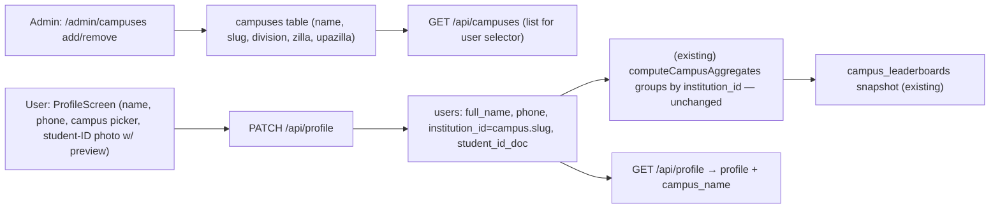

# Chokro — Feature Build Blueprint (AI-Executable) #2

**Feature in this file:**
1. **Feature 3 — User Profile & Campus Registry** (structured user profile + admin-managed Bangladesh campuses)

**Date:** 2026-08-17 · **Author:** sadat · **Status:** Executable draft (open decisions = `OD-`)

> **For the executing AI:** this file is a work order. Read **Part 0** (codebase conventions + verbatim templates), then execute the work orders in order — **Feature 3 `U1…U8`**. Every work order lists the exact files to create/edit, the exact code/pattern to use, and the exact command to verify. Do not "design" — copy the templates. Do not touch files outside the lists. Run the verification command after every work order before moving on.

---

# Part 0 — Codebase blueprint (read this first)

## 0.1 Repo layout & import rules

| Where | What | Import style |
|---|---|---|
| `packages/shared/src` | Zod enums + DTOs (source of truth) | `import { X } from '@chokro/shared'` |
| `packages/db/src` | Drizzle schema, `db` client, migrate, seed | `import { db, users, eq, and, desc, sql } from '@chokro/db'` |
| `apps/api/lib` | auth, http, database, domains, repos | internal: `@/lib/...` |
| `apps/api/app/api/**/route.ts` | Next route handlers | `@/lib/auth`, `@/lib/http`, `@/lib/domain/...` |
| `apps/api/app/admin` | admin SPA | relative + `@chokro/shared` |
| `apps/mobile/src` | RN app | `@/services/api`, `@/hooks/...`, `@/components/...`, alias `@/` = `src/` |

**Path alias `@/`** exists in `apps/api` and `apps/mobile` (tsconfig path mapping + babel module-resolver in mobile).

## 0.2 The HTTP + auth helpers you MUST use (do not reimplement)

From `apps/api/lib/http.ts`:
- `safeRoute(handler)` — wraps any route handler; converts thrown errors to responses, stamps CORS. **Every exported handler is `export const GET/POST/DELETE = safeRoute(async (req) => {...})`.**
- `apiData(data, status=200)` → `{...data}`
- `apiError(message, status, details?)` → `{ error: message [, details] }`
- `apiSuccess(message, data?, status=200)` → `{ message, ...data }`

From `apps/api/lib/auth.ts`:
- `requireAuth(req)` → `{ user } | { response }` (401). **Always: `const auth = requireAuth(req); if (auth.response) return auth.response;`**
- `requireAdmin(req)` → same shape, demands role `ADMIN` (403).
- Admin `[id]` routes use the Next 15 promise-params convention: `const { id } = await params;` (see `drop-zones/[id]/poster/route.ts`).

`apps/api/lib/database.ts` exports `routeError` (503 on DB down, else 500). Repos use `withDb` from `apps/api/lib/repos/seam.ts` — you never touch raw db in routes/domains.

## 0.3 Verbatim templates (COPY THESE, they are the language of this repo)

**A. Repo template** — copy `apps/api/lib/repos/dropZones.ts` shape verbatim:

```ts
import { db, tableName, eq, desc } from '@chokro/db';
import { withDb } from './seam';

export const someRepo = {
  async findAll() {
    return withDb(async () => db.select().from(tableName).orderBy(desc(tableName.created_at)));
  },
  async findById(id: string) {
    return withDb(async () => {
      const rows = await db.select().from(tableName).where(eq(tableName.id, id)).limit(1);
      return rows[0] || null;
    });
  },
  async create(input: {...}) {
    return withDb(async () => {
      const [row] = await db.insert(tableName).values(input).returning();
      return row;
    });
  },
};
```

**B. Route template** — copy `apps/api/app/api/partners/apply/route.ts` verbatim pattern (auth guard → zod parse → domain call → status response):

```ts
import { requireAuth } from '@/lib/auth';
import { apiError, apiSuccess, apiData, safeRoute } from '@/lib/http';
import { SomeDomain } from '@/lib/domain/SomeDomain';
import { SomeSchema } from '@chokro/shared';

export const PATCH = safeRoute(async (req: Request) => {
  const auth = requireAuth(req);
  if (auth.response) return auth.response;
  const body = await req.json();
  const parsed = SomeSchema.safeParse(body);
  if (!parsed.success) return apiError('Invalid data', 400, parsed.error.format());
  try {
    const result = await SomeDomain.doThing(auth.user.userId, parsed.data);
    return apiData(result);
  } catch (error) {
    return apiError(error instanceof Error ? error.message : 'Failed', 400);
  }
});
```

**C. Domain template** — copy object-literal style of `apps/api/lib/domain/AuthDomain.ts` (rules + thin repo forwarding, pure helpers exported for unit tests).

**D. Shared enum template** — copy `packages/shared/src/enums/index.ts`:

```ts
export const XEnum = z.enum(['A', 'B']);
export type X = z.infer<typeof XEnum>;
export const XS = XEnum.options;
```

**E. Shared DTO template** — copy `packages/shared/src/dto/partners.ts` (`z.object(...)`, `z.infer`, one `Schema` + one `Input` type per file). Register new files in `packages/shared/src/index.ts`.

**F. DB table template** — copy `packages/db/src/schema.ts` (`pgTable`, `uuid PK defaultRandom`, `timestamp defaultNow notNull`). Tables auto-export via `export * from './schema'` in `packages/db/src/index.ts`.

**G. Mobile hook template** — copy `apps/mobile/src/hooks/useWallet.ts` (`useQuery` + `queryKey` array; mutations invalidate it).

**H. Admin hook template** — copy `apps/api/app/admin/hooks/useAdminDropZones.ts` (`'use client'`, `useAdminAuth().status` gating with `enabled: status === 'signed-in'`, exported `ADMIN_X_QUERY_KEY = ['admin','x'] as const`, `useQuery` + `useMutation`, `onSuccess: () => void queryClient.invalidateQueries({ queryKey })`).

**I. Mobile request client** — `apps/mobile/src/services/api.ts`: `apiRequest<T>(path, options)` and `getErrorMessage(error, fallback)`. Token injected automatically by `AuthContext`; never pass tokens manually.

**J. Admin request client** — `apps/api/app/admin/services/adminApi.ts`: `adminApiRequest<T>(input, options)`; 401/403 handled globally.

## 0.4 DB access in tests (PGlite)

`apps/api/tests/test-utils.ts` provides, verbatim usage:
- `ensureTestDbSchema()` / `resetTestStore()` — call `resetTestStore()` in `beforeEach`.
- `createTestUser(role?, email?)` → `{ id, email, role }`.
- `tokenFor(user)` → JWT; `authHeaders(token)` → `Authorization` headers.
- `routeParams(id)` → `{ params: Promise.resolve({ id }) }` for `[id]` routes.

Tests use **jest** (`apps/api/package.json` → `test: jest --forceExit`). Test files live in `apps/api/tests/*.test.ts`. They call route handlers directly (not a server).

## 0.5 Commands (verification at every work order)

```bash
# create/alter tables + apply invariants + seed (local dev DB)
pnpm db:push && pnpm db:migrate && pnpm db:seed

# typecheck per package
pnpm --filter @chokro/shared typecheck
pnpm --filter @chokro/db typecheck
pnpm --filter @chokro/api typecheck
pnpm --filter @chokro/mobile typecheck

# API tests (PGlite, no DB needed)
pnpm --filter @chokro/api test           # or: pnpm --filter @chokro/api test -- campus

# everything
pnpm typecheck && pnpm test
```

> **Compatibility note (why nothing breaks):** the campus leaderboard already works keyed on the free-text string `users.institution_id` (seed uses `'BRACU'`, `'NSU'`, `'DU'`), aggregated by `campusLeaderboardsRepo.computeCampusAggregates`. This feature **keeps `institution_id` as the stable campus key** and backs it with a proper `campuses` table whose `slug` column equals that same key. No SQL in `computeCampusAggregates`, no `campus_leaderboards` shape, no existing routes change. Users who already have `institution_id` keep their rankings.

---

# Feature 3 — User Profile & Campus Registry

## Overview (data flow)



**Rules that must hold:**
- `campuses.slug` is the eternal link between the registry and the leaderboard. Never rename/re-key it; it equals `users.institution_id` and `campus_leaderboards.campus_id`.
- A user gets a **campus tag** only when they (a) pick a registered campus **and** (b) upload a student-ID photo. Picking a campus without an ID photo is rejected client-side (server stores what it is given but the mobile screen enforces the pairing). Users may keep `institution_id = null` (skip) — "not a student" — and are simply not ranked.
- A campus **cannot be deleted while members reference it** (`countByInstitution(slug) > 0` → 400 with count). No orphaned leaderboard keys.
- Student-ID photo is a compressed JPEG data URI stored in a `text` column — same storage precedent as `partners.doe_license_doc`. Max 500 KB enforced by the existing `compressPhoto` helper.
- `slug` is auto-derived from the name (uppercase `[A-Z0-9_]`, dedup with `_2`, `_3…`) unless the admin supplies one.
- Location is Bangladesh-context: `division` is a fixed 8-value enum; `zilla` and `upazilla/thana` are free-text inputs (`OD-4`).

## Work order U1 — Shared: division enum + campus & profile DTOs

**Files:**
- `packages/shared/src/enums/index.ts` — **edit**: append
- `packages/shared/src/dto/campuses.ts` — **create** (new file)
- `packages/shared/src/dto/profile.ts` — **create** (new file)
- `packages/shared/src/index.ts` — **edit**: add the two exports

**Edit `enums/index.ts` — append exactly:**

```ts
// Bangladesh administrative divisions (8) for campus geo-context
export const DivisionEnum = z.enum([
  'DHAKA',
  'CHITTAGONG',
  'RAJSHAHI',
  'KHULNA',
  'BARISAL',
  'SYLHET',
  'RANGPUR',
  'MYMENSINGH',
]);
export type Division = z.infer<typeof DivisionEnum>;
export const DIVISIONS = DivisionEnum.options;
```

**Create `dto/campuses.ts`:**

```ts
// DTOs for the campus registry and admin campus management.
import { z } from 'zod';
import { DivisionEnum } from '../enums';

// Optional explicit slug; otherwise derived from the name (uppercase [A-Z0-9_]).
export const CreateCampusSchema = z.object({
  name: z.string().trim().min(2).max(255),
  division: DivisionEnum,
  zilla: z.string().trim().min(1).max(120),
  upazilla: z.string().trim().min(1).max(120),
  slug: z.string().trim().regex(/^[A-Z0-9_]+$/).max(255).optional(),
});
export type CreateCampusInput = z.infer<typeof CreateCampusSchema>;

// Canonical campus row as returned by the API (used by admin page + mobile selector).
export const CampusSchema = z.object({
  id: z.string(),
  slug: z.string(),
  name: z.string(),
  division: DivisionEnum,
  zilla: z.string(),
  upazilla: z.string().nullable(),
  created_at: z.string(),
});
export type Campus = z.infer<typeof CampusSchema>;
```

**Create `dto/profile.ts`:**

```ts
// DTOs for the user-editable profile (name, phone, campus link, student-ID card photo).
import { z } from 'zod';

export const ProfileUpdateSchema = z.object({
  fullName: z.string().trim().min(1).max(120).optional(),
  phone: z.string().trim().min(7).max(20).nullable().optional(),
  // campus.slug to attach; null/"" to detach ("not a student"). Undefined = leave unchanged.
  campusSlug: z.string().trim().max(255).nullable().optional(),
  // Compressed JPEG data URI from the mobile PhotoUploader flow (cap ~500 KB source).
  studentIdDoc: z.string().max(900_000).nullable().optional(),
});
export type ProfileUpdateInput = z.infer<typeof ProfileUpdateSchema>;
```

**Edit `index.ts` — add:**

```ts
export * from './dto/campuses';
export * from './dto/profile';
```

**Verify:** `pnpm --filter @chokro/shared typecheck`

## Work order U2 — DB: campuses table + users profile columns + migrate + seed

**Files:**
- `packages/db/src/schema.ts` — **edit**: append `campuses` table + 3 columns on `users`
- `packages/db/src/migrate.ts` — **edit**: idempotent create-table + add-columns
- `packages/db/src/seed.ts` — **edit**: seed 3 campuses + enrich demo user profile

**Edit `schema.ts` — append to the `users` table:**

```ts
  full_name: varchar('full_name', { length: 120 }),
  phone: varchar('phone', { length: 30 }),
  student_id_doc: text('student_id_doc'),
```

**Append a new table after `users` (before `partners`):**

```ts
// Registered university/college campuses. slug === users.institution_id (leaderboard key).
export const campuses = pgTable('campuses', {
  id: uuid('id').defaultRandom().primaryKey(),
  slug: varchar('slug', { length: 255 }).notNull().unique(),
  name: varchar('name', { length: 255 }).notNull(),
  division: varchar('division', { length: 50 }).notNull(), // DivisionEnum
  zilla: varchar('zilla', { length: 120 }).notNull(),
  upazilla: varchar('upazilla', { length: 120 }),
  created_at: timestamp('created_at').defaultNow().notNull(),
});
```

**Edit `migrate.ts` — add inside `migrate()` (same `db.execute(sql\`...\`)` style):**

```sql
CREATE TABLE IF NOT EXISTS campuses (
  id uuid PRIMARY KEY DEFAULT gen_random_uuid(),
  slug varchar(255) NOT NULL UNIQUE,
  name varchar(255) NOT NULL,
  division varchar(50) NOT NULL,
  zilla varchar(120) NOT NULL,
  upazilla varchar(120),
  created_at timestamp NOT NULL DEFAULT NOW()
);
alter table users add column if not exists full_name varchar(120);
alter table users add column if not exists phone varchar(30);
alter table users add column if not exists student_id_doc text;
```

**Edit `seed.ts`:**
- Import `campuses` from `./index`.
- Add an idempotent `upsertCampus` (insert `onConflictDoNothing` keyed on `slug`) for `NSU` / `BRACU` / `DU` — matching the `institution_id` values already used by the demo users and seeded leaderboard snapshots:

```ts
await upsertCampus({ slug: 'NSU', name: 'North South University', division: 'DHAKA', zilla: 'Dhaka', upazilla: 'Bashundhara R/A' });
await upsertCampus({ slug: 'BRACU', name: 'BRAC University', division: 'DHAKA', zilla: 'Dhaka', upazilla: 'Mohakhali' });
await upsertCampus({ slug: 'DU', name: 'University of Dhaka', division: 'DHAKA', zilla: 'Dhaka', upazilla: 'Shahbag' });
```

- After `upsertUser('user@chokro.org', ...)`, set the demo profile (idempotent `onConflictDoUpdate` on the user row): `full_name: 'Demo Student'`, `phone: '01700000000'`.

**Verify:** `pnpm db:push && pnpm db:migrate && pnpm --filter @chokro/db typecheck`

## Work order U3 — Repos: campuses + users extend

**Files:**
- `apps/api/lib/repos/campuses.ts` — **create**
- `apps/api/lib/repos/users.ts` — **edit** (add `updateProfile`, `countByInstitution`)

**Create `repos/campuses.ts` (template A):**

```ts
import { db, campuses, eq, desc, inArray } from '@chokro/db';
import { withDb } from './seam';

export const campusRepo = {
  async findAll() {
    return withDb(async () => db.select().from(campuses).orderBy(desc(campuses.created_at)));
  },
  async findById(id: string) {
    return withDb(async () => {
      const rows = await db.select().from(campuses).where(eq(campuses.id, id)).limit(1);
      return rows[0] || null;
    });
  },
  async findBySlug(slug: string) {
    return withDb(async () => {
      const rows = await db.select().from(campuses).where(eq(campuses.slug, slug)).limit(1);
      return rows[0] || null;
    });
  },
  async findAllBySlugs(slugs: string[]) {
    return withDb(async () => {
      if (slugs.length === 0) return [];
      return db.select().from(campuses).where(inArray(campuses.slug, slugs));
    });
  },
  async create(input: { slug: string; name: string; division: string; zilla: string; upazilla?: string | null }) {
    return withDb(async () => {
      const [row] = await db.insert(campuses).values({
        slug: input.slug,
        name: input.name,
        division: input.division,
        zilla: input.zilla,
        upazilla: input.upazilla || null,
      }).returning();
      return row;
    });
  },
  async remove(id: string) {
    return withDb(async () => {
      await db.delete(campuses).where(eq(campuses.id, id));
    });
  },
};
```

**Edit `repos/users.ts` — append to `userRepo`:**

```ts
  // Partial profile update: undefined fields are left untouched by Drizzle's .set().
  async updateProfile(id: string, input: {
    fullName?: string | null;
    phone?: string | null;
    institutionId?: string | null;
    studentIdDoc?: string | null;
  }): Promise<User | null> {
    return withDb(async () => {
      const [updated] = await db
        .update(users)
        .set({
          ...(input.fullName !== undefined ? { full_name: input.fullName } : {}),
          ...(input.phone !== undefined ? { phone: input.phone } : {}),
          ...(input.institutionId !== undefined ? { institution_id: input.institutionId } : {}),
          ...(input.studentIdDoc !== undefined ? { student_id_doc: input.studentIdDoc } : {}),
        })
        .where(eq(users.id, id))
        .returning();
      return (updated as User) || null;
    });
  },

  // Number of users linked to a campus slug — used to guard campus deletion.
  async countByInstitution(institutionId: string): Promise<number> {
    return withDb(async () => {
      const rows = await db
        .select({ count: sql<number>`count(*)::int` })
        .from(users)
        .where(eq(users.institution_id, institutionId));
      return Number(rows[0]?.count ?? 0);
    });
  },
```

> Add `sql` to the existing `import { db, users, eq } from '@chokro/db'` line in `repos/users.ts`.

**Verify:** `pnpm --filter @chokro/api typecheck`

## Work order U4 — Domains: CampusDomain + ProfileDomain

**Files (create two):**
- `apps/api/lib/domain/CampusDomain.ts`
- `apps/api/lib/domain/ProfileDomain.ts`

**Create `CampusDomain.ts` (template C — pure slug helper + rules, thin repo forwarding):**

```ts
import { campusRepo } from '@/lib/repos/campuses';
import { userRepo } from '@/lib/repos/users';

// Uppercase [A-Z0-9_] slug, e.g. "BRAC University" -> "BRAC_UNIVERSITY".
export function slugifyCampusName(name: string): string {
  const slug = name
    .toUpperCase()
    .replace(/[^A-Z0-9]+/g, '_')
    .replace(/^_+|_+$/g, '');
  return slug || 'CAMPUS';
}

export const CampusDomain = {
  async list() {
    return campusRepo.findAll();
  },

  // Create with dedup: caller-supplied slug wins, else slugify(name); append _2, _3…
  async create(input: { name: string; division: string; zilla: string; upazilla?: string; slug?: string }) {
    const base = (input.slug && input.slug.trim())
      ? input.slug.toUpperCase()
      : slugifyCampusName(input.name);
    let slug = base;
    let suffix = 2;
    while (await campusRepo.findBySlug(slug)) {
      slug = `${base}_${suffix}`;
      suffix += 1;
    }
    return campusRepo.create({ ...input, slug });
  },

  // Refuse to delete a campus that still has linked student members.
  async remove(id: string) {
    const campus = await campusRepo.findById(id);
    if (!campus) throw new Error('Campus not found');
    const members = await userRepo.countByInstitution(campus.slug);
    if (members > 0) {
      throw new Error(`Cannot delete "${campus.name}": ${members} student(s) are linked to it. Unlink them first.`);
    }
    await campusRepo.remove(id);
    return campus;
  },
};
```

**Create `ProfileDomain.ts` (template C):**

```ts
import { userRepo } from '@/lib/repos/users';
import { campusRepo } from '@/lib/repos/campuses';

// Caller-facing profile shape (camelCase) with the campus display name resolved.
export interface Profile {
  id: string;
  email: string;
  role: string;
  fullName: string | null;
  phone: string | null;
  institutionId: string | null;
  campusName: string | null;
  studentIdDoc: string | null;
}

export const ProfileDomain = {
  async getProfile(userId: string): Promise<Profile | null> {
    const user = await userRepo.findById(userId);
    if (!user) return null;

    let campusName: string | null = null;
    if (user.institution_id) {
      const campus = await campusRepo.findBySlug(user.institution_id);
      campusName = campus?.name ?? null;
    }

    return {
      id: user.id,
      email: user.email,
      role: user.role,
      fullName: user.full_name ?? null,
      phone: user.phone ?? null,
      institutionId: user.institution_id ?? null,
      campusName,
      studentIdDoc: user.student_id_doc ?? null,
    };
  },

  // Partial update. campusSlug: a registered slug attaches the campus; null/"" detaches.
  async update(userId: string, input: {
    fullName?: string;
    phone?: string | null;
    campusSlug?: string | null;
    studentIdDoc?: string | null;
  }): Promise<Profile | null> {
    let institutionId: string | null | undefined;
    if ('campusSlug' in input && input.campusSlug !== undefined) {
      if (input.campusSlug && input.campusSlug.length > 0) {
        const campus = await campusRepo.findBySlug(input.campusSlug);
        if (!campus) throw new Error('The selected campus is not registered. Contact Chokro to add it.');
        institutionId = campus.slug;
      } else {
        institutionId = null; // "not a student" clears the campus tag
      }
    }

    const normalized = {
      fullName: input.fullName !== undefined && input.fullName?.trim() === '' ? undefined : input.fullName,
      phone: input.phone !== undefined && input.phone?.trim() === '' ? null : input.phone,
      institutionId,
      studentIdDoc: input.studentIdDoc !== undefined && input.studentIdDoc?.trim() === '' ? null : input.studentIdDoc,
    };

    await userRepo.updateProfile(userId, normalized);
    return this.getProfile(userId);
  },
};
```

**Verify:** `pnpm --filter @chokro/api typecheck`

## Work order U5 — API routes + tests

**Files:**
- `apps/api/app/api/campuses/route.ts` — **create**
- `apps/api/app/api/profile/route.ts` — **create**
- `apps/api/app/api/admin/campuses/route.ts` — **create**
- `apps/api/app/api/admin/campuses/[id]/route.ts` — **create**
- `apps/api/tests/test-utils.ts` — **edit** (test schema must mirror the new tables/columns)
- `apps/api/tests/campus-profile.test.ts` — **create**

**Edit `tests/test-utils.ts` first (the PGlite test schema is hand-listed, not generated):**
1. In `TABLE_DDLS`, add to the `users` DDL (before `created_at`):
   `full_name varchar(120),` / `phone varchar(30),` / `student_id_doc text,`
2. Append a `campuses` DDL (before the final `];`):
   ```sql
   `CREATE TABLE IF NOT EXISTS campuses (
     id uuid PRIMARY KEY DEFAULT gen_random_uuid(),
     slug varchar(255) NOT NULL UNIQUE,
     name varchar(255) NOT NULL,
     division varchar(50) NOT NULL,
     zilla varchar(120) NOT NULL,
     upazilla varchar(120),
     created_at timestamp NOT NULL DEFAULT NOW()
   );`,
   ```
3. In `resetTestStore()`'s `TRUNCATE`, add `campuses` to the table list (e.g. `..., listings, partners, campuses, users CASCADE`) — `campuses` first so the FK-free slug link is not an issue, and order `users` last.
4. `createTestUser(role)` already covers the admin case: use `createTestUser('ADMIN')` (there is **no** `createAdminUser` helper — fix the snippet below accordingly).

**`campuses/route.ts` (user-facing campus list for the profile selector, template B, GET only):**

```ts
import { requireAuth } from '@/lib/auth';
import { apiData, safeRoute } from '@/lib/http';
import { CampusDomain } from '@/lib/domain/CampusDomain';

export const GET = safeRoute(async (req: Request) => {
  const auth = requireAuth(req);
  if (auth.response) return auth.response;
  const campuses = await CampusDomain.list();
  return apiData({ campuses });
});
```

**`profile/route.ts` (GET + PATCH, template B):**

```ts
import { requireAuth } from '@/lib/auth';
import { apiData, apiError, safeRoute } from '@/lib/http';
import { ProfileDomain } from '@/lib/domain/ProfileDomain';
import { ProfileUpdateSchema } from '@chokro/shared';

export const GET = safeRoute(async (req: Request) => {
  const auth = requireAuth(req);
  if (auth.response) return auth.response;
  const profile = await ProfileDomain.getProfile(auth.user.userId);
  if (!profile) return apiError('Unauthorized', 401);
  return apiData({ user: profile });
});

export const PATCH = safeRoute(async (req: Request) => {
  const auth = requireAuth(req);
  if (auth.response) return auth.response;
  const body = await req.json();
  const parsed = ProfileUpdateSchema.safeParse(body);
  if (!parsed.success) return apiError('Invalid profile data', 400, parsed.error.format());
  try {
    const user = await ProfileDomain.update(auth.user.userId, parsed.data);
    return apiData({ user });
  } catch (error) {
    return apiError(error instanceof Error ? error.message : 'Failed to update profile', 400);
  }
});
```

**`admin/campuses/route.ts` (list + create, `requireAdmin`, template B):**

```ts
import { requireAdmin } from '@/lib/auth';
import { apiData, apiError, apiSuccess, safeRoute } from '@/lib/http';
import { CampusDomain } from '@/lib/domain/CampusDomain';
import { CreateCampusSchema } from '@chokro/shared';

export const GET = safeRoute(async (req: Request) => {
  const auth = requireAdmin(req);
  if (auth.response) return auth.response;
  const campuses = await CampusDomain.list();
  return apiData({ campuses });
});

export const POST = safeRoute(async (req: Request) => {
  const auth = requireAdmin(req);
  if (auth.response) return auth.response;
  const body = await req.json();
  const parsed = CreateCampusSchema.safeParse(body);
  if (!parsed.success) return apiError('Invalid campus data', 400, parsed.error.format());
  try {
    const campus = await CampusDomain.create(parsed.data);
    return apiSuccess('Campus added', { campus }, 201);
  } catch (error) {
    return apiError(error instanceof Error ? error.message : 'Failed to add campus', 400);
  }
});
```

**`admin/campuses/[id]/route.ts` (delete, Next-15 promise params):**

```ts
import { requireAdmin } from '@/lib/auth';
import { apiError, apiSuccess, safeRoute } from '@/lib/http';
import { CampusDomain } from '@/lib/domain/CampusDomain';

export const DELETE = safeRoute(async (_req: Request, { params }: { params: Promise<{ id: string }> }) => {
  const auth = requireAdmin(_req);
  if (auth.response) return auth.response;
  const { id } = await params;
  try {
    await CampusDomain.remove(id);
    return apiSuccess('Campus removed');
  } catch (error) {
    return apiError(error instanceof Error ? error.message : 'Failed to remove campus', 400);
  }
});
```

**`tests/campus-profile.test.ts` (jest + PGlite — copy `test-utils` idioms from `auth.test.ts` / `dropzones.test.ts`):**

```ts
import { resetTestStore, createTestUser, tokenFor, authHeaders, routeParams } from './test-utils';
import { GET as getCampuses } from '../app/api/campuses/route';
import { PATCH as patchProfile } from '../app/api/profile/route';
import { POST as postCampus } from '../app/api/admin/campuses/route';
import { DELETE as deleteCampus } from '../app/api/admin/campuses/[id]/route';

beforeEach(async () => { await resetTestStore(); });

it('lists campuses for a signed-in user', async () => {
  const user = await createTestUser();
  const res = await getCampuses(new Request('http://x/api/campuses', { headers: authHeaders(tokenFor(user)) }));
  const body = await res.json();
  expect(res.status).toBe(200);
  expect(Array.isArray(body.campuses)).toBe(true);
});

it('rejects unauthenticated campus list', async () => {
  const res = await getCampuses(new Request('http://x/api/campuses'));
  expect(res.status).toBe(401);
});

it('admin creates a campus and slug is auto-derived + deduped', async () => {
  const admin = await createTestUser('ADMIN');
  const headers = authHeaders(tokenFor(admin));
  const first = await postCampus(new Request('http://x/api/admin/campuses', {
    method: 'POST', headers: { ...headers, 'Content-Type': 'application/json' },
    body: JSON.stringify({ name: 'BRAC University', division: 'DHAKA', zilla: 'Dhaka', upazilla: 'Mohakhali' }),
  }));
  expect(first.status).toBe(201);
  expect((await first.json()).campus.slug).toBe('BRAC_UNIVERSITY');

  const second = await postCampus(new Request('http://x/api/admin/campuses', {
    method: 'POST', headers: { ...headers, 'Content-Type': 'application/json' },
    body: JSON.stringify({ name: 'BRAC University', division: 'DHAKA', zilla: 'Dhaka', upazilla: 'Mohakhali' }),
  }));
  expect((await second.json()).campus.slug).toBe('BRAC_UNIVERSITY_2');
});

it('admin create rejects invalid division', async () => {
  const admin = await createTestUser('ADMIN');
  const res = await postCampus(new Request('http://x/api/admin/campuses', {
    method: 'POST', headers: { ...authHeaders(tokenFor(admin)), 'Content-Type': 'application/json' },
    body: JSON.stringify({ name: 'X College', division: 'COMILLA', zilla: 'Cumilla', upazilla: 'X' }),
  }));
  expect(res.status).toBe(400);
});

it('cannot delete a campus that still has members', async () => {
  // create campus, attach a user to its slug via userRepo.create institution_id or direct db update,
  // then DELETE -> 400 with message; after unlinking, DELETE -> 200.
});
```

Also add cases (mirroring `wallet.test.ts` conventions):
- `PATCH /api/profile` updates `fullName`/`phone`, and attaching a registered `campusSlug` sets `institution_id` to the slug + `campusName` resolves on the follow-up `GET /api/profile`.
- `PATCH /api/profile` with unknown `campusSlug` → 400 with "not registered".
- `PATCH /api/profile` with `campusSlug: null` clears `institution_id`.
- `studentIdDoc` (data URI) persists and round-trips via GET.

**Verify:** `pnpm --filter @chokro/api typecheck && pnpm --filter @chokro/api test -- campus`

## Work order U6 — Admin UI: campuses page

**Files:**
- `apps/api/app/admin/hooks/useAdminCampuses.ts` — **create** (template H)
- `apps/api/app/admin/campuses/page.tsx` — **create** (copy `drop-zones/page.tsx` anatomy)
- `apps/api/app/admin/components/layout/AdminShell.tsx` — **edit**: add nav link

**Create `hooks/useAdminCampuses.ts` (template H):**

```ts
'use client';
import type { Campus } from '@chokro/shared';
import { useMutation, useQuery, useQueryClient } from '@tanstack/react-query';
import { useAdminAuth } from '../context/AdminAuthContext';
import { adminApiRequest } from '../services/adminApi';

export type CampusInput = {
  name: string;
  division: string;
  zilla: string;
  upazilla: string;
  slug?: string;
};

export const ADMIN_CAMPUSES_QUERY_KEY = ['admin', 'campuses'] as const;

export function useAdminCampuses() {
  const { status } = useAdminAuth();
  return useQuery<Campus[]>({
    queryKey: ADMIN_CAMPUSES_QUERY_KEY,
    queryFn: async () => {
      const data = await adminApiRequest<{ campuses?: Campus[] }>('/api/admin/campuses');
      return Array.isArray(data.campuses) ? data.campuses : [];
    },
    enabled: status === 'signed-in',
  });
}

export function useCreateCampus() {
  const queryClient = useQueryClient();
  return useMutation<Campus | undefined, Error, CampusInput>({
    mutationFn: async (payload) => {
      const data = await adminApiRequest<{ campus?: Campus }>('/api/admin/campuses', {
        method: 'POST',
        headers: { 'Content-Type': 'application/json' },
        body: JSON.stringify(payload),
      });
      return data.campus;
    },
    onSuccess: () => {
      void queryClient.invalidateQueries({ queryKey: ADMIN_CAMPUSES_QUERY_KEY });
    },
  });
}

export function useRemoveCampus() {
  const queryClient = useQueryClient();
  return useMutation<Campus | undefined, Error, string>({
    mutationFn: async (id) => {
      const data = await adminApiRequest<{ campus?: Campus }>(`/api/admin/campuses/${id}`, {
        method: 'DELETE',
      });
      return data.campus;
    },
    onSuccess: () => {
      void queryClient.invalidateQueries({ queryKey: ADMIN_CAMPUSES_QUERY_KEY });
    },
  });
}
```

**Create `campuses/page.tsx`** — copy the form + table + modal anatomy of `drop-zones/page.tsx` and `partners/page.tsx`:
- `AdminPageHeader` kicker "Network operations", title "Campuses", description: "Register universities/colleges. Campus code (slug) is what links students to the leaderboard."
- **Add campus panel** (`admin-panel` + `admin-form admin-form-grid`): `AdminInput` `name` (required), `AdminSelect` `division` (options `DIVISIONS` from `@chokro/shared`, required), `AdminInput` `zilla` (required), `AdminInput` `upazilla` (required), optional `AdminInput` `slug` with hint "Optional 2–8 letter code, e.g. BRACU. Auto-derived from name otherwise." Submit via `useCreateCampus` (`AdminButton variant="primary" loading`), banner via `AdminStatusMessage`.
- **Campus table**: columns `Name`, `Code`, `Division`, `Zilla / Upazilla`, `Actions`. Each row's actions: an `AdminButton variant="danger"` "Remove" that opens `AdminConfirmModal` (title `Remove {name}?`, confirm runs `useRemoveCampus`). Use the same loading/error/empty states as the drop-zones page.
- Format the division string with `formatLabel` (sadath read: `formatLabel('DHAKA')` → `Dhaka`).

**Edit `AdminShell.tsx`** — add to `NAVIGATION_ITEMS` after Leaderboard:

```ts
{ href: '/admin/campuses', label: 'Campuses' },
```

**Verify:** `pnpm --filter @chokro/api typecheck`

## Work order U7 — Mobile: useCampuses + useProfile hooks

**Files (create two):**
- `apps/mobile/src/hooks/useCampuses.ts`
- `apps/mobile/src/hooks/useProfile.ts`

**Create `hooks/useCampuses.ts` (template G):**

```ts
import { useQuery } from '@tanstack/react-query';
import { apiRequest } from '@/services/api';
import type { Campus } from '@chokro/shared';

export const CAMPUSES_QUERY_KEY = ['campuses'] as const;

export function useCampuses() {
  return useQuery<Campus[]>({
    queryKey: CAMPUSES_QUERY_KEY,
    queryFn: async () => {
      const data = await apiRequest<{ campuses: Campus[] }>('/api/campuses');
      return data.campuses ?? [];
    },
  });
}
```

**Create `hooks/useProfile.ts` (template G + mutation):**

```ts
import { useMutation, useQuery, useQueryClient } from '@tanstack/react-query';
import { apiRequest } from '@/services/api';

// The profile shape returned by GET /api/profile.
export interface MobileProfile {
  id: string;
  email: string;
  role: string;
  fullName: string | null;
  phone: string | null;
  institutionId: string | null;
  campusName: string | null;
  studentIdDoc: string | null;
}

export const PROFILE_QUERY_KEY = ['profile'] as const;

export function useProfile() {
  return useQuery<{ user: MobileProfile }, Error>({
    queryKey: PROFILE_QUERY_KEY,
    queryFn: async () => apiRequest<{ user: MobileProfile }>('/api/profile'),
  });
}

export function useUpdateProfile() {
  const queryClient = useQueryClient();
  return useMutation<{ user: MobileProfile }, Error, {
    fullName?: string;
    phone?: string | null;
    campusSlug?: string | null;
    studentIdDoc?: string | null;
  }>({
    mutationFn: async (payload) => apiRequest<{ user: MobileProfile }>('/api/profile', {
      method: 'PATCH',
      headers: { 'Content-Type': 'application/json' },
      body: JSON.stringify(payload),
    }),
    onSuccess: () => {
      void queryClient.invalidateQueries({ queryKey: PROFILE_QUERY_KEY });
    },
  });
}
```

**Verify:** `pnpm --filter @chokro/mobile typecheck`

## Work order U8 — Mobile: ProfileScreen + AppShell wiring

**Files:**
- `apps/mobile/src/screens/ProfileScreen.tsx` — **create**
- `apps/mobile/src/navigation/AppShell.tsx` — **edit** (subview, header entry, campus chip)
- `apps/mobile/src/types.ts` — **edit** (`User` gains profile fields)

**Edit `types.ts` `User` type — add optional fields (login/signup return shape stays compatible):**

```ts
export type User = {
  id: string;
  email: string;
  role: 'INDIVIDUAL' | 'PARTNER' | 'ADMIN';
  institutionId?: string | null;
  fullName?: string | null;
  phone?: string | null;
  studentIdDoc?: string | null;
};
```

**Create `screens/ProfileScreen.tsx`** — copy the layout of `BecomePartnerScreen.tsx` (KeyboardAvoidingView + ScrollView card):
- Props: `{ onBack?: () => void }`.
- Data: `useProfile()` (seed the form from `data.user`, mirroring the `useEffect` sync pattern in `BecomePartnerScreen`) + `useCampuses()`.
- **Fields:**
  - `ui/Input` **Full name** (`fullName`).
  - `ui/Input` **Phone** (`phone`, `keyboardType="phone-pad"`).
  - **Campus selector** — title "University / College (optional)": a wrapping row of chips from `useCampuses()` rendering `campus.name` (like the `PARTNER_TYPES` chips, single-select `accessibilityRole="radio"`); plus a "Not a student" chip that clears the selection (sets `campusSlug: null`).
  - **Student ID card** — only shown/enabled when a campus chip is selected (rule: campus tag requires ID photo). Reuse the `PhotoUploader` interaction pattern: a dashed "Upload student ID card" area that calls `pickAndCompressPhoto()` from `@/lib/photo`; when a `PreparedPhoto` is set show a full-width `Image` preview (`previewUri`) with an overlay remove button (copy from `components/PhotoUploader.tsx`). Store `photo.dataUri` and send as `studentIdDoc`.
  - Explain that non-students can skip: a muted caption "Not associated with a university? Skip — you won't be ranked on the campus leaderboard."
  - Save via `useUpdateProfile` + `ui/Button` loading; errors via `getErrorMessage` + `ErrorBanner`.
  - On success: show a success banner and refetch (`invalidate` already happens in the hook).

**Edit `AppShell.tsx`:**
1. Add `'profile'` to the `SubView` union.
2. Import `ProfileScreen` and `useProfile`.
3. In the header, make the email block pressable → `setSubView('profile')`; add a small campus chip next to the email when present:

```tsx
const { data: profileData } = useProfile();
const campusTag = profileData?.user.campusName ?? profileData?.user.institutionId ?? null;
// ...
<Pressable accessibilityRole="button" accessibilityLabel="Open profile" onPress={() => setSubView('profile')}>
  <View className="flex-row items-center gap-1.5">
    <Text className="text-muted text-[11px]" numberOfLines={1}>{session.user.email}</Text>
    {campusTag ? (
      <View className="px-1.5 py-0.5 rounded bg-leaf-soft border border-leaf/40">
        <Text className="text-[9px] font-black text-leaf-dark">{campusTag}</Text>
      </View>
    ) : null}
  </View>
</Pressable>
```

4. Render the subview (add alongside the other `subView === ...` branches):

```tsx
) : subView === 'profile' ? (
  <ProfileScreen onBack={() => setSubView(null)} />
```

> Note: `useProfile()` only exists after sign-in; AppShell already gates on `session`, and partners keep their own `usePartner` query, so this is additive and non-breaking.

**Verify:** `pnpm --filter @chokro/mobile typecheck`; manual (PGlite dev): sign in as `user@chokro.org`, open profile from header, edit name/phone, pick a campus + upload (or skip) an ID photo, Save; reload → chip shows campus; admin `admin@chokro.org` → `/admin/campuses` add/remove (remove a campus with no members OK; one with members → error).

---

# Final verification matrix

| Check | Command |
|---|---|
| All typechecks | `pnpm typecheck` (all 4 packages) |
| All tests (PGlite) | `pnpm --filter @chokro/api test` |
| DB schema + invariants + seed re-runnable | `pnpm db:push && pnpm db:migrate && pnpm db:seed` |
| Feature 3 manual | sign in `user@chokro.org` → edit profile → pick campus + ID photo → header chip; admin add/remove campus; leaderboard still materializes (`/admin/leaderboard` → Rebuild) grouped by the same slugs |

# Open decisions

- `OD-1` — student-ID verification: this build grants the campus tag immediately on upload + campus selection (trust-based, like most onboarding apps). If admins must approve ID cards later, add `student_id_status` (`NONE | SUBMITTED | APPROVED`) on `users` and an admin review queue — out of scope now (`OD-1`).
- `OD-2` — campus keying: kept as `slug` (= `users.institution_id`) instead of a UUID FK to avoid touching `computeCampusAggregates`, `campus_leaderboards.campus_id`, and seed data. Revisit only when the leaderboard is rebuilt around a campuses join.
- `OD-3` — leaderboard display names (optional enrichment): `CampusLeaderboardEntry` could gain `campus_name` by joining `campuses` in `findPublished`; not required for this feature.
- `OD-4` — BD location granularity: `division` from the fixed 8-value enum; `zilla` and `upazilla/thana` are free text. A full BD administrative dataset (~64 zillas) can replace the inputs later without schema changes.
- `OD-5` — photo storage: student-ID card is stored as a compressed JPEG data URI in `users.student_id_doc` (same precedent as `partners.doe_license_doc`). Move to object storage (S3/blob) when real documents arrive.
- `OD-6` — on campus removal, opted-out/ranked members: currently the delete guard requires zero linked members. If soft-delete is preferred, add `status` on `campuses` instead.