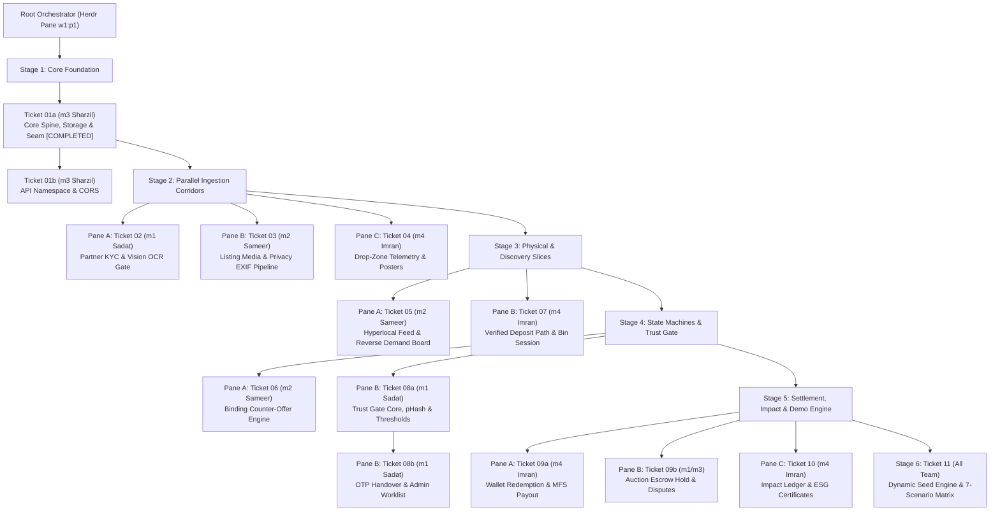

# Chokro Circular Loop: Herdr Multi-Pane Sub-Agent Orchestration Plan (Sprint 3)

## 1. Executive Summary & Orchestration Architecture

This implementation plan orchestrates the **end-to-end construction of Chokro Sprint 3 (SPECs 10–22)** using **Herdr terminal multiplexing**, **isolated Git Worktrees**, and **promptless Antigravity (AGY) sub-agents**.

Rather than executing all tickets linearly within a single conversation context, the **Root Orchestrator** running in Herdr spawns dedicated sub-agents in parallel Herdr terminal panes. Each sub-agent operates within its own clean Git worktree (`.worktrees/<ticket-id>`), develops the vertical slice (Schema $\to$ Domain $\to$ API $\to$ UI $\to$ Jest Suite), verifies against in-memory PGlite, and integrates back into `Sprint3` via fast-forward or squash merge.



---

## 2. Team Member Ownership & Ticket Inventory

| Ticket ID | Feature / Milestone | Owner | Blocked By | Verification Criteria |
|---|---|---|---|---|
| **01a** | Core Spine, Storage, Seam & Test Derivation | `m3` Sharzil | None | `spec10-core-spine.test.ts` (22 suites pass) [DONE] |
| **01b** | API Namespace Consolidation & CORS Allowlist | `m3` Sharzil | `01a` | `spec10-namespace-cors.test.ts` |
| **02** | Partner KYC Document Intelligence & OCR Gate | `m1` Sadat | `01a` | `spec15-partner-kyc.test.ts` + Screen `A06` |
| **03** | Listing Media & Privacy-Safe Ingest Pipeline | `m2` Sameer | `01a` | `spec16-media-privacy.test.ts` + Screen `M02` |
| **04** | Drop-Zone Telemetry & Dynamic Poster Infra | `m4` Imran | `01a` | `spec19-zone-telemetry.test.ts` + Screen `A03` |
| **05** | Hyperlocal Feed & Recycler Demand Board | `m2` Sameer | `01a`, `03` | `spec17-feed-and-demands.test.ts` + Screens `M01`, `M11` |
| **06** | Binding Counter-Offer Negotiation Engine | `m2` Sameer | `01a`, `03`, `05` | `spec18-negotiation.test.ts` + Screen `M12` |
| **07** | Verified Deposit Path: Drop Session & Emptying | `m4` Imran | `01a`, `04` | `spec11-verified-deposit.test.ts` + Screens `M05`, `M06` |
| **08a** | Trust Gate Pure Decision, pHash & Thresholds | `m1` Sadat | `01a`, `02`, `07` | `spec12-trust-gate-core.test.ts` + Screen `A08` |
| **08b** | Custody Handover OTP & Admin Worklist | `m1` Sadat | `08a` | `spec12-custody-handover.test.ts` + Screen `A07`, `M08` |
| **09a** | Wallet Redemption & MFS Cash-Out Engine | `m4` Imran | `01a`, `08b` | `spec13-wallet-redemption.test.ts` + Screens `M14`, `A10`, `A11` |
| **09b** | Auction Escrow Hold & Unified Disputes | `m1`/`m3` | `01a`, `06`, `08b` | `spec13-escrow-disputes.test.ts` + Screens `M09`, `M10`, `M15`, `A09` |
| **10** | Impact Ledger, ESG Certs & Sponsorship Pools | `m4` Imran | `01a`, `08b` | `spec14-impact-ledger.test.ts` + Screens `M16`, `M17`, `A12` |
| **11** | Dynamic Seed Engine & 7-Scenario Matrix | All Team | `01b`–`10` | Full `pnpm test` + `pnpm db:setup` (27 Mobile + 13 Admin Screens) |

---

## 3. Herdr + Git Worktree Orchestrator Protocol

### 3.1 Worktree Directory Structure
All concurrent worker agents execute inside dedicated worktree folders under `.worktrees/`:
```
/Users/sharzilnafis/Desktop/Project/chokro-m3/
├── .worktrees/
│   ├── ticket-02-partner-kyc/
│   ├── ticket-03-listing-media/
│   ├── ticket-04-zone-telemetry/
│   └── ...
├── apps/
├── packages/
└── docs/
```

### 3.2 Standard Sub-Agent Spawn & Execution Lifecycle

For every ticket $T$, the root orchestrator executes:

1. **Create Feature Worktree**:
   ```bash
   git worktree add -b feat/<ticket-id> .worktrees/<ticket-id> Sprint3
   ```
2. **Create Herdr Pane**:
   ```bash
   # Split down if height >= 40, else right; preserve cwd into worktree
   PANE_RESP=$(herdr pane split --current --direction right --cwd "$PWD/.worktrees/<ticket-id>" --no-focus)
   PANE_ID=$(echo "$PANE_RESP" | jq -r '.result.pane.pane_id')
   ```
3. **Start Promptless AGY Agent**:
   ```bash
   herdr agent start worker-<ticket-id> --kind agy --pane "$PANE_ID" -- --dangerously-skip-permissions
   ```
4. **Dispatch Ticket Prompt & Wait**:
   ```bash
   herdr agent prompt worker-<ticket-id> "You are building Ticket <ticket-id> located at .scratch/build-tickets/issues/<ticket-file>. Follow AGENTS.md surgical rules. Run pnpm --filter @chokro/api test <test-file> to verify. Report DONE when finished." --wait --timeout 600000
   ```
5. **Inspect & Merge**:
   - Verify test output via `herdr agent read worker-<ticket-id> --source recent-unwrapped --lines 80`.
   - In main repo root (`Sprint3`):
     ```bash
     git merge --no-ff feat/<ticket-id> -m "feat(ticket): merge <ticket-id>"
     pnpm --filter @chokro/api test
     git push origin Sprint3
     ```
6. **Worktree & Pane Teardown**:
   ```bash
   git worktree remove --force .worktrees/<ticket-id>
   git branch -d feat/<ticket-id>
   herdr pane kill "$PANE_ID"
   ```

---

## 4. Stage-by-Stage Implementation Blueprint

### Stage 1: Core Spine (Completed & Verified)
- **Ticket 01a**: Rate Card fallback deleted; evidence storage added; auction bid monotonic sequence unique constraint; seam error taxonomy (23505 $\to$ 409 Conflict, 23514 $\to$ 400 Bad Request, 503 Service Unavailable); bounded Haversine drop-zone resolution. All 22 test suites passing on `Sprint3`.

### Stage 2: Parallel Ingestion Corridors (3 Parallel Panes)
1. **Pane A — Ticket 02 (`m1` Sadat)**: Partner KYC OCR extractions (`kyc_extractions`), confidence scoring, discrepancy matrix, Admin KYC queue (`/admin/kyc-queue` `A06`), `e_waste_licensed` flag gate.
2. **Pane B — Ticket 03 (`m2` Sameer)**: Media pipeline (`listing_media`), binary EXIF stripping with capture-time GPS coordinate interception, Sharp WebP derivative sizing (`thumb`, `card`, `full`), Cloudinary with local disk fallback.
3. **Pane C — Ticket 04 (`m4` Imran)**: Drop-zone capacity telemetry (`zone_capacity_logs`), dynamic fill ratio vs capacity limit, auto-empty pickup trigger at $\ge 85\%$, signed HMAC-SHA256 SVG printable poster generation (`A03`).

### Stage 3: Physical & Discovery Slices (2 Parallel Panes)
1. **Pane A — Ticket 05 (`m2` Sameer)**: Hyperlocal Feed with pure SQL Haversine radius ranking ($1\text{km}, 3\text{km}, 5\text{km}, 10\text{km}$), Thana facets, standing buyer demands registry (`buyer_demands`), and synchronous match dispatcher (`demand_matches`).
2. **Pane B — Ticket 07 (`m4` Imran)**: Verified Deposit Path (`drop_sessions`), single-use 15m session locking, camera evidence linking, pending green credit minting with Rate Card provenance (`UNIQUE(custody_ref)`), scale emptying readings (`zone_emptying_records`), divergence calculations.

### Stage 4: State Machines & Trust Gate (2 Parallel Panes)
1. **Pane A — Ticket 06 (`m2` Sameer)**: Bilateral negotiation state machine (`negotiation_threads`, `negotiation_offers`), single active offer invariant, 24h TTL, atomic binding acceptance flipping listing to `MATCHED` and closing rival threads with `SUPERSEDED_BY_SALE`.
2. **Pane B — Tickets 08a & 08b (`m1` Sadat)**: Pure decision function `evaluate(subject, signals, thresholds)`, perceptual image hashing (dHash/pHash) Hamming distance duplicate detection, dynamic threshold config (`A08`), 2-sided 6-digit OTP custody handover (`custody_handovers`), Admin Escalation worklist (`A07`), decision contests.

### Stage 5: Settlement, Impact & Institutional Ledger (3 Parallel Panes)
1. **Pane A — Ticket 09a (`m4` Imran)**: Green wallet cash-out state machine (`redemption_requests`, `payout_records`), monthly liability caps (`A11`), overdraw protection with compensating ledger entries, mock SSLCommerz MFS payout.
2. **Pane B — Ticket 09b (`m1`/`m3`)**: B2B Auction winner escrow holds (`escrow_holds`), inspection period auto-release, partial release arithmetic, unified dispute arbitration queue (`A09`, `M15`).
3. **Pane C — Ticket 10 (`m4` Imran)**: Verified impact ledger (`impact_records`), versioned emission factors with uncertainty ranges, Climatiq integration, campus sponsorship pools, cryptographic ESG sustainability certificates (`sustainability_certificates`, `A12`, `M17`).

### Stage 6: Final Dynamic Seed Engine & Zero-Empty-Screen Validation
- **Ticket 11**: Update `packages/db/src/seed.ts` across all 44 tables using dynamic relative timestamps (`Date.now() + offset`), priming all 7 mid-lifecycle scenarios.
- Verify all 27 Mobile Screens and 13 Admin Web Pages render rich active data with zero empty screens.

---

## 5. Automated Verification Plan

Every ticket must be validated using automated Jest tests running against in-memory PGlite before merging into `Sprint3`:

```bash
# Run specific ticket test suite
pnpm --filter @chokro/api test tests/<spec-test-file>.test.ts

# Run entire repository test suite
pnpm --filter @chokro/api test

# Verify seed database bootstrap
pnpm --filter @chokro/api db:setup
```

---

## 6. How to Launch This Plan in Herdr CLI

To execute this orchestration plan, paste the following command into an active Herdr terminal session:

```bash
# Verify Herdr environment
test "${HERDR_ENV:-}" = 1 || echo "Warning: Not inside Herdr"

# Ensure on Sprint3 branch
git checkout Sprint3
git pull origin Sprint3

# Launch the Herdr multi-pane coordinator
agy --dangerously-skip-permissions "I am executing the master Sprint 3 Herdr orchestration plan. Read docs/plans/sprint3-herdr-orchestration-plan.md, inspect all tickets in .scratch/build-tickets/issues/, and spawn parallel Herdr panes with git worktrees to implement Tickets 01b through 11 stage-by-stage."
```
