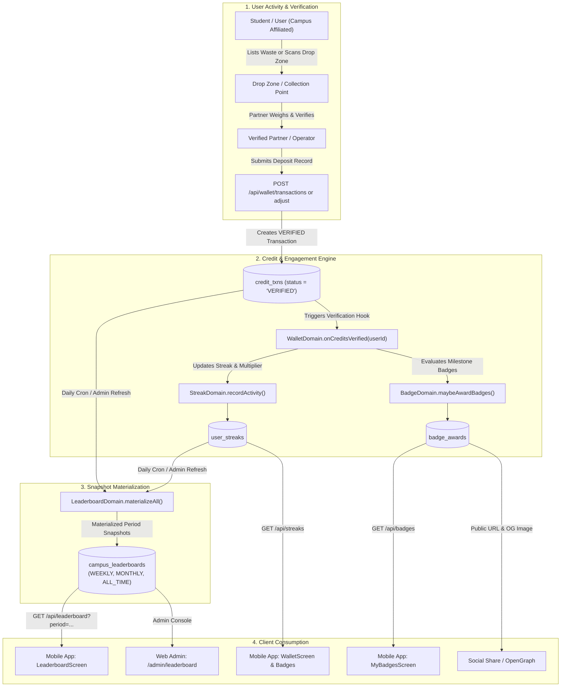
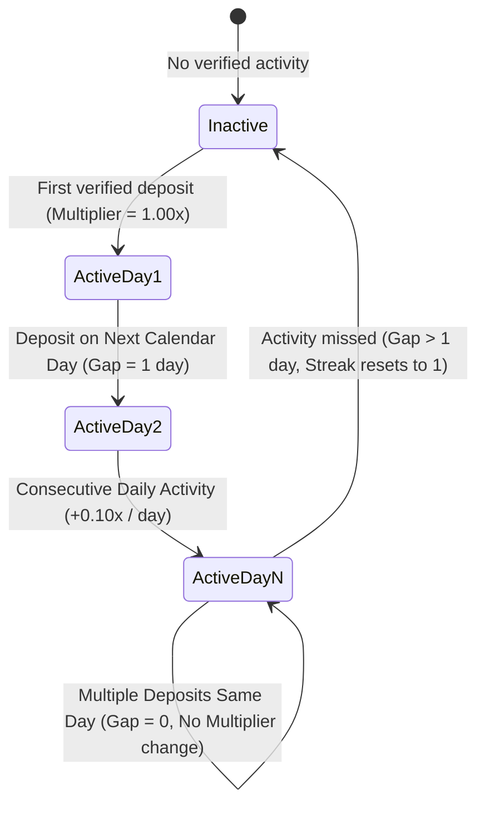
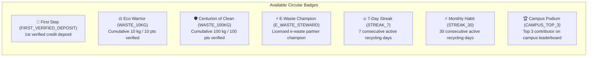
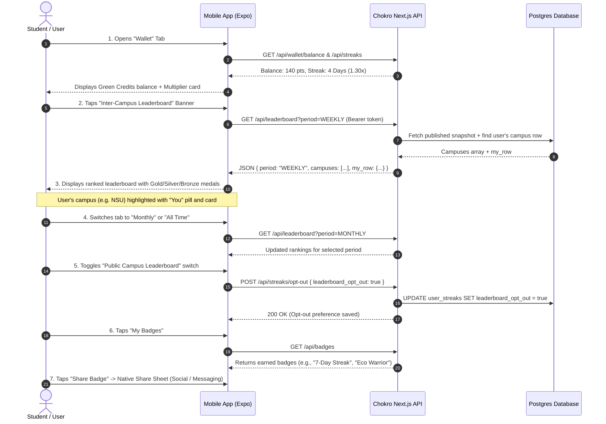

# Inter-Campus Circularity & Campus Leaderboard Feature Specification

## 1. Overview & Vision

**Inter-Campus Circularity** is Chokro's institutional gamification engine. It transforms individual campus recycling and item re-circulation into a competitive, collective metric where universities compete for sustainability rankings and circular impact.

### Core Objectives
1. **Gamified Environmental Action**: Encourage daily sustainable habits among students and staff through verified Green Credit rewards and streak multipliers.
2. **Institutional Recognition**: Aggregate individual verified contributions by university/campus (`institution_id`) to highlight top circular campuses in Bangladesh.
3. **Trust & Verification**: Prevent fraud by ensuring leaderboard points are strictly derived from **VERIFIED** transactions recorded by certified partners or authorized drop zone drop-offs.
4. **Privacy-First Design**: Empower individual users with a dedicated privacy toggle to opt out of public leaderboard aggregation without forfeiting personal credits.

---

## 2. End-to-End System Architecture

---

## 3. Mathematical Models & Reward Logic

### 3.1 Green Credits Lifecycle
Green credits represent verified circular currency earned through physical item deposits and e-waste diversion:

| Transaction Status | Description | Contributes to Leaderboard? |
|---|---|---|
| `PENDING` | Listing submitted or deposit waiting for partner inspection | ❌ No |
| `VERIFIED` | Partner/admin confirmed weight, category, and condition | ✅ **Yes** |
| `REJECTED` | Mismatched item, contaminated batch, or unverified claim | ❌ No |

### 3.2 Daily Engagement Streak & Multiplier
Consistent recycling actions trigger streak bonuses, boosting the user's score contribution to their campus.

- **Formula for Multiplier**:
  $$\text{Multiplier} = \min\left(2.00,\, 1.00 + (\text{current\_streak\_days} - 1) \times 0.10\right)$$
- **Range**: `1.00x` (Base) to `2.00x` (11+ Consecutive Days).
- **Streak Calculation**:
  - `gapDays = 1`: `current_streak_days = current_streak_days + 1` (Streak continues).
  - `gapDays = 0`: Same-day deposit; streak preserved, no increment.
  - `gapDays > 1`: Streak broken; resets `current_streak_days = 1`.

### 3.3 Campus Score Aggregation
The leaderboard rankings are materialized from verified transactions multiplied by the contributor's streak multiplier:

$$\text{User Contribution} = \sum_{\text{txn} \in \text{VERIFIED}} \left( \text{amount}_{\text{txn}} \times \text{multiplier}_{\text{user}} \right)$$

$$\text{Campus Total Points} = \sum_{\substack{u \in \text{Campus} \\ \text{opt\_out} = \text{false}}} \text{User Contribution}_u$$

$$\text{Active Members} = \operatorname{COUNT}(\{ u \in \text{Campus} \mid u \text{ has } \ge 1 \text{ verified transaction in period and opt\_out} = \text{false} \})$$

---

## 4. Milestone Badges Directory

Badges are awarded automatically upon reaching circularity milestones:

---

## 5. Database Schema & Data Models

### 5.1 `users`
- `id` (`uuid`, PK): Unique user identifier.
- `institution_id` (`varchar(255)`): Campus identifier (e.g., `"NSU"`, `"BUET"`, `"DU"`, `"BRACU"`). Only users with a non-null institution are eligible for campus rankings.
- `role` (`varchar(50)`): `'INDIVIDUAL'`, `'PARTNER'`, or `'ADMIN'`.

### 5.2 `credit_txns`
- `id` (`uuid`, PK): Transaction identifier.
- `user_id` (`uuid`, FK -> `users.id`): Recipient of credits.
- `amount` (`decimal(10, 2)`): Credit quantity.
- `kind` (`varchar(50)`): `'EARN'`, `'REDEEM'`, or `'ADJUST'`.
- `status` (`varchar(50)`): `'PENDING'`, `'VERIFIED'`, `'REJECTED'`.

### 5.3 `user_streaks`
- `id` (`uuid`, PK): Streak record.
- `user_id` (`uuid`, FK -> `users.id`, UNIQUE): 1:1 relationship with user.
- `current_streak_days` (`integer`): Current consecutive active days.
- `longest_streak_days` (`integer`): Peak streak record.
- `streak_multiplier` (`decimal(4, 2)`): Multiplier between `1.00` and `2.00`.
- `leaderboard_opt_out` (`boolean`): Privacy switch (default `false`).

### 5.4 `campus_leaderboards` (Materialized Snapshots)
- `id` (`uuid`, PK): Snapshot row.
- `period` (`varchar(20)`): `'WEEKLY'`, `'MONTHLY'`, `'ALL_TIME'`.
- `campus_id` (`varchar(255)`): University name / code.
- `total_points` (`decimal(12, 2)`): Total aggregated points.
- `member_count` (`integer`): Number of contributing students/members.
- `top_scorer_user_id` (`uuid`, FK -> `users.id`): Top contributor for that campus.
- `snapshot_date` (`date`): Materialization date (`YYYY-MM-DD`).

### 5.5 `badge_awards`
- `id` (`uuid`, PK): Award instance.
- `user_id` (`uuid`, FK -> `users.id`): Badge recipient.
- `badge_type` (`varchar(50)`): Enum from badge catalog.
- `award_points` (`decimal(10, 2)`): User's points at award time.
- `meta` (`jsonb`): Proof payload (e.g., `{ streakDays: 7, rank: 1 }`).
- `awarded_at` (`timestamp`): Timestamp of grant.

---

## 6. How a User Uses the Leaderboard (Step-by-Step Walkthrough)

### Step 1: Navigating to the Leaderboard
1. The user logs into the **Chokro Mobile App**.
2. Selects the **Wallet** tab from the bottom navigation bar (`WalletScreen.tsx`).
3. In the wallet header, the user sees their **Verified Green Credits**, **Pending Balance**, and **Active Multiplier** (e.g., `1.30x (4 Days Active)`).
4. Taps the **"Inter-Campus Leaderboard"** quick-access tile.

### Step 2: Exploring Campus Standings
1. The user enters `LeaderboardScreen.tsx`.
2. **Top Banner**: If the user belongs to an affiliated campus (e.g. `"North South University"`), their campus standing card is pinned to the top with total verified points and active students.
3. **Period Selection**: The user toggles between **Weekly**, **Monthly**, and **All Time** tabs to view live rankings across different timeframes.
4. **Campus List**:
   - `#1` Campus: Gold Trophy card with total points and member count.
   - `#2` Campus: Silver Medal card.
   - `#3` Campus: Bronze Medal card.
   - `#4+` Campuses: Ranked list items.
   - The user's own campus row is highlighted in soft green with a `"You"` badge.

### Step 3: Managing Leaderboard Privacy
1. At the top of `LeaderboardScreen.tsx`, the user has a **"Public Campus Leaderboard"** switch.
2. If toggled **OFF** (`leaderboard_opt_out = true`), the user's verified points will no longer be aggregated into their campus score on the next snapshot materialization, giving complete privacy control.

### Step 4: Viewing & Sharing Milestone Badges
1. From the Leaderboard, the user taps the **"My Badges"** button in the upper right.
2. Navigates to `MyBadgesScreen.tsx` which displays:
   - Daily engagement streak meter with multiplier progression (`+0.10x per active day up to 2.00x`).
   - Earned badges with unlock dates.
   - Milestone Directory showing locked vs unlocked achievements.
3. Tapping **"Share Badge"** triggers the native OS Share Sheet with a shareable URL and dynamic OpenGraph card (`/api/badges/[awardId]/og`).

---

## 7. Admin Console Operations

Admins can inspect rankings and trigger materialization from the web console at `/admin/leaderboard`:

1. **View Live Snapshots**: Inspect current rankings across Weekly, Monthly, and All-Time tables.
2. **On-Demand Materialization**: Click **"Materialize snapshot"** (`POST /api/admin/leaderboard/refresh`) to compute aggregate scores from the latest `credit_txns` and award podium badges (`CAMPUS_TOP_3`) to top performers.

---

## 8. Summary Table: API Endpoints

| Endpoint | Method | Auth | Description |
|---|---|---|---|
| `/api/leaderboard` | `GET` | Optional | Returns campus rankings for `period` (`WEEKLY`, `MONTHLY`, `ALL_TIME`) + caller's campus row |
| `/api/streaks` | `GET` | Required | Returns caller's streak days, multiplier, and privacy opt-out status |
| `/api/streaks/opt-out` | `POST` | Required | Toggles user's `leaderboard_opt_out` privacy preference |
| `/api/badges` | `GET` | Required | Lists all badges earned by the caller with metadata definitions |
| `/api/badges/[awardId]` | `GET` | Public | Returns specific badge award details for public verification & sharing |
| `/api/admin/leaderboard/refresh` | `POST` | Admin | Rebuilds and stores materialized leaderboard snapshots across all periods |
